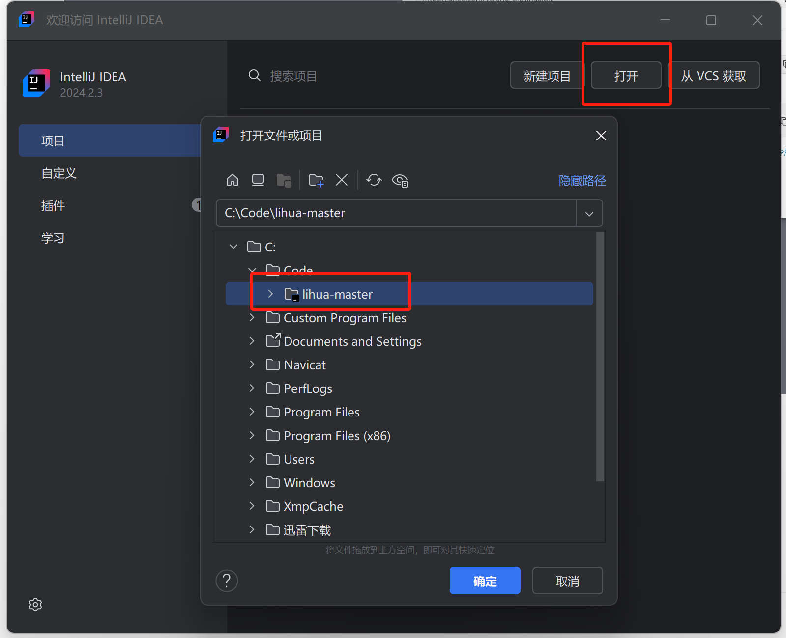
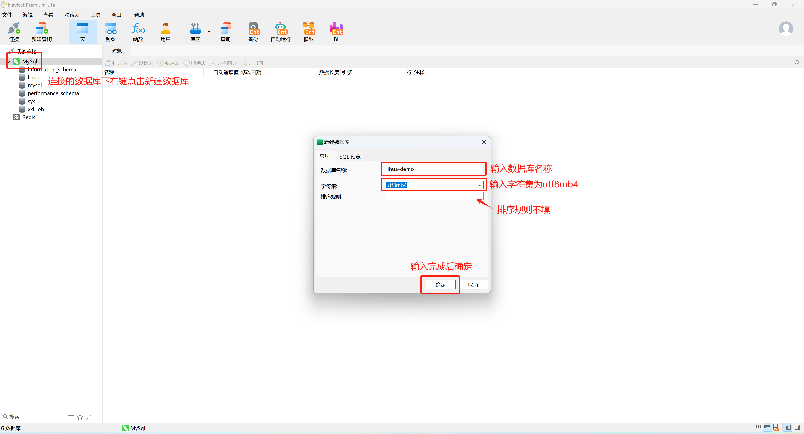
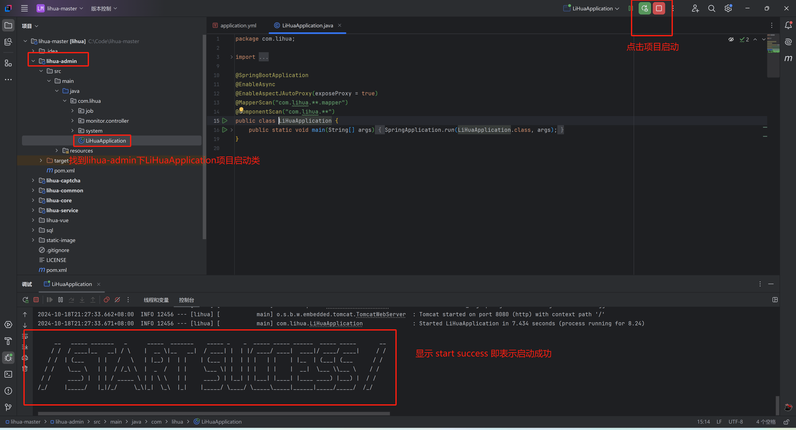

# 项目启动

## 环境准备

- Java版本：21
- MySQL版本：8.0+
- Redis：3.0+
- Maven：3.0+

## 开发工具

- IDEA
- Navicat

## 拉取项目代码

1. 前往仓库下载master分支代码 [仓库](https://gitee.com/yukino_git/lihua)

   

2. 使用IDEA打开项目

   

   

## 导入数据库脚本

1. 新建数据库

   以Navicat为例，找到连接的MySQL数据库，右键新建数据库，输入数据库名称，字符集选择 `utf8mb4` 后点击确定

   

2. 导入SQL文件

   新建数据库后鼠标在新建的数据库上右键点击 “运行SQL文件” ，选择项目 `sql/lihua.sql` 文件后点击开始

   

## 基础配置

### 配置文件

`lihua-admin` 子工程下 `src/main/resources` 下`.yml` 为项目的配置文件

- `application.yml` 开发、生产环境公共配置

- `application-dev.yml`  开发环境配置

- `application-prod.yml` 生产环境配置

  

### 配置项

**application.yml**

- 运行端口： `server.port` 可配置项目运行端口，默认8080

**application-dev.yml**

- 附件路径：`lihua.uploadFilePath` 配置附件上传路径
- Excel导出路径： `lihua.exportFilePath` 配置附件上传路径
- 数据库连接：`spring.datasource.dynamic.datasource.master` 下配置 `url` `username` `password`
- Redis连接：`spring.data.redis` 下配置 `host` `port` `password`
- 日志路径：`logging.file.name` 配置日志保存路径

## 启动项目

> 需确保Mysql、Redis启动中并连接正常

1. `lihua-admin` 子项目下找到 `com/lihua/LiHuaApplication.java` 启动类，点击IDEA启动按钮，控制台打印 `/START SUCCESS/` 即表示启动成功

   

2. 浏览器输入 `localhost:端口号`  显示返回结果即启动成功

   

