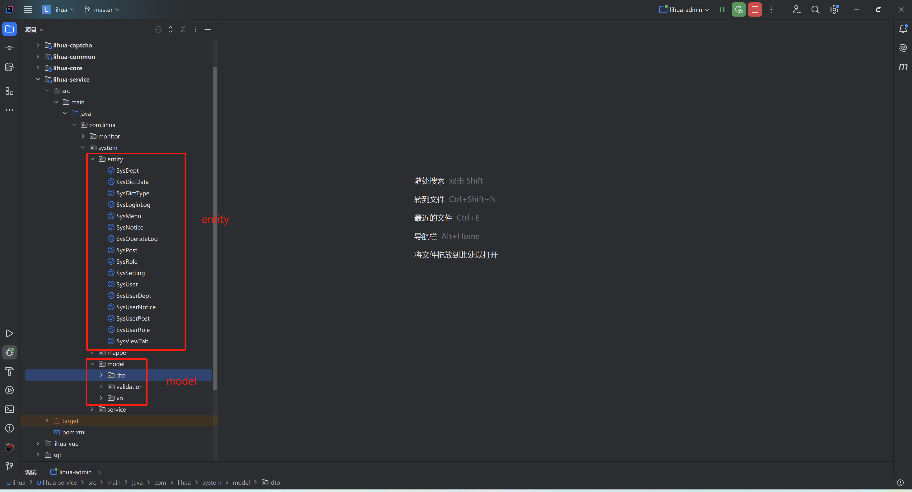

# 数据模型 Entity & Model

项目设计中，entity为与数据库字段想对应的实体类，model中则包含dto、vo、validation等实体类



## Entity

entity类中属性与数据库字段相对应，主键字段使用`@TableId(type = IdType.ASSIGN_ID)`注解标记。数据库表ID类型为Number，对应Java端使用String（避免前端精度丢失），两者可相互转换

``` java
@EqualsAndHashCode(callSuper = true)
@Data
public class Test extends BaseEntity {
    /**
     * 主键
     */
    @TableId(type = IdType.ASSIGN_ID)
    private String id;

    /**
     * 名称
     */
    @NotNull(message = "请输入名称")
    private String name;

    /**
     * 逻辑删除标志
     */
    private String delFlag;
}
```

**BaseEntity**

BaseEntity包含SQL表中必须存在的字段，所有Entity都应该继承此类（中间关联表可以忽略）

``` java
@Data
public class BaseEntity implements Serializable {
    @Serial
    private static final long serialVersionUID = 1L;

    /**
     * 创建人
     */
    private String createId;

    /**
     * 创建时间
     */
    private LocalDateTime createTime;

    /**
     * 更新人
     */
    private String updateId;

    /**
     * 更新时间
     */
    private LocalDateTime updateTime;
}
```


## DTO

前端向后台传递参数时，当参数不与Entity相同时，一般建立对应Entity的DTO进行接收，有分页需求的DTO类应继承 `BaseDTO`

对应条件查询、分页查询等场景，可建立对应Entity的DTO接受数据，尽量不破坏Entity类

``` java
@EqualsAndHashCode(callSuper = true)
@Data
public class SysPostDTO extends BaseDTO {
    /**
     * 部门id
     */
    private String deptId;
    /**
     * 岗位名称
     */
    private String name;
    /**
     * 岗位编码
     */
    private String code;
    /**
     * 岗位状态
     */
    private String status;
}
```

**BaseDTO**

主要应对分页查询参数的实体类，当没有传递分页参数时，会使用默认值

``` java
@Data
public class BaseDTO implements Serializable {

    @Serial
    private static final long serialVersionUID = 1L;
    /**
     * 最大分页页码
     */
    public static final int MAX_PAGE_NUM = 100;
    /**
     * 最大分页大小
     */
    public static final int MAX_PAGE_SIZE = 100;
    /**
     * 默认分页页码
     */
    public static final int DEFAULT_PAGE_NUM = 1;
    /**
     * 默认分页大小
     */
    public static final int DEFAULT_PAGE_SIZE = 10;

    /**
     * 当前页码
     */
    @Max(value = MAX_PAGE_NUM, message = "当前分页参数超出限制", groups = {MaxPageSizeLimit.class})
    protected Integer pageNum;

    /**
     * 当前分页大小
     */
    @Max(value = MAX_PAGE_SIZE, message = "当前分页参数超出限制", groups = {MaxPageSizeLimit.class})
    protected Integer pageSize;

    //在构造方法中设置默认值
    public BaseDTO() {
        this.pageNum = Optional.ofNullable(pageNum).orElse(BaseDTO.DEFAULT_PAGE_NUM);
        this.pageSize = Optional.ofNullable(pageSize).orElse(BaseDTO.DEFAULT_PAGE_SIZE);
    }
}
```


## VO

数据库向后端映射多表数据时，Entity无法映射全部数据，为不破坏Entity结构，新建对应的VO类，属于对Entity类的扩展。可直接继承Entity，再添加新增的属性

``` java
@EqualsAndHashCode(callSuper = true)
@ExcelModel(sheetName = "部门信息",includeAllField = false)
@Data
public class SysDeptVO extends SysDept {

    /**
     * 部门名称路径
     */
    @ExcelColumn(index = 0, title = "*部门名称路径", width = 12)
    private String namePath;

    /**
     * 岗位名称
     */
    @ExcelColumn(order = 9, title = "部门下岗位", width = 12)
    private String postNames;

    /**
     * excel 批量导入异常说明
     * 数据导入后，因异常无法入库的数据错误描述
     */
    @ExcelColumn(order = 10, title = "系统提示", style = {"cell->color:red"})
    private String importErrorMsg;

    /**
     * 岗位信息
     */
    private List<SysPost> sysPostList;
}
```

