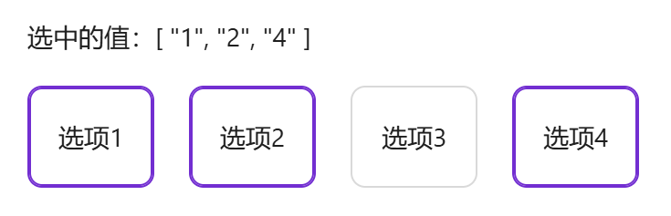

# 可选择卡片

表单中需要单选或多选数据，并需要在选项中描述更多数据内容时使用


## 基础用法

引入组件 `import SelectableCard from "@/components/selectable-card/index.vue"`后通过`data-source`定义可选数据，`item-key`定义双向绑定的值（必须为data-source中的属性）通过`v-model`进行双向绑定。

卡片内容通过`content`插槽编写，插槽会返回 `{dataSource, item, isSelected, color, index}`


```vue
<template>
  <a-typography-title :level="4">基础用法</a-typography-title>
  <a-typography strong>选中的值：{{value}}</a-typography>
  <selectable-card :data-source="dataSource" item-key="key" v-model="value">
    <template #content="{dataSource, item, isSelected, color, index}">
      <a-typography-title :level="5" :style="{color: isSelected ? color : ''}">
        content插槽，可获取到dataSource、item、isSelected、color、index信息
      </a-typography-title>
      <div>
        <a-typography-text strong :style="{color: isSelected ? color : ''}">item</a-typography-text> {{item}}
      </div>
      <div>
        <a-typography-text strong :style="{color: isSelected ? color : ''}">是否选中</a-typography-text> {{isSelected}}
      </div>
      <div>
        <a-typography-text strong :style="{color: isSelected ? color : ''}">索引</a-typography-text> {{index}}
      </div>
    </template>
  </selectable-card>
</template>

<script setup lang="ts">
import SelectableCard from "@/components/selectable-card/index.vue"
import {ref} from "vue";
const dataSource = [{
  key: '1',
  label: '选项1'
},{
  key: '2',
  label: '选项2'
},{
  key: '3',
  label: '选项3'
},{
  key: '4',
  label: '选项4'
}]
const value = ref<string>()
</script>
```

## 多选卡片

通过`multiple`可开启多选模式，多选下`v-model`需绑定为`数组`



```vue
<template>
  <a-typography-title :level="4">可多选</a-typography-title>
  <a-typography strong>选中的值：{{value}}</a-typography>
  <selectable-card :data-source="dataSource" item-key="key" multiple v-model="value">
    <template #content="{ item }">
      {{item.label}}
    </template>
  </selectable-card>
</template>

<script setup lang="ts">
import SelectableCard from "@/components/selectable-card/index.vue"
import {ref} from "vue";
const dataSource = [{
  key: '1',
  label: '选项1'
},{
  key: '2',
  label: '选项2'
},{
  key: '3',
  label: '选项3'
},{
  key: '4',
  label: '选项4'
}]
const value = ref<string[]>([])
</script>
```

## 空状态

data-source 数据为空时显示空状态


```vue
<template>
  <a-typography-title :level="4">加载遮罩及空数据</a-typography-title>
  <a-button @click="handleLoading" style="width: 100px">加载数据</a-button>
  <a-typography strong>选中的值：{{value}}</a-typography>
  <a-row>
    <a-col :span="6">
      <selectable-card :data-source="dataSource" item-key="key" multiple v-model="value" :loading="dataLoading">
        <template #content="{ item }">
          {{item.label}}
        </template>
      </selectable-card>
    </a-col>
  </a-row>
</template>

<script setup lang="ts">
import SelectableCard from "@/components/selectable-card/index.vue"
import {ref} from "vue";
const dataSource = ref<any[]>([])
const dataLoading = ref<boolean>(false)
const value = ref<string[]>([])
const handleLoading = () => {
  dataLoading.value = true
  setTimeout(() => {
    dataSource.value = [{
      key: '1',
      label: '选项1'
    },{
      key: '2',
      label: '选项2'
    },{
      key: '3',
      label: '选项3'
    },{
      key: '4',
      label: '选项4'
    }]
    dataLoading.value = false
  },1500)
}
</script>
```

## API

## 双向绑定

| 属性名称 | 描述     | 类型                              | 默认值 | 是否必填 |
| -------- | -------- | --------------------------------- | ------ | -------- |
| v-model  | 双向绑定 | string（单选）\| string[]（多选） | -      | 是       |

## 属性

| 属性名称                 | 描述                                                  | 类型    | 默认值 | 是否必填 |
| ------------------------ | ----------------------------------------------------- | ------- | ------ | -------- |
| dataSource               | 可选的数据列表                                        | any[]   | -      | 是       |
| itemKey                  | dataSource 对象中的唯一值，用作双向绑定               | string  | -      | 是       |
| multiple                 | 是否支持多选                                          | boolean | false  | 否       |
| gap                      | 卡片间距                                              | number  | 16     | 否       |
| cardStyle（1.2.5）       | 卡片组件样式                                          | object  | {}     | 否       |
| itemStyle                | 卡片内元素样式                                        | object  | {}     | 否       |
| vertical                 | 是否垂直排列                                          | boolean | false  | 否       |
| maxHeight                | 最大高度 （仅对垂直排列生效）                         | number  | 300    | 否       |
| emptyDescription         | 空状态描述文本                                        | string  | -      | 否       |
| scrollViewIndex（1.2.5） | 竖向排列出现滚动条时，目标index的元素将始终在可视范围 | number  | 0      | 否       |
| loading                  | 加载中                                                | boolean | false  | 否       |

## 插槽

| 插槽名称 | 描述     | 参数说明                                                     | 是否必须 |
| -------- | -------- | ------------------------------------------------------------ | -------- |
| content  | 卡片内容 | dataSource：数据集合 item：遍历出的item对象 index：索引 isSelected：是否被选中 color：当前主题颜色 | 是       |

## 方法

| 方法名称 | 描述           | 参数                           |
| -------- | -------------- | ------------------------------ |
| click    | 点击卡片触发   | \{activeValueList,item,props\} |
| change   | 选项变化时触发 | \{item\}                       |