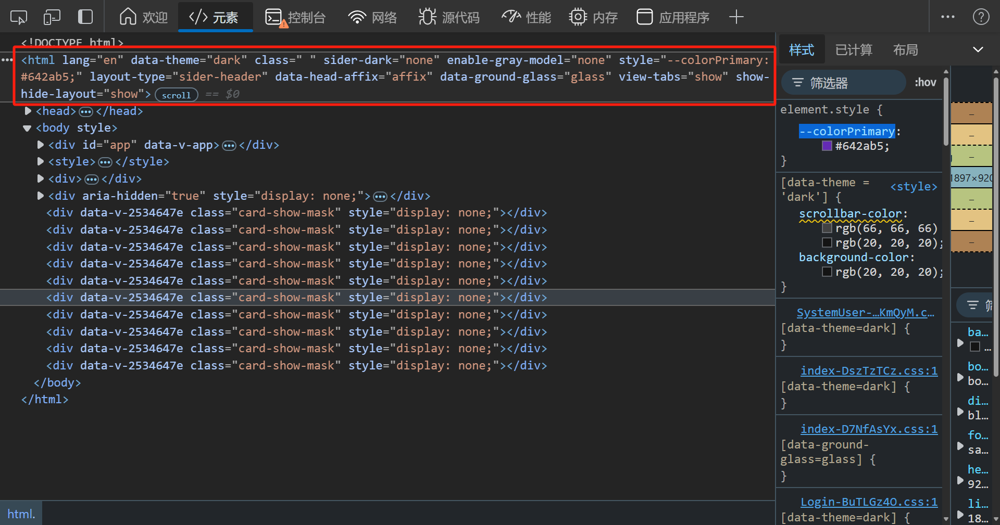

# 系统主题

可获取当前是否处于暗色模式、布局类型、主题颜色等，方便自定义组件的适配


## 在组件中获取主题

通过`useThemeStore.$state` 可获取当前主题信息

> 其中主题颜色获取需通过 `antColorPrimary` 属性进行获取，或调用`actions` 下`getColorPrimary()` 方法进行获取
>
> `colorPrimary` 属性的颜色再暗色模式下没有经过 ant design 的算法调整，会出现色号和全局不统一的问题

``` vue
<script setup lang="ts">
// 导入 useThemeStore
import {useThemeStore} from "@/stores/theme.ts";
const themeStore = useThemeStore();
// 当前是否处于暗色模式
const isDark = themeStore.$state.isDarkTheme
// 获取当前主题颜色
const colorPrimary = themeStore.$state.antColorPrimary
// 通过方法获取当前主题颜色
const colorPrimary = themeStore.getColorPrimary()
// 获取布局类型
const layoutType = themeStore.$state.layoutType
</script>
```

主题定义state如下

``` typescript
state() {
    /**
     * 暗色模式
     */
    const isDarkTheme: boolean = settings.isDarkTheme

    /**
     * 顶部栏背景颜色
     */
    const layoutBackgroundColor: string = settings.siderBackgroundColor

    /**
     * 布局类型 sider-header / header-sider / header-content
     */
    const layoutType: string = settings.layoutType

    /**
     * 组件大小 small/ middle / large
     */
    const componentSize: string = settings.componentSize

    /**
     * 导航模式 inline / horizontal
     */
    const siderMode: string = settings.siderMode

    /**
     * 菜单分组
     */
    const siderGroup: boolean = settings.siderGroup

    /**
     * 主要颜色
     * 组件中使用系统颜色不可直接取用该字段
     * 使用下面提供的getColorPrimary()方法进行获取
     */
    const colorPrimary: string = settings.themeConfig.token.colorPrimary

    /**
     * 通过ant提供的theme的主要颜色，针对暗色模式进行了颜色调整
     */
    const antColorPrimary: string = settings.themeConfig.token.colorPrimary

    /**
     * 侧边栏背景颜色
     */
    const siderBackgroundColor: string = settings.layoutBackgroundColor

    /**
     * 磨砂玻璃效果
     */
    const groundGlass: boolean = settings.groundGlass

    /**
     * 固定头部
     */
    const affixHead: boolean = settings.affixHead

    /**
     * 显示多窗口标签
     */
    const showViewTabs: boolean = settings.showViewTabs

    /**
     * 侧边颜色 light / dark
      */
    const siderTheme: string = settings.siderTheme

    /**
     * 侧边宽度
     */
    const siderWith: number = settings.siderWith

    /**
     * 原侧边宽度，用于调整侧边栏时保存临时变量
     */
    const originSiderWith: number = settings.originSiderWith

    /**
     * 切换路由时的过渡动画 zoom / fade / breathe / top / down / switch / trick
     */
    const routeTransition: string = settings.routeTransition

    /**
     * 灰色模式
     */
    const grayModel: string = settings.grayModel

    /**
     * ant 主题配置
     */
    const themeConfig = settings.themeConfig

    return {
        layoutType,
        componentSize,
        showViewTabs,
        isDarkTheme,
        colorPrimary,
        antColorPrimary,
        siderTheme,
        groundGlass,
        affixHead,
        layoutBackgroundColor,
        siderBackgroundColor,
        siderMode,
        siderGroup,
        siderWith,
        originSiderWith,
        routeTransition,
        grayModel,
        themeConfig
    }
}
```

## 在css中获取主题

在dom元素html标签中，定义了若干自定义属性，用来标识各种主题属性



**自定义属性**

| 属性名称          | 属性描述                                                     |
| ----------------- | ------------------------------------------------------------ |
| data-theme        | 全局主题模式（暗色模式：dark，亮色模式：light）              |
| sider-dark        | 导航栏主题（深色模式：dark，亮色模式：light）                |
| enable-gray-model | 全局灰色模式（开启：active，关闭：none）                     |
| layout-type       | 导航样式（侧边导航样式1：sider-header，侧边导航样式2：header-sider，顶部导航：header-content） |
| data-head-affix   | 固定头部（固定：affix，不固定：un-affix）                    |
| data-ground-glass | 高级材质毛玻璃效果（开启：glass，关闭：no-glass）            |
| view-tabs         | 是否显示多任务栏（显示：show，隐藏：hide）                   |
| show-hide-layout  | 是否显示Layout（显示：show，隐藏：hide）                     |

> 组件中使用属性选择器 `style` 标签不可添加 `scoped` 否则不会生效

``` css
[data-theme = 'dark'] {
    .scrollbar, .sider-scrollbar {
        scrollbar-color: rgb(66,66,66) transparent;
    }
}
[sider-dark = 'dark'] {
    .sider-scrollbar {
        scrollbar-color: rgb(66,66,66) transparent;
    }
}
```

**css 变量**

| 变量名         | 变量描述                                        |
| -------------- | ----------------------------------------------- |
| --colorPrimary | 当前主题颜色（经由ant算法处理，已适配暗色模式） |

``` css
.icon-group:hover {
	background: var(--colorPrimary);
}
```

#### 