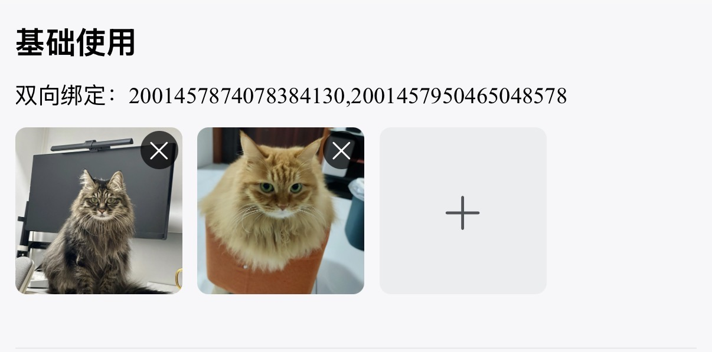

# 附件上传
业务场景中有需要上传照片或视频的场景
::: warning 提示
如需从文件管理器中上传其他类型附件，需要自行扩展，uniapp没有提供相关接口。
微信小程序支持从聊天内容中选取其他类型附件
:::

## 基础用法

引入组件 `import AttachmentUpload from "@/components/attachment-upload/index"` ，使用`v-model`进行双向绑定即可。双向绑定的数据为逗号分隔格式，返回的数据为后台附件表`sys_attachment`的主键id



``` vue
<template>
  <sar-space direction="vertical">
    <view class="title">基础使用</view>
    <view class="model-val">双向绑定：{{attachmentValue1}}</view>
    <attachment-upload v-model="attachmentValue1"/>
  </sar-space>
</template>
<script lang="ts" setup>
import AttachmentUpload from "@/components/attachment-upload/index"
const attachmentValue1 = ref<string>()
</script>
```


## 按钮形式

设置  `mode="button"` 即可以按钮形式上传。附件预览以卡片形式展示


``` vue
<template>
  <sar-space direction="vertical">
    <view class="title">按钮形式</view>
    <view class="model-val">双向绑定：{{attachmentValue1}}</view>
    <attachment-upload 
     v-model="attachmentValue2"  
     mode="button" 
     button-type="outline" 
     buttonText="上传聊天文件" 
     buttonIsRound 
     buttonIcon="CloudUploadOutlined" 
     buttonIconFamily="outlined"/>
  </sar-space>
</template>
<script lang="ts" setup>
import AttachmentUpload from "@/components/attachment-upload/index"
const attachmentValue2 = ref<string>()
</script>
```


## 从聊天框选择<Badge type="warning" text="仅微信小程序支持" />

设置 `uploadType="file"` 或 `uploadType="all"` 时生效，此模式下只能使用按钮形式。支持通过 `extension` 属性指定附件类型


``` vue
<template>
  <sar-space direction="vertical">
    <view class="title">从聊天框选择</view>
    <view class="model-val">双向绑定：{{attachmentValue1}}</view>
    <attachment-upload v-model="attachmentValue3" uploadType="file" :extension="['pdf']"/>
  </sar-space>
</template>
<script lang="ts" setup>
import AttachmentUpload from "@/components/attachment-upload/index"
const attachmentValue3 = ref<string>()
</script>
```


## 数量大小限制

设置 `:max-count="2"` 指定最多上传数量，设置  `:max-size="10 * 1024"` 指定单个附件大小


```  vue
<template>
  <sar-space direction="vertical">
    <view class="title">数量大小限制</view>
    <view class="model-val">双向绑定：{{attachmentValue1}}</view>
    <attachment-upload v-model="attachmentValue4" :max-count="2" :max-size="10 * 1024"/>
  </sar-space>
</template>
<script lang="ts" setup>
import AttachmentUpload from "@/components/attachment-upload/index"
const attachmentValue4 = ref<string>()
</script>
```


## API

### 双向绑定

| 属性名称 | 描述     | 类型   | 默认值 | 必填 |
| -------- | -------- | ------ | ------ | ---- |
| v-model  | 双向绑定 | string | -      | 是   |

### 属性

| 属性名称         | 描述                                                         | 类型                                                         | 默认值                       | 必填 |
| ---------------- | ------------------------------------------------------------ | ------------------------------------------------------------ | ---------------------------- | ---- |
| businessCode     | 业务编码（用于后台附件管理区分附件对应的业务）               | string                                                       | -                            | 是   |
| businessName     | 业务名称（用于后台附件管理区分附件对应的业务）               | string                                                       | -                            | 是   |
| mode             | 模式切换                                                     | 'button' \| 'picture'                                        | 'picture'                    | 否   |
| uploadType       | 可上传附件类型（设置为file会从微信聊天中选取文件，仅微信小程序支持） | 'image' \| 'video' \| 'file' \| 'all'                        | 'image'                      | 否   |
| extension        | 包含的文件后缀，仅 uploadType === 'file' 时生效，数组后缀名不带. | string[]                                                     | -                            | 否   |
| maxCount         | 最大上传数量                                                 | number                                                       | 6                            | 否   |
| maxSize          | 单个附件最大上传大小（单位：字节）                           | number                                                       | 1\*1024\*1024 (1MB)          | 否   |
| disabled         | 禁用状态                                                     | boolean                                                      | false                        | 否   |
| readonly         | 只读状态                                                     | boolean                                                      | false                        | 否   |
| removable        | 可否删除                                                     | boolean                                                      | true                         | 否   |
| autoRemove       | 自动删除（点击删除按钮是否自动进行业务删除）                 | boolean                                                      | true                         | 否   |
| removeText       | 删除描述（自动删除开启后，点击删除弹框提示文本）             | string                                                       | '删除后无法恢复，是否删除？' | 否   |
| buttonText       | 按钮文本                                                     | string                                                       | '点击上传'                   | 否   |
| buttonType       | 按钮类型                                                     | 'default' \| 'pale' \| 'mild' \| 'outline' \| 'text' \| 'pale-text' | 'default'                    | 否   |
| buttonTheme      | 按钮主题                                                     | 'primary' \| 'secondary' \| 'success' \| 'info' \| 'warning' \| 'danger' | 'primary'                    | 否   |
| buttonIsRound    | 是否为圆形按钮                                               | boolean                                                      | false                        | 否   |
| buttonIsSquare   | 是否为方形按钮                                               | boolean                                                      | false                        | 否   |
| buttonSize       | 按钮尺寸                                                     | 'mini' \| 'small' \| 'medium' \| 'large'                     | 'medium'                     | 否   |
| buttonIcon       | 按钮图标                                                     | string                                                       | -                            | 否   |
| buttonIconFamily | 按钮图标字体                                                 | string                                                       | -                            | 否   |

### 方法

| 方法名称       | 描述                     | 参数           |
| -------------- | ------------------------ | -------------- |
| uploadSuccess  | 上传成功触发             | 附件，附件列表 |
| uploadError    | 附件删除时触发           | 附件，错误信息 |
| exceedMaxCount | 超出附件最大数限制时触发 | 附件列表       |