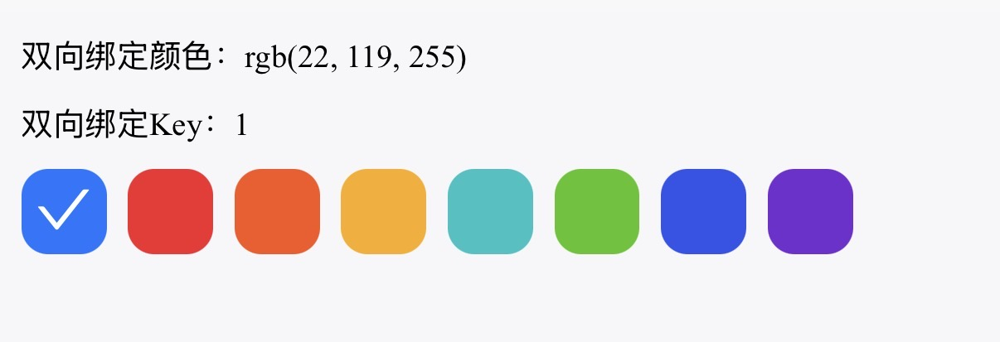

# 颜色选择

需要指定颜色的场景，系统中用于指定头像背景颜色

## 基础用法

引入组件 `import ColorSelect from '@/components/color-select/index.vue'`

 `v-model:color` 对颜色值进行双向绑定

 `v-model:value="value"` 对颜色key进行双向绑定

`dataSource` 指定颜色列表



``` vue
<template>
	<view class="content">
		<sar-space direction="vertical">
			<view class="model-val">双向绑定颜色：{{color}}</view>
			<view class="model-val">双向绑定Key：{{value}}</view>
			<!-- 头像背景颜色 -->
			<color-select :dataSource="colorSource" v-model:color="color" v-model:value="value"></color-select>
		</sar-space>
	</view>
</template>

<script lang="ts" setup>
import { ref } from 'vue'
import ColorSelect from '@/components/color-select/index.vue'
// 头像背景颜色
const colorSource = [
	{
		name: '拂晓蓝',
		color: 'rgb(22, 119, 255)',
		key: '1'
	},
	{
		name: '薄暮',
		color: 'rgb(245, 34, 45)',
		key: '2'
	},
	{
		name: '火山',
		color: 'rgb(250, 84, 28)',
		key: '3'
	},
	{
		name: '日暮',
		color: 'rgb(250, 173, 20)',
		key: '4'
	},
	{
		name: '明青',
		color: 'rgb(19, 194, 194)',
		key: '5'
	},
	{
		name: '极光绿',
		color: 'rgb(82, 196, 26)',
		key: '6'
	},
	{
		name: '极客蓝',
		color: 'rgb(47, 84, 235)',
		key: '7'
	},
	{
		name: '酱紫',
		color: 'rgb(114, 46, 209)',
		key: '8'
	}
]

const color = ref<string>('rgb(114, 46, 209)')
const value = ref<string>('8')
</script>
```

## API

### 双向绑定

| 属性名称      | 描述          | 类型   | 默认值 | 是否必填               |
| ------------- | ------------- | ------ | ------ | ---------------------- |
| v-model:color | 绑定的color值 | string | -      | 否（至少绑定一个属性） |
| v-model:value | 绑定的key值   | string | -      | 否（至少绑定一个属性） |

### 属性

| 属性名称   | 描述         | 类型                                                 | 默认值 | 是否必填 |
| ---------- | ------------ | ---------------------------------------------------- | ------ | -------- |
| dataSource | 可选颜色数组 | Array<{ name: string, color: string, key?: string }> | -      | 是       |

### 方法

| 方法名称 | 描述           | 参数           |
| -------- | -------------- | -------------- |
| click    | 点选颜色时触发 | 选中的item对象 |