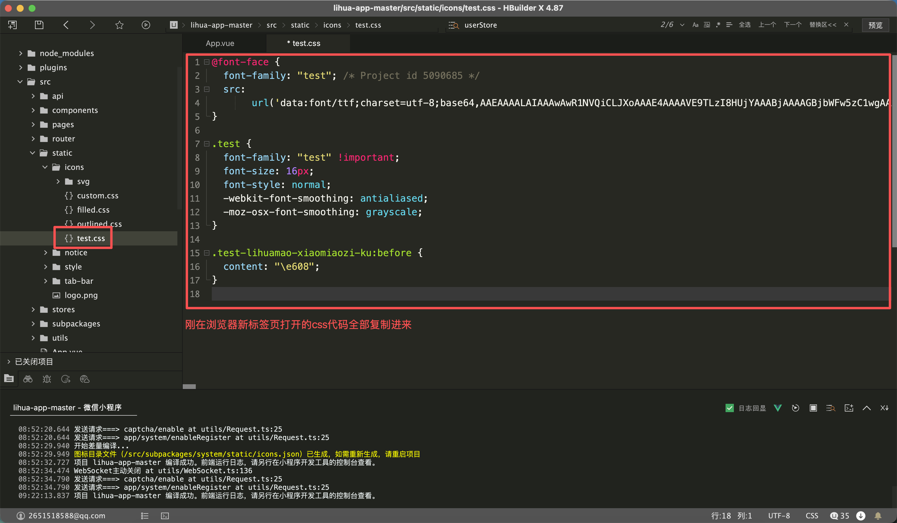
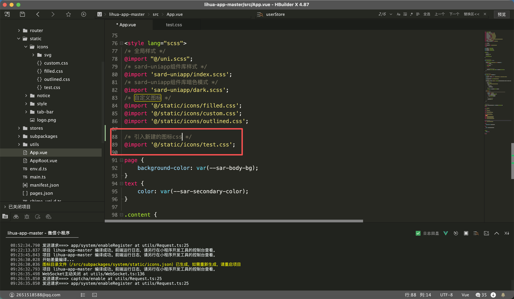

# 自定义图标

> 项目中图标组件使用 `sard-uniapp` 组件库提供的图标组件。引入自定义图标方式详见 [自定义图标](https://sard.wzt.zone/sard-uniapp-docs/components/icon#%E8%87%AA%E5%AE%9A%E4%B9%89%E5%9B%BE%E6%A0%87)

项目中内置了与web端相同的图标，包括 `ant-design`和`自定义`图标，位于 `src/static/icons` 目录下


## css图标

::: warning 注意事项

css图标会将图标原本颜色抹去，如需要保持图标原本颜色，请使用svg图标

引入的图标css是会占用主包空间的，对空间敏感的话请只引入需要的图标

:::

> 以 `iconfont` 进行导入自定义图标演示

1. 创建项目，登录 [iconfont](https://www.iconfont.cn/) 后在顶部导航栏找到 `资源管理` `我的项目`

   

   

2. 挑选图标，加入到项目

   

   

3. 生成图标代码，在刚创建的项目中点击生成代码

   

   

4. `lihua-app`项目中创建css文件，将浏览器新标签页中的代码全部复制到文件内，保存文件

   

   

5. 在`App.vue` 中引入新建的css文件

   

6. 使用图标，name为图标名称（可在iconfont自行修改）family为图标字体（创建项目时指定的）

   ``` html
   <sar-icon name="lihuamao-xiaomiaozi-ku" family="test"></sar-icon>
   ```


## svg图标

> svg 图标直接从iconfont下载svg文件保存到项目下即可

svg 图标可以保留图标原本的颜色，使用时需要以路径的方式引用

``` html
<sar-icon name="/static/icons/svg/AlertTwoTone.svg"></sar-icon>
```


