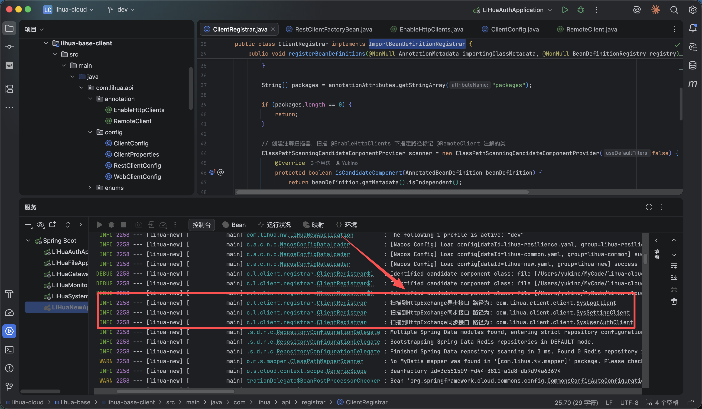

# 远程调用
远程调用基于 Spring 6 中提供的声明式 HTTP 接口 `http-interface` ，无需引入第三方依赖，更轻量。

为提升开发效率，系统对 `http-interface` 进行了一定程度整合，包括自定义注解、基于包与注解的客户端自动扫描注册等简单封装。

## 超时时间
可通过配置文件配置远程调用超时时间，对应properties定义为如下：
```java 
@Data
@Configuration
@ConfigurationProperties(prefix = "http.client")
public class ClientProperties {

    /**
     * 访问超时时间
     */
    private Duration responseTimeout = Duration.ofSeconds(30);

    /**
     * 连接超时时间
     */
    private Duration connectTimeout = Duration.ofSeconds(3);
}

```

## 自定义注解

### @EnableHttpClients
主要用于搭配客户端自动创建，作用于配置类上可启用客户端的自动创建，业务开发无需关心。
```java
/**
 * 启用 @HttpExchange 自动扫描
 */
@Configuration
@EnableHttpClients(packages = "com.lihua")
public class ClientConfig {}
```

### @RemoteClient
应用在 api 层 client 接口上，标记远程调用客户端对应的服务名，可自动负载均衡进行远程调用。executionMode 用于标记是否启用异步调用，默认为同步。
```java
/**
 * RemoteClient 包路径注解
 */
@Target(ElementType.TYPE)
@Retention(RetentionPolicy.RUNTIME)
public @interface RemoteClient {

    /**
     * 服务名称
     */
    String serverName();

    /**
     * 请求协议
     */
    SchemeEnum scheme() default SchemeEnum.HTTP;

    /**
     * 执行模式
     * SYNC：同步执行
     * ASYNC：异步执行
     */
    ExecutionModeEnum executionMode() default ExecutionModeEnum.SYNC;
}

```

## Http 请求头消息透传
多个服务相互调用需要携带token等信息，`RestClient` 和 `WebClient` 提供了对应的请求拦截/过滤器，发送前可对请求头进行设置。

同步请求拦截器配置
```java 
@Bean
    public RestClient.Builder restClientBuilder(LoadBalancerInterceptor loadBalancerInterceptor) {
        return RestClient
            .builder()
            .requestFactory(initRequestFactory())
            // 负载均衡拦截器
            .requestInterceptor(loadBalancerInterceptor)
            // 请求拦截器
            .requestInterceptor((request, body, execution) -> {
                // token 透传
                String token = LoginUserContext.getToken();
                if (StringUtils.hasText(token)) {
                    request.getHeaders().add(TokenEnum.TOKEN_KEY.getValue(), token);
                }

                // 生成签名
                long timeMillis = DateUtils.nowTimeStamp();
                String sign = HmacUtils.hmacSha256(SignEnum.SIGN_SECRET.getValue(), String.format("%s:%s:%s",
                        request.getMethod().name(),
                        request.getURI().getPath(),
                        timeMillis));
                request.getHeaders().add(SignEnum.SIGN_KEY.getValue(), sign);
                request.getHeaders().add("Timestamp", String.valueOf(timeMillis));

                return execution.execute(request, body);
            });
    }
```

异步请求过滤器配置

```java 

@Bean
    public WebClient.Builder webClientBuilder(ReactorLoadBalancerExchangeFilterFunction filterFunction) {
        return WebClient
            .builder()
            .clientConnector(initConnector())
            // 负载均衡过滤器
            .filter(filterFunction)
            // 透传
            .filter((request, next) -> {
                // token透传
                String token = LoginUserContext.getToken();

                //  构建新的 request
                ClientRequest.Builder builder = ClientRequest.from(request);

                if (StringUtils.hasText(token)) {
                    builder.header(TokenEnum.TOKEN_KEY.getValue(), token);
                }

                // 签名
                long timeMillis = DateUtils.nowTimeStamp();
                String sign = HmacUtils.hmacSha256(
                        SignEnum.SIGN_SECRET.getValue(),
                        String.format("%s:%s:%s",
                                request.method().name(),
                                request.url().getPath(),
                                timeMillis)
                );

                builder.header(SignEnum.SIGN_KEY.getValue(), sign);
                builder.header("Timestamp", String.valueOf(timeMillis));

                return next.exchange(builder.build());
            });
    }
```


## 自动客户端创建

> 相关代码位于 `lihua-base-client` 下 config 和 registrar 包中

在网络搜索@HttpExchange使用方式时，都需要根据接口自行创建对应的 Client Bean，业务开发上太过繁琐。为了消除下方样板代码，项目使用 `ImportBeanDefinitionRegistrar` 方式按包和注解扫描自动注册Client Bean，根据配置信息自动加载 `同步` `异步` 两套客户端。
```java 
// 样板代码
@Configuration
public class WebClientConfiguration {
    @Bean
    public OrderApiInterface albumsClient(WebClient.Builder webClientBuilder) {
        WebClient webClient = webClientBuilder.baseUrl("http://localhost:8898").build();
        return HttpServiceProxyFactory.builder().clientAdapter(WebClientAdapter.forClient(webClient)) //
                .build().createClient(OrderApiInterface.class);
    }
}
```

项目启动时会打印扫描到的客户端接口

