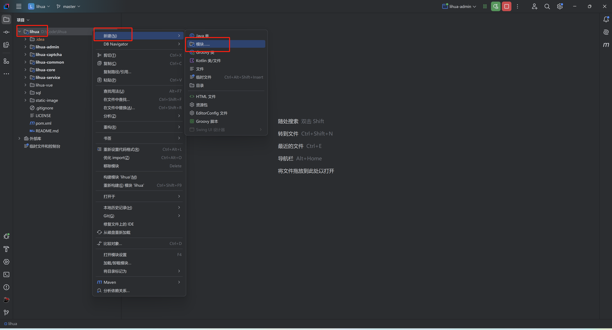
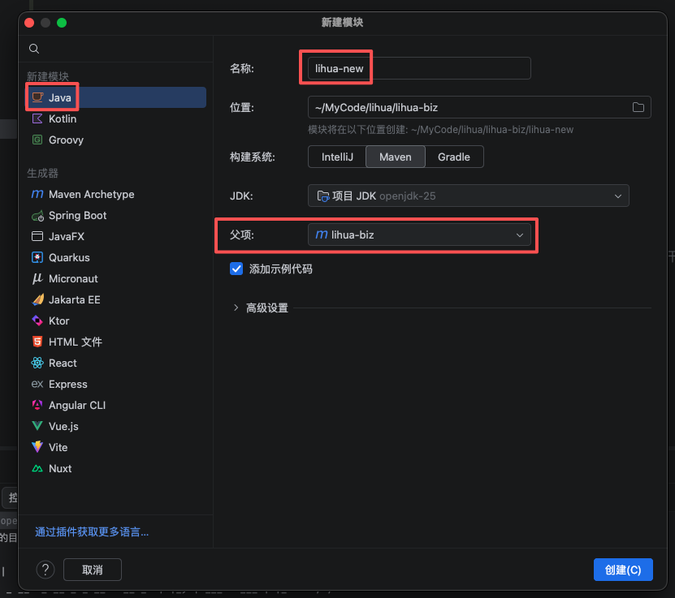
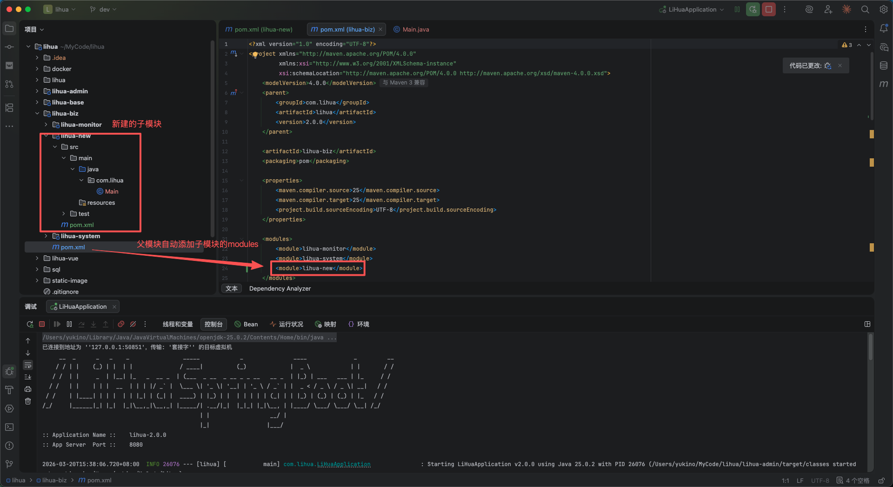
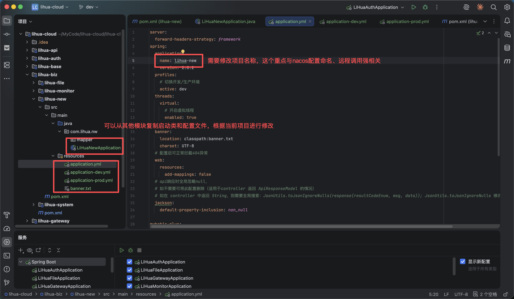
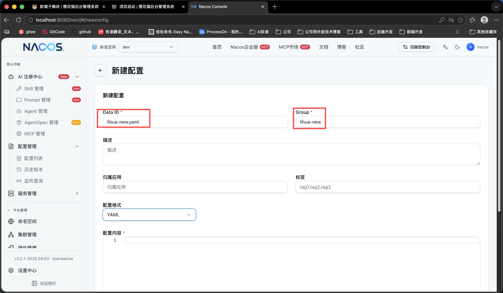
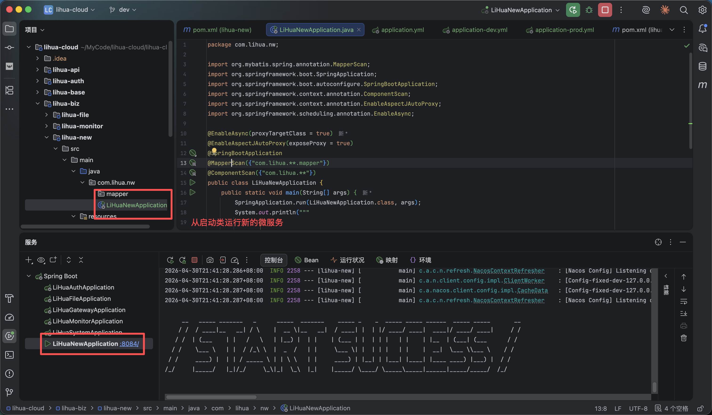
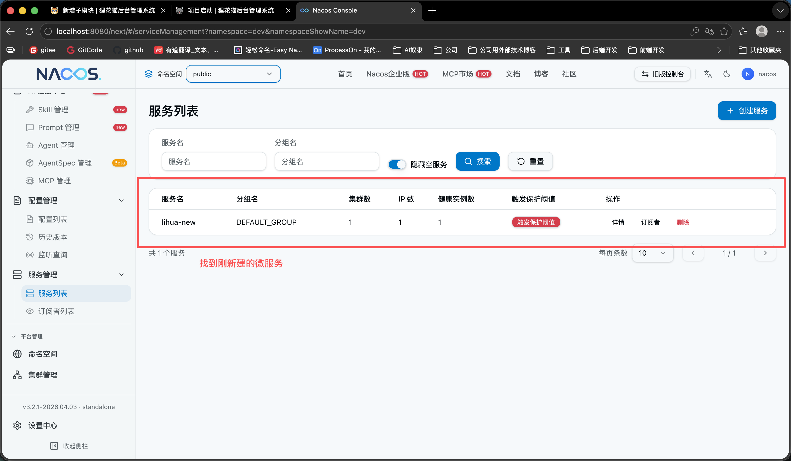

# 新增子模块

> 2.0 版本中，子模块按模块类型划分，并分别归属到对应父模块下进行维护。

- `lihua-biz`：业务模块，面向具体业务场景，对外提供接口能力（可被前端直接调用）
- `lihua-base`：基础模块，提供通用能力与底层实现，供 `lihua-biz` 依赖使用

---

**以lihua-biz为例**
1. 使用IDEA新建子模块，在项目`目录右键->新建->模块`

   

2. 选择左侧 Java，填好名称，构建系统选择Maven，选择父项目为 `lihua-biz` 点击创建

   

3. 创建后可以看到新模块目录结构，根据需求可自行修改。创建完成后父级pom会自动添加新模块的module信息

   

4. 创建项目启动类、yml配置文件、nacos对应配置

   

5. Nacos 新建对应配置

   

6. 启动对应微服务，注意端口号不要与现有服务重复

   

7. naocs 服务列表能正确识别到服务

   