# 项目启动


## 环境准备

- Java：21+
- MySQL：8.0+
- Redis：3.0+
- Maven：3.0+
- Nacos：3.1+


## 开发工具

- IDEA：2025+
- Navicat


## 拉取项目代码

1. 前往仓库下载master分支代码 [仓库](https://gitee.com/yukino_git/lihua-cloud)

   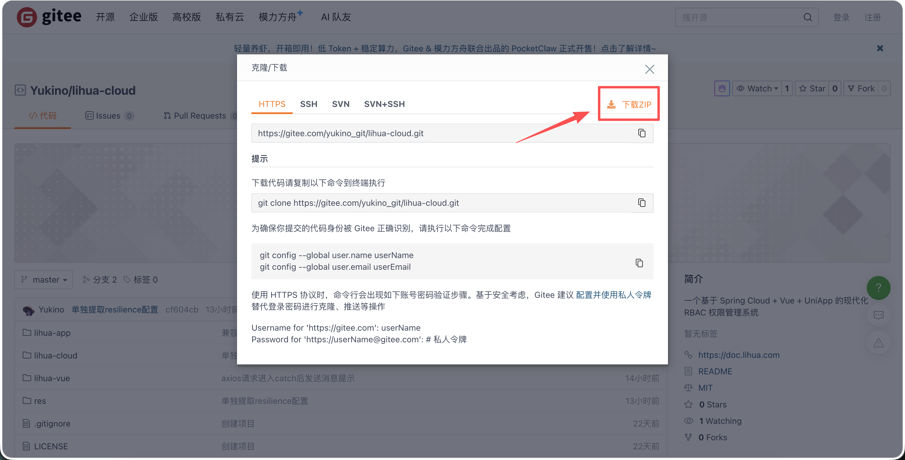

2. 下载后项目包含 web端、App端、服务端。使用 idea 打开后端服务

   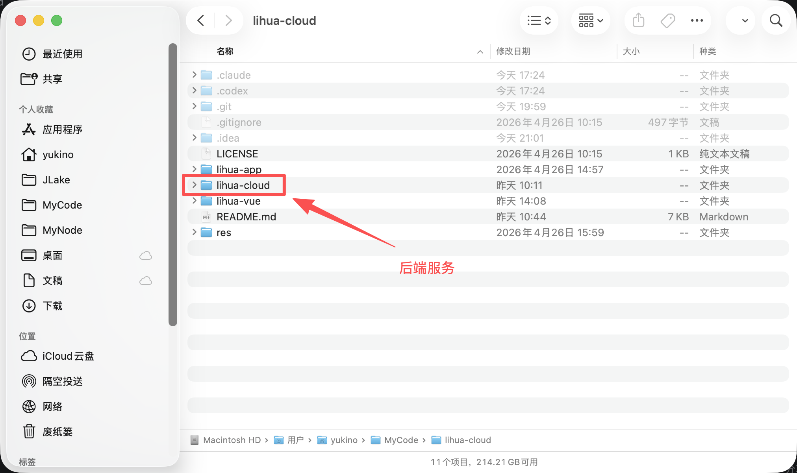

3. 使用IDEA打开 `lihua-cloud`

   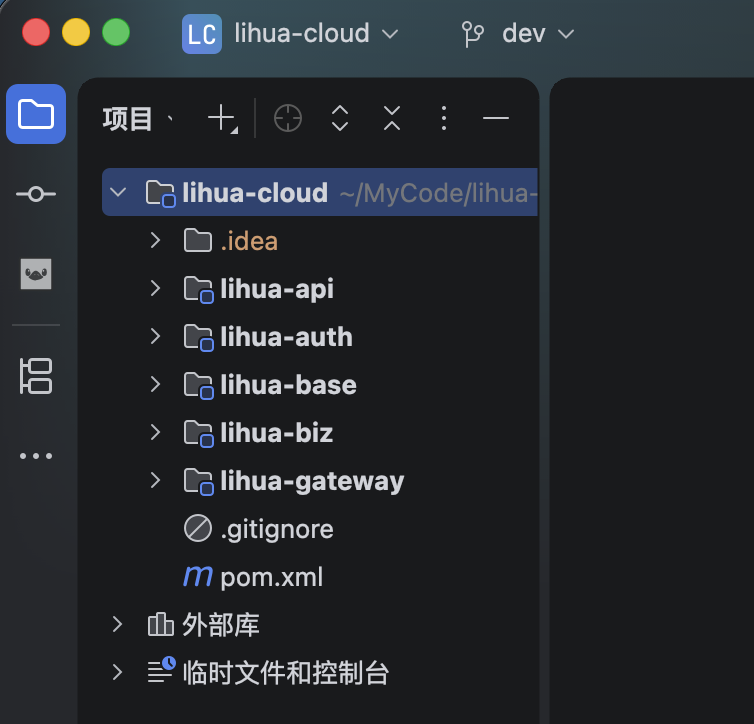

   

## 导入数据库脚本

1. 新建数据库

   以Navicat为例，找到连接的MySQL数据库，右键新建数据库，输入数据库名称，字符集选择 `utf8mb4` 后点击确定

   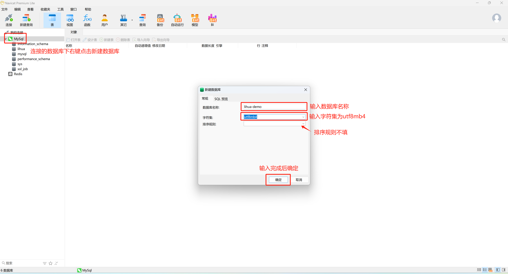

2. 导入SQL文件

   新建数据库后鼠标在新建的数据库上右键点击 “运行SQL文件” ，选择项目 `lihua-cloud/res/db/lihua.sql` 文件后点击开始

   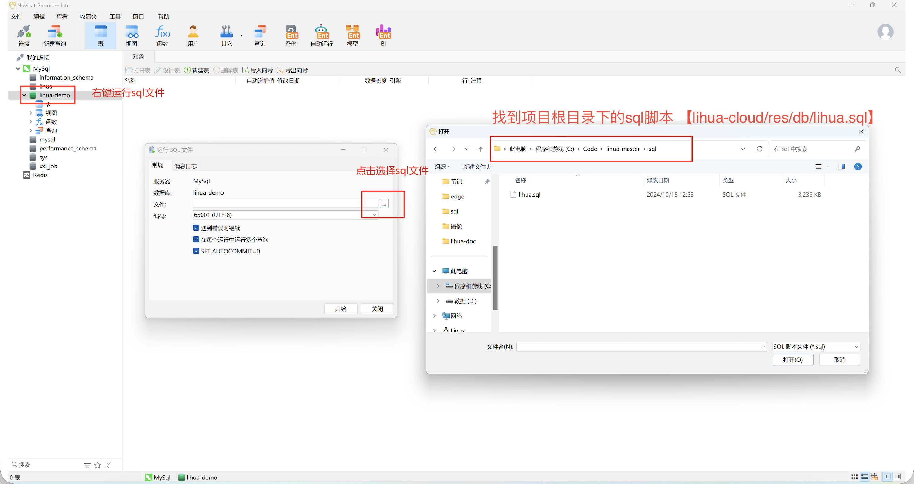


## 项目配置

### Nacos

1. 启动Nacos

   **默认已集成Docker环境** 终端运行下面docker命令

   ```
   docker run --name nacos-standalone-derby \
     -e MODE=standalone \
     -e NACOS_AUTH_ENABLE=true \
     -e NACOS_AUTH_TOKEN=QmVsb25nUmFuZG9tU2VjdXJlVG9rZW5TdHJpbmcxMjM0 \
     -e NACOS_AUTH_IDENTITY_KEY=nacos \
     -e NACOS_AUTH_IDENTITY_VALUE=nacos \
     -p 8080:8080 \
     -p 8848:8848 \
     -p 9848:9848 \
     -d nacos/nacos-server:latest
   ```

   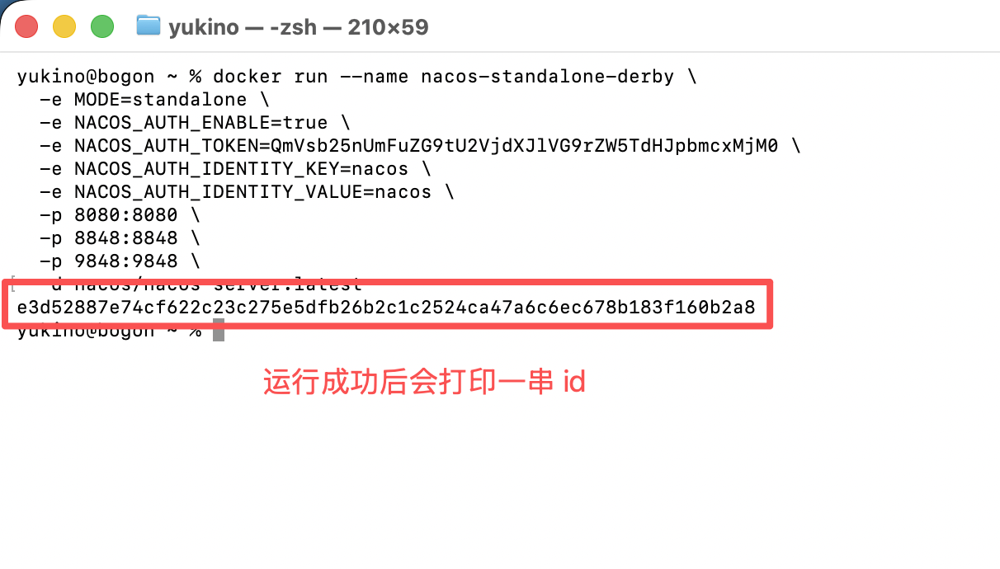

   

   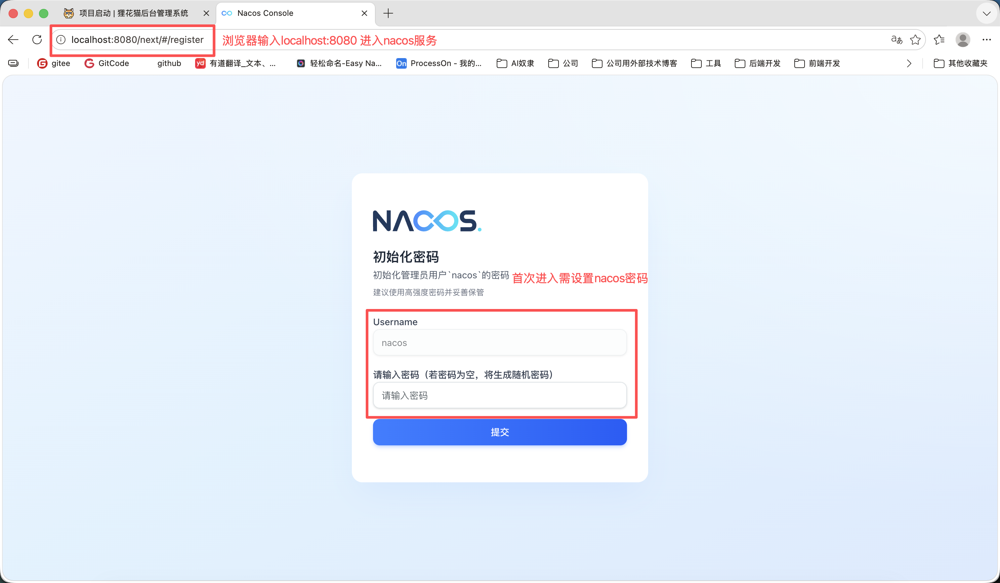

2. 创建命名空间，登录进系统后创建命名空间 **命名空间ID也需要设置为dev** 

   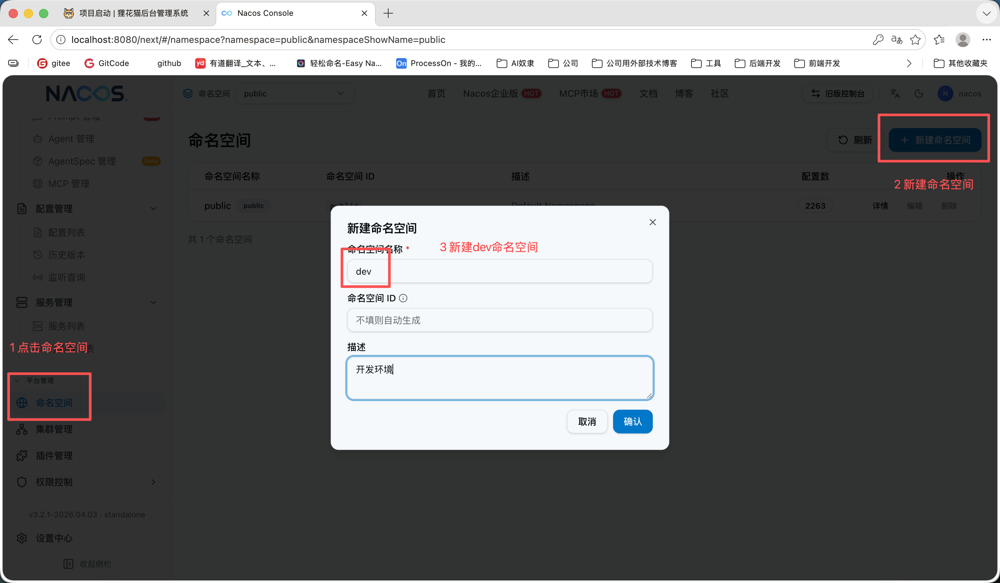

3. 导入配置，工程根路径 `lihua-cloud/res/nacos` 下 `nacos_config.zip` 导入到nacos

   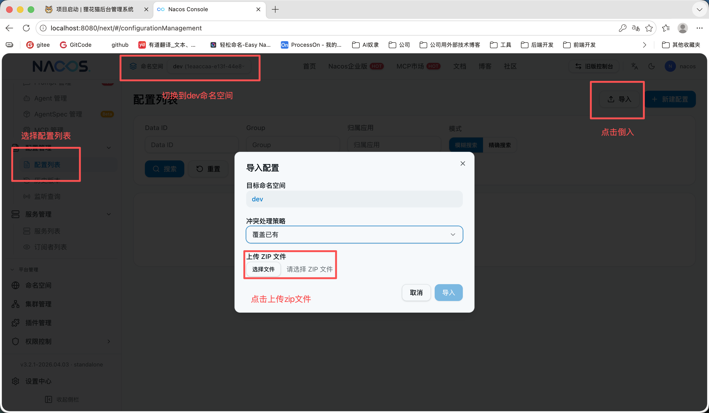

   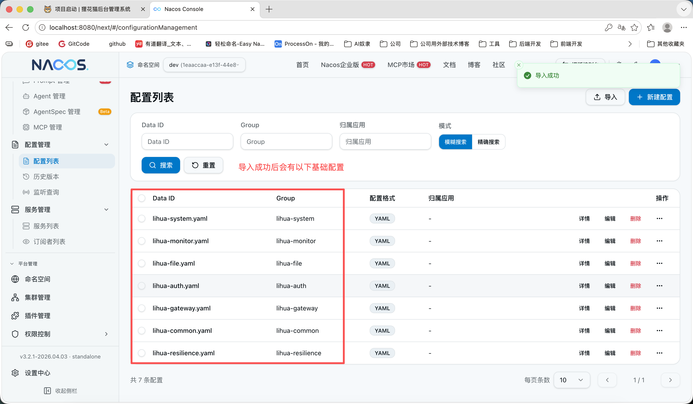


### 配置文件

1. 配置总揽，项目下有 `5` 个可启动服务，每个服务都包含 `application.yml` 配置文件

   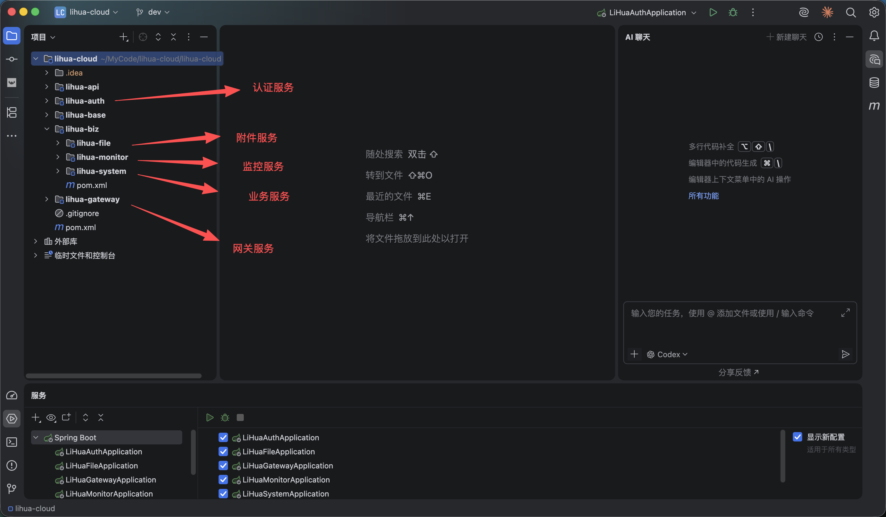

2. 本地配置包含nacos服务发现、配置中心和编码相关配置

   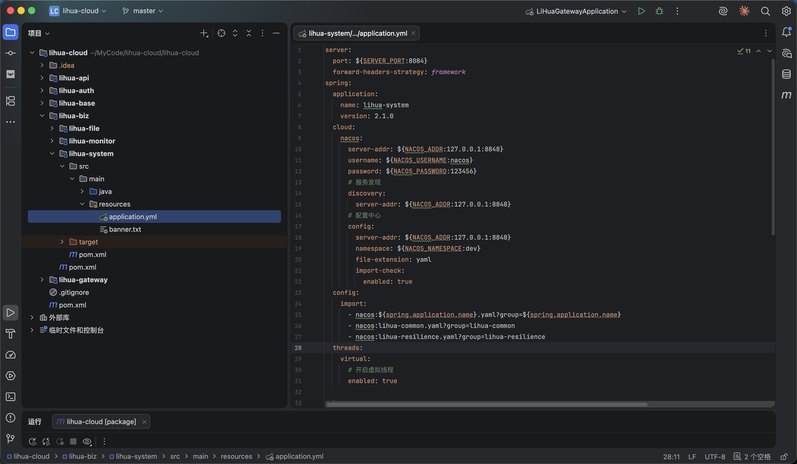

3. 微服务配置规范为

   - 配置文件名称：$\{serverName\}.yaml

   - 分组：$\{serverName\}

## 启动项目

> 需确保Mysql、Redis、Nacos启动中并连接正常

1. IDEA 可识别到微服务中各个服务，可右键一键启动。

   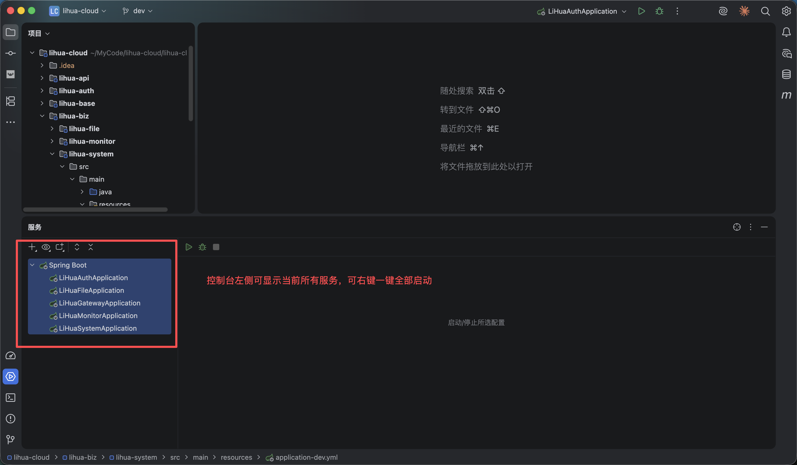

   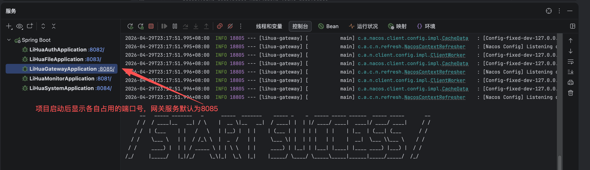

   

2. 浏览器输入 `http://localhost:8085/system/auth/onceToken`  返回 401 表示接口调用成功

   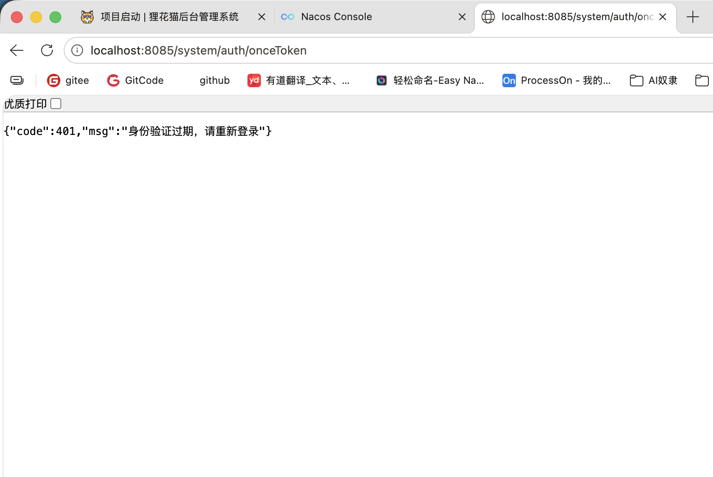
   
   
   
   nacos服务列表可以看到对应服务
   
   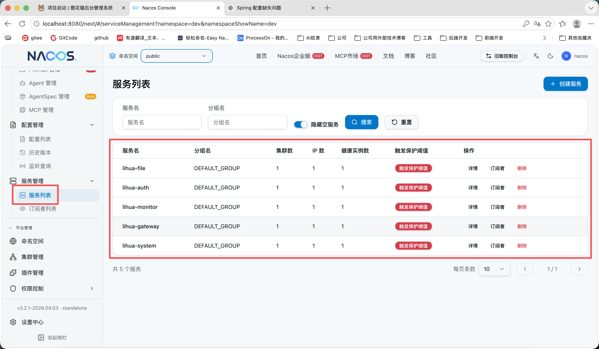


