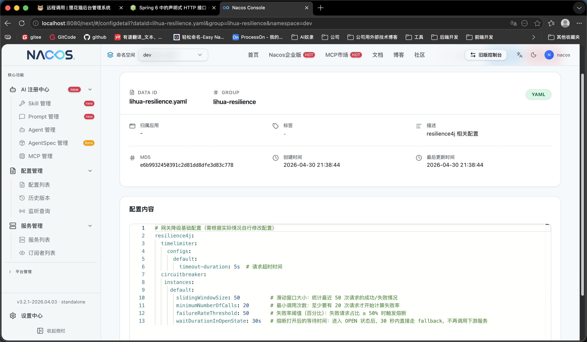

# 远程调用

> 远程调用模块位于 `lihua-api` 下，不同模块提供的远程调用接口在 `lihua-api` 下以子模块的形式维护。

## 目录结构

```
lihua-api/                                   # api层
└── lihua-api-system/                        # 系统模块 API 子模块
    └── src/
        └── main/
            └── java/
                └── com/lihua/api/system/
                    ├── client               # client接口，用于httpExchange接口定义
                    ├── facade               # client门面扩展，用于集成resilience4j治理
                    ├── model                # 远程调用相关的业务模型
```


## 实现方案

远程调用使用  [HTTP Interface](https://springdoc.cn/spring-6-http-interface/) 此方案同时支持 `同步` 与 `异步` 调用。官方示例中每个接口需要单独注册对应的Client客户端，本项目将这一过程进行封装简化，项目启动时自动扫描创建，使用过程与OpenFeign一样丝滑。


## 自定义注解 @RemoteClient

`HTTP Interface` 只是一个客户端工具，并没有集成远程调用相关业务功能，本项目在集成时进行了一定的服务发现扩展。使用自定义注解 `@RemoteClient` 可指定服务名，用于服务发现和负载均衡的远程调用地址切换和同步异步方法的指定。

``` java
// serverName 为服务名称
// executionMode 指定同步/异步调用，默认同步
@RemoteClient(serverName = "lihua-system", executionMode = ExecutionModeEnum.ASYNC)
@HttpExchange("system/log")
public interface SysLogClient {

    /**
     * 保存操作日志
     */
    @PostExchange("operate/insert")
    Mono<ApiResponseModel<String>> insertOperate(@RequestBody LogModel logModel);

    /**
     * 保存登录日志
     */
    @PostExchange("login/insert")
    Mono<ApiResponseModel<String>> insertLogin(@RequestBody LogModel logModel);
}
```

设置执行模式为 `executionMode = ExecutionModeEnum.ASYNC` 后，远程调用接口返回值为 `Mono<ApiResponseModel<T>>`

## 服务治理

HTTP Interface 没有提供OpenFeign类似的简单服务治理方案，项目集成了 `resilience4j` 在 `facade` 包下统一处理服务治理，业务服务可直接调用相关Facade类提供的方法进行远程调用，无需在业务层关注服务治理相关逻辑。

``` java

/**
 * 系统日志相关远程调用
 */
@Component
@Slf4j
public class SysLogClientFacade {

    @Resource
    private SysLogClient sysLogClient;

    /**
     * 保存操作日志
     */
    @CircuitBreaker(name = "sysLog", fallbackMethod = "logFallback")
    public Mono<ApiResponseModel<String>> insertOperate(LogModel logModel) {
        return sysLogClient.insertOperate(logModel);
    }

    /**
     * 保存登录日志
     */
    @CircuitBreaker(name = "sysLog", fallbackMethod = "logFallback")
    public Mono<ApiResponseModel<String>> insertLogin(LogModel logModel) {
        return sysLogClient.insertLogin(logModel);
    }


    public Mono<ApiResponseModel<CurrentUser>> logFallback(LogModel logModel, Throwable throwable) {
        log.error("远程调用异常, 请求参数{}", logModel, throwable);
        return Mono.error(throwable);
    }

```


Nacos 配置中提供了基础的resilience4j配置，详细配置许根据业务情况自行调整。

**此配置可立即生效**


