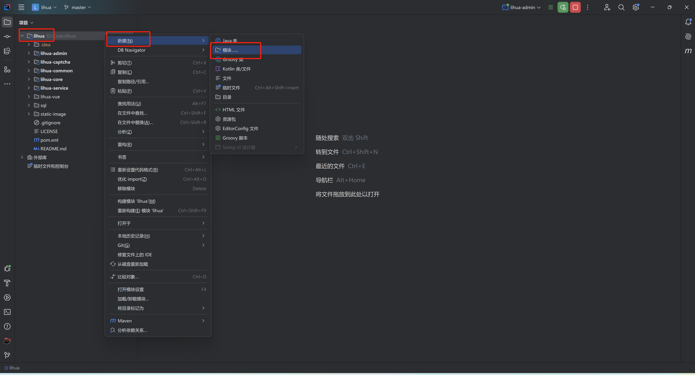
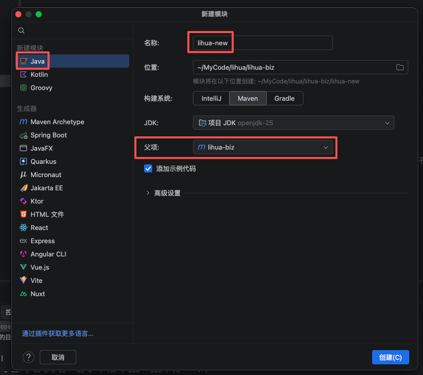
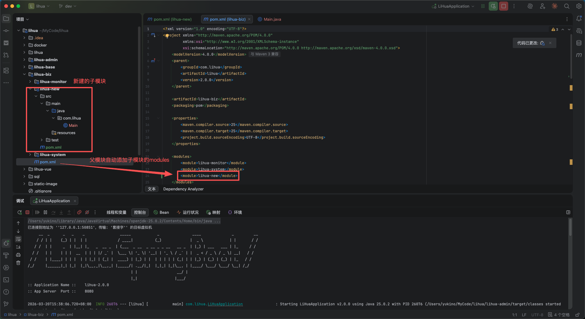
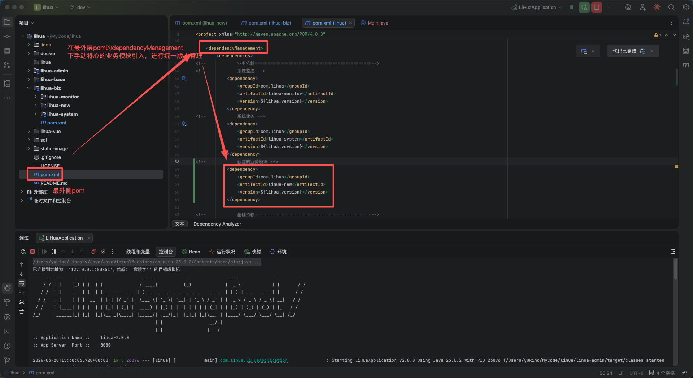
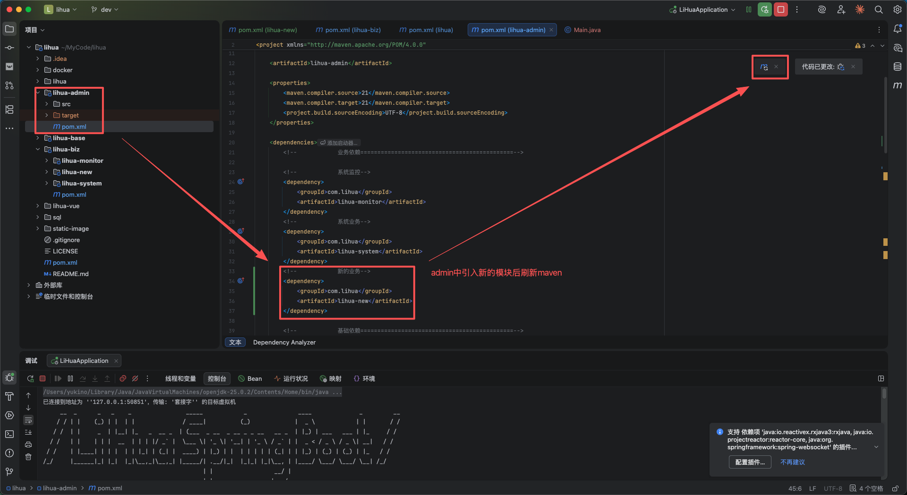
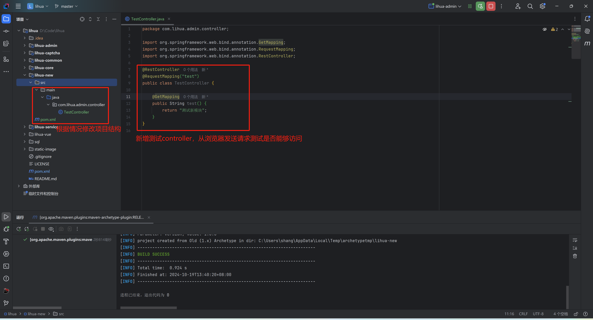
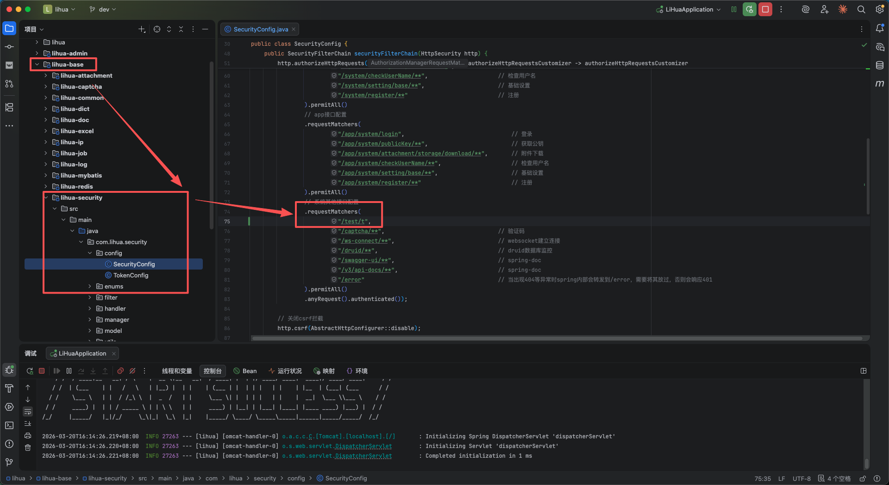
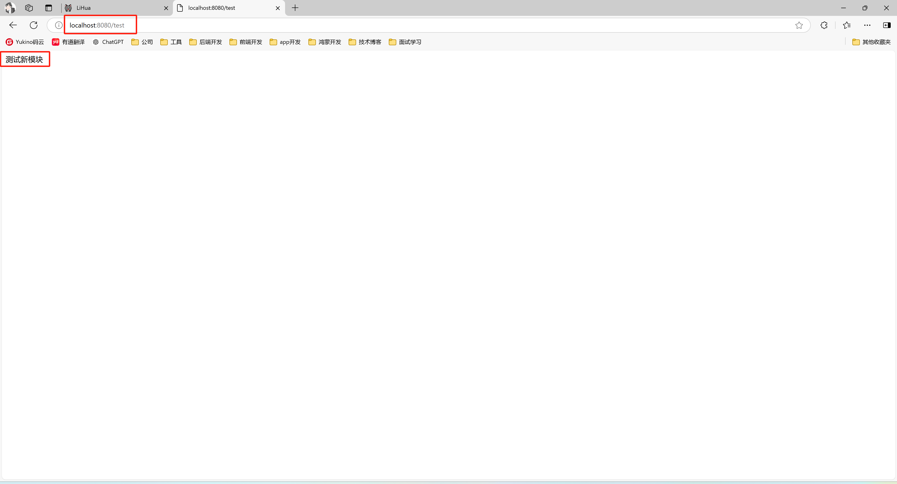

# 新增子模块

> 2.0 版本中，子模块按模块类型划分，并分别归属到对应父模块下进行维护。

- `lihua-biz`：业务模块，面向具体业务场景，对外提供接口能力（可被前端直接调用）
- `lihua-base`：基础模块，提供通用能力与底层实现，供 `lihua-biz` 依赖使用

---

**以lihua-biz为例**
1. 使用IDEA新建子模块，在项目`目录右键->新建->模块`

   

2. 选择左侧 Java，填好名称，构建系统选择Maven，选择父项目为 `lihua-biz` 点击创建

   

3. 创建后可以看到新模块目录结构，根据需求可自行修改。创建完成后父级pom会自动添加新模块的module信息

   

4. 在最外层pom的dependencyManagement下，手动将新的业务模块引入，进行统一版本管理

   

5. `lihua-admin` 中添加新模块的依赖，`lihua-admin` 中包含系统启动类，需在此模块下引入系统所有模块（经过上一步后，无需填写依赖版本），引入完成后刷新Maven

   

6. 测试，新建测试 controller，验证请求是否能进入

   

7. 默认没有携带 `token` 的请求会被 `SpringSecurity` 拦截，可在 `lihua-base` - `lihua-security` - `com/lihua/security/config/SecurityConfig.java` 下新增临时白名单

   

8. 测试完成，通过url后端返回非401就表示测试成功了

   