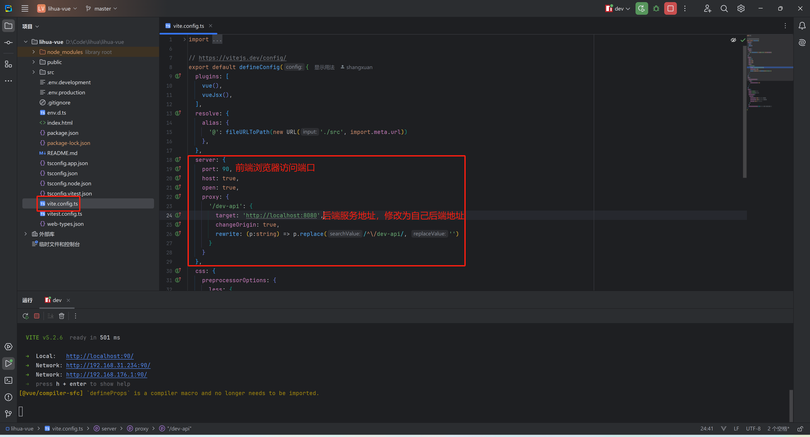

# 项目启动

## 前期准备

- 开发环境：[node 20+](https://nodejs.cn/download/)
- 开发工具：[WebStorm](https://www.jetbrains.com.cn/webstorm/)

## 拉取项目代码

1. 前端项目与后端在同一工程下参考后端[拉取项目代码](/doc-server/basic/start.html#拉取项目代码)，前端代码在`lihua/lihua-vue `中

2. 使用WebStorm打开项目中的 `lihua-vue` 工程

   

## 安装依赖

1. 找到项目中 `README.md` 文件后点击安装依赖下的小箭头或其他操作

   

   ::: info 出现依赖下载失败时可尝试以下操作

   清空缓存 `npm cache clear --force`

   切换镜像仓库 `npm config set registry https://registry.npmmirror.com/`

   执行依赖安装 `npm install`

   :::

## 修改配置

1. 修改配置文件，找到项目中 `vite.config.ts` 文件，修改 `server` 下 `port` 和 `proxy（重点）`

   

## 启动项目

1. 启动项目，依赖安装完成后点击开发模式启动或控制台输入 `npm run dev` 即可执行启动命令

   

2. 启动完成，启动完成后浏览器会自动打开页面，默认账号密码为 `admin` / `admin123`

   