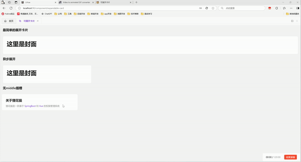

# 可展开卡片

仪表盘页面用来展示概述和详情时使用

小卡片展示汇总数据，展开后大卡片展示明细/历史/详细数据

## 组件效果

可以展开/收回的卡片组件，类似手机小组件，提供从哪来回哪去的卡片展示效果，支持页面任意缩放


### 基础用法

引入组件`import ExpandableCard from '@/components/expandable-card/index.vue'` 后使用`overview` `middle` `detail` 实现最简单的展开卡片


```vue
<template>
  <a-typography-title :level="4">最简单的展开卡片</a-typography-title>
  <expandable-card :expanded-height="600" :expanded-width="600" :hover-scale="1.01">
    <template #overview>
      <a-card>
        <a-typography-title>这里是封面</a-typography-title>
      </a-card>
    </template>
    <template #middle>
      <a-card style="width: 100%" :bordered="false">
        <a-typography-title>这里是过渡</a-typography-title>
        <a-typography-title>这里是过渡</a-typography-title>
        <a-typography-title>这里是过渡</a-typography-title>
      </a-card>
    </template>
    <template #detail>
      <a-card>
        <a-typography-title>这里是展开</a-typography-title>
      </a-card>
    </template>
  </expandable-card>
</template>

<script setup lang="ts">
import ExpandableCard from '@/components/expandable-card/index.vue'
</script>
```

### 异步展开

设置`:auto-complete="false"` 后通过`is-complete`属性来控制卡片是否展开，通常配合异步请求，结果返回后展示详情卡片。通过`before-card-expand`和`after-card-close`来控制`loadSuccess`的值


```vue
<template>
  <a-typography-title :level="4">异步展开</a-typography-title>
    <expandable-card :expanded-height="600"
                     :expanded-width="600"
                     :hover-scale="1.01"
                     :auto-complete="false"
                     :is-complete="loadSuccess"
                     @before-card-expand="handleCardClick"
                     @after-card-close="handleCardReady"
                     style="width: 30%"
    >
      <template #overview>
        <a-card>
          <a-typography-title>
            这里是封面
          </a-typography-title>
        </a-card>
      </template>
      <template #middle>
        <a-card style="width: 100%;">
          过渡状态持续1.5s后展示展开卡片
        </a-card>
      </template>
      <template #detail>
        <a-card>
          <a-typography-title>
            这里是展开
          </a-typography-title>
        </a-card>
      </template>
    </expandable-card>
</template>

<script setup lang="ts">
import ExpandableCard from '@/components/expandable-card/index.vue'
import {ref} from "vue";
// 控制卡片是否切换到展开状态
const loadSuccess = ref<boolean>(false)
// 处理点击卡片模拟异步请求
const handleCardClick = () => {
  setTimeout(() => {
    loadSuccess.value = true
  }, 1500)
}
// 关闭卡片
const handleCardReady = () => {
  loadSuccess.value = false
}
</script>
```

### 无middle插槽

不使用`middle`插槽，会直接使用detail进行中间过渡，适合纯静态detail并detail中元素不多的场景



```vue
<template>
  <a-typography-title :level="4">无middle插槽</a-typography-title>
  <a-row>
    <a-col :span="6">
      <expandable-card
          style="width: 100%"
          :hover-scale="1.03"
          :expanded-width="600"
          :expanded-height="610"
          :middle-style="{'background':themeStore.$state.isDarkTheme ? '#141414': '#fff','background-size': 'contain','border-radius':' 8px'}"
      >
        <template #overview>
          <a-card :body-style="{height: '100px'}" class="card-background">
            <a-typography-title :level="4" ellipsis>关于狸花猫</a-typography-title>
            <a-typography-text ellipsis type="secondary">
              <a-typography-text type="secondary">狸花猫是一款基于</a-typography-text>
              <a-typography-text :style="{color:themeStore.getColorPrimary()}"> SpringBoot </a-typography-text>
              <a-typography-text type="secondary">和</a-typography-text>
              <a-typography-text :style="{color:themeStore.getColorPrimary()}"> Vue </a-typography-text>
              <a-typography-text type="secondary">的权限管理系统</a-typography-text>
            </a-typography-text>
          </a-card>
        </template>
        <template #detail>
          <a-card class="card-background" id="test">
            <a-typography-title :level="4" ellipsis>关于狸花猫</a-typography-title>
            <a-typography-text ellipsis type="secondary">
              <a-typography-text type="secondary">狸花猫是一款基于</a-typography-text>
              <a-typography-text :style="{color:themeStore.getColorPrimary()}"> SpringBoot </a-typography-text>
              <a-typography-text type="secondary">和</a-typography-text>
              <a-typography-text :style="{color:themeStore.getColorPrimary()}"> Vue </a-typography-text>
              <a-typography-text type="secondary">的权限管理系统</a-typography-text>
            </a-typography-text>
            <div class="scrollbar" style="height: 484px;margin-top: 16px;overflow-x: hidden">
              <a-typography-title :level="5">
                为什么叫狸花猫
              </a-typography-title>
              <a-typography-title :level="5">
                系统功能
              </a-typography-title>
              <a-typography-text>
                <p style="text-indent: 2em">
                  系统包含完整的基于角色控制的 RBAC 权限管理系统，包括菜单管理、角色管理和用户管理。此外，还提供部门和岗位管理，适用于大多数业务场景，用户支持多部门并可指定默认部门，前后端均提供接口获取用户的默认信息。
                </p>
              </a-typography-text>
              <a-typography-title :level="5">
                字典管理
              </a-typography-title>
              <a-typography-text>
                <p style="text-indent: 2em">
                  系统字典支持普通字典和树形字典，并提供工具类用于获取和翻译字典信息，前端还提供 dict-tag 组件，可以通过字典 value 直接展示字典 label，并自动匹配 tag 样式。
                </p>
              </a-typography-text>
              <a-typography-title :level="5">
                通知公告
              </a-typography-title>
              <a-typography-text>
                <p style="text-indent: 2em">
                  通知公告集成了 Vditor 富文本解析器，并使用 SSE 实现了消息的实时发送与接收。
                </p>
              </a-typography-text>
              <a-typography-title :level="5">
                个人中心
              </a-typography-title>
              <a-typography-text>
                <p style="text-indent: 2em">
                  个人中心支持个性化系统主题配置，支持主题、布局、导航等页面设置。
                </p>
              </a-typography-text>
              <a-typography-title :level="5">
                系统设置
              </a-typography-title>
              <a-typography-text>
                <p style="text-indent: 2em">
                  管理员角色用户可以对系统进行进一步配置，包括默认密码设置、定期修改密码、同账号登录限制、自助注册配置、验证码开关、IP 黑名单和灰色模式。
                </p>
              </a-typography-text>
              <a-typography-title :level="5">
                其他功能
              </a-typography-title>
              <a-typography-text>
                <p style="text-indent: 2em">
                  系统还提供了日志服务、在线用户监控、缓存监控、服务监控以及定时任务等功能。
                </p>
              </a-typography-text>
            </div>
          </a-card>
        </template>
      </expandable-card>
    </a-col>
  </a-row>
</template>
<script setup lang="ts">
import ExpandableCard from "@/components/expandable-card/index.vue";
import {useThemeStore} from "@/stores/theme.ts";
const themeStore = useThemeStore();
</script>
<style scoped>
.card-background {
  background-position-y: 10px;
  background-position-x: calc(100% - 10px);
  background-repeat: no-repeat;
  background-size: 36px 36px;
}
</style>
```

## API

### 属性

| 属性名称        | 描述                                                         | 类型    | 默认值 | 是否必填 |
| --------------- | ------------------------------------------------------------ | ------- | ------ | -------- |
| expandedWidth   | 展开后宽度                                                   | number  | -      | 是       |
| expandedHeight  | 展开后高度                                                   | number  | -      | 是       |
| expandedTop     | 展开后距离页面顶端像素                                       | number  | 100    | 否       |
| hoverScale      | 鼠标悬浮缩略卡片缩放倍率                                     | number  | 1.05   | 否       |
| autoComplete    | 中间过渡完成后自动切换到展开状态（异步调用时配合isComplete使用） | boolean | true   | 否       |
| isComplete      | 中间过渡完成后是否切换到展开状态（异步调用时配合autoComplete使用） | boolean | -      | 否       |
| isDetailVisible | 是否展示详情（设置为false后，无法点击卡片展开）              | boolean | true   | 否       |
| minWindowSpace  | 窗口缩小时的最小间距（窗口缩小到比展开卡片小时，卡片周围到浏览器视口的距离，类似margin） | number  | 16     | 否       |

### 插槽

| 插槽名称 | 描述                                                   | 是否必须 |
| -------- | ------------------------------------------------------ | -------- |
| overview | 卡片展开前显示的内容                                   | 是       |
| middle   | 卡片展开时显示的内容（没有使用该插槽默认以detail过渡） | 否       |
| detail   | 卡片展开后显示的内容                                   | 是       |

### 方法

| 方法名称         | 描述                                           | 参数                                |
| ---------------- | ---------------------------------------------- | ----------------------------------- |
| cardClick        | 点击小卡片触发                                 | detailVisible:boolean卡片是否可展开 |
| beforeCardExpand | 卡片展开前触发（卡片就绪状态下点击卡片触发）   | -                                   |
| afterCardExpand  | 卡片展开前触后（卡片展开完成后触发）           | -                                   |
| beforeCardClose  | 卡片关闭前触发（卡片展开状态下触发关闭时触发） | -                                   |
| afterCardClose   | 卡片关闭后触发（卡片关闭完成后触发）           | -                                   |
| onMouseEnter     | 鼠标移入卡片时触发                             | -                                   |
| onMouseLeave     | 鼠标移出卡片时触发                             | -                                   |