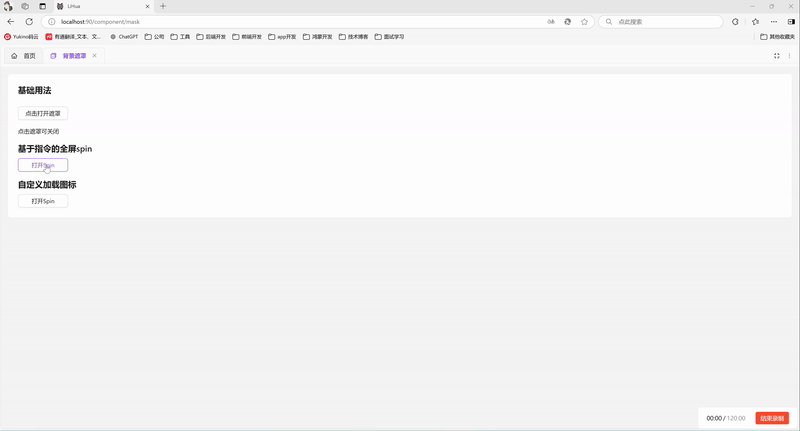

# 全屏遮罩

Mask 组件适合在自定义弹窗等组件中遮挡背景使用

Spin 适合在ts中进行耗时操作时加载动效缓解用户焦虑


## Mask遮罩基础用法

引入组件`import Mask from "@/components/mask/index.vue`后通过`show-mask`属性控制是否显示遮罩


```vue
<template>
  <a-typography-title :level="4">基础用法</a-typography-title>
  <a-button @click="showMask = true" style="width: 120px">点击打开遮罩</a-button>
  <a-typography-text>点击遮罩可关闭</a-typography-text>
  <Mask :show-mask="showMask" @click="showMask = false"/>
</template>

<script setup lang="ts">
import Mask from "@/components/mask/index.vue"
import {ref} from "vue";
const showMask = ref<boolean>(false)
</script>
```

## Spin基础用法

因`ant-design-vue官方spin组件`不支持通过服务方式调用，看到互联网大佬做了对应的实现后集成到了系统中

引入组件`import Spin from '@/components/spin'` 后通过`Spin.service()`可打开遮罩，返回spin实例，可调用关闭遮罩



```vue
<template>
  <div>
    <a-typography-title :level="4">基于指令的全屏spin</a-typography-title>
    <a-button @click="openSpin" style="width: 120px">打开Spin</a-button>
  </div>
</template>

<script setup lang="ts">
import Spin from '@/components/spin';
// 打开全屏加载并在1.5s后关闭
const openSpin = () => {
  const spin = Spin.service({
    tip: '1.5秒后关闭',
  })
  setTimeout(() => {
    spin.close()
  },1500)
}
</script>
```

## Spin修改加载图标

Spin组件支持官方属性，参考ant-design-vue官方文档可进行调整


```vue
<template>
  <div>
    <a-typography-title :level="4">自定义加载图标</a-typography-title>
    <a-button @click="openSpin" style="width: 120px">打开Spin</a-button>
  </div>
</template>

<script setup lang="ts">
import Spin from '@/components/spin';
import {LoadingOutlined} from "@ant-design/icons-vue";
import { h } from 'vue';
const indicator = h(LoadingOutlined, {
  style: {
    fontSize: '24px',
  },
  spin: true,
});
// 打开全屏加载并在1.5s后关闭
const openSpin = () => {
  const spin = Spin.service({
    tip: '1.5秒后关闭',
    indicator: indicator,
  })
  setTimeout(() => {
    spin.close()
  },1500)
}
</script>
```

## API

### Mask属性

| 属性名称 | 描述     | 类型    | 默认值 | 是否必填 |
| -------- | -------- | ------- | ------ | -------- |
| showMask | 显示遮罩 | boolean | -      | 是       |
| zIndex   | 层级     | number  | 1000   | 否       |

### Mask方法

| 方法名称 | 描述           | 参数                                 |
| -------- | -------------- | ------------------------------------ |
| click    | 点击遮罩时触发 | KeyboardEvent \| MouseEvent , 'mask' |

### Spin属性

| 属性名称         | 描述                                   | 类型                      | 默认值  | 是否必填 |
| ---------------- | -------------------------------------- | ------------------------- | ------- | -------- |
| tip              | 显当作为包裹元素时，可以自定义描述文案 | string \| slot            | -       | 否       |
| delay            | 延迟显示加载效果的时间（防止闪烁）     | number                    | -       | 否       |
| indicator        | 加载指示符                             | vNode\|slot               | -       | 否       |
| spinning         | 是否为加载中状态                       | boolean                   | true    | 否       |
| wrapperClassName | 包装器的类属性                         | string                    | -       | 否       |
| size             | 组件大小                               | small \| default \| large | default | 否       |

详见[官方文档](https://antdv.com/components/spin-cn#api)

### Spin实例

| 方法名称 | 描述     |
| -------- | -------- |
| close()  | 关闭Spin |