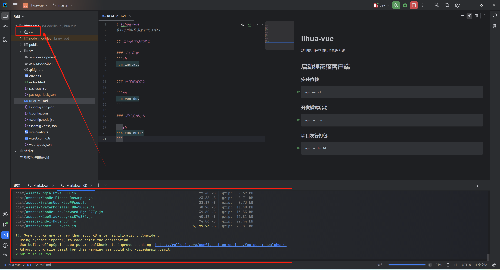
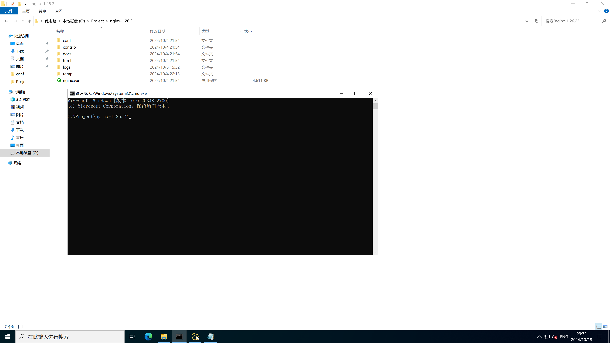
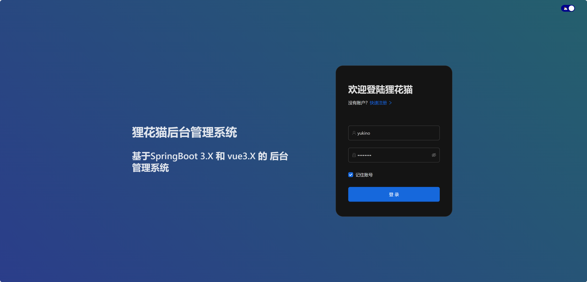

# 打包部署

> 后端 spring boot 集成了 tomcat 服务器，部署相对简单一些，前端部署需要 nginx 进行反向代理，需要对 nginx 进行配置并启动

## 项目打包

1. 找到README.md ，点击项目发行打包下的小三角，或控制台输入`npm run build` 进行项目打包

   

2. 打包完成，打包命令执行完成后控制台会显示 `built in time` 并且项目中会生成 `dist` 目录，将此目录交给 nginx 反向代理即可

   

## 配置Nginx

1. 配置 nginx

   下载 nginx 解压后找到 `nginx-version/conf/nginx.conf` 进行编辑配置

   

   参考 nginx 配置，重点关心：

   - `listen`：指定监听端口号
   - `location /`：前端代理
   - `root` ：dist所在服务器的绝对路径
   - `location /prod-api/`：prod-api/ 为前端工程`.env.production` 中定义的 api 前缀，一般无需改动
   - `proxy_pass`：指定后端服务地址路径（地址最后需带有/）
   - `location /prod-api/ ` 下的对象全部复制即可
   - `location /ws-connect` 下的对象全部复制即可

   ``` nginx
     server {
       listen       80;
       server_name  localhost;
     
       # 默认超时设置
       proxy_connect_timeout 30s;
       proxy_send_timeout 60s;
       proxy_read_timeout 60s;
     
       location / {
           root   C:/Project/lihua/dist;
           index  index.html index.htm;
           try_files $uri $uri/ /index.html;
       }
   
       # API代理配置
       location /prod-api/ {
           proxy_pass http://127.0.0.1:8080/; # 尾部斜线
           proxy_set_header Host $host;
           proxy_set_header X-Real-IP $remote_addr;
           proxy_set_header X-Forwarded-For $proxy_add_x_forwarded_for;
           proxy_set_header X-Forwarded-Proto $scheme;
           proxy_buffering on;
           proxy_buffer_size 4k;
           proxy_buffers 8 4k;
       }
     
       # WebSocket配置
       location /ws-connect {
           proxy_pass http://127.0.0.1:8080; # 注意：这里不加斜线，保留路径
           proxy_http_version 1.1;
           proxy_set_header Upgrade $http_upgrade;
           proxy_set_header Connection "upgrade";
   
           proxy_set_header Host $host;
           proxy_set_header X-Real-IP $remote_addr;
           proxy_set_header X-Forwarded-For $proxy_add_x_forwarded_for;
           proxy_set_header X-Forwarded-Proto $scheme;
   
           # WebSocket需要长超时
           proxy_connect_timeout 7d;
           proxy_send_timeout 7d;
           proxy_read_timeout 7d;
           # WebSocket需要关闭缓冲
           proxy_buffering off;  
       }
   
       error_page   500 502 503 504  /50x.html;
       location = /50x.html {
           root   html;
       }
   }
   ```

2. 保存 nginx 配置，并启动服务

   > 回到nginx根目录下（有nginx.exe文件的目录）执行以下命令，执行报错先检查配置文件格式是否有问题

   

   - 保存修改配置

     ``` bash
     nginx -s reload
     ```

   - 启动nginx

     ``` bash
     start nginx
     ```

   - 停止nginx（需要时执行）

     ``` bash
     nginx -s stop
     ```

   3. 启动成功

      执行 `start nginx` 窗口会一闪而过，浏览器访问配置的地址，显示登录页即启动成功

      