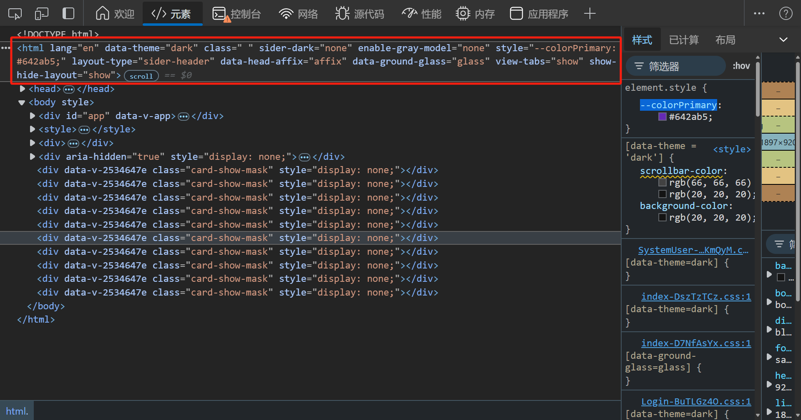

# 系统主题

可获取当前是否处于暗色模式、布局类型、主题颜色等，方便自定义组件的适配


## 在组件中获取主题

通过`useThemeStore.$state` 可获取当前主题信息

> 其中主题颜色获取需通过 `antColorPrimary` 属性进行获取，或调用`actions` 下`getColorPrimary()` 方法进行获取
>
> `colorPrimary` 属性的颜色再暗色模式下没有经过 ant design 的算法调整，会出现色号和全局不统一的问题

``` vue
<script setup lang="ts">
// 导入 useThemeStore
import {useThemeStore} from "@/stores/theme.ts";
const themeStore = useThemeStore();
// 当前是否处于暗色模式
const isDark = themeStore.$state.isDarkTheme
// 通过方法获取当前主题颜色
const colorPrimary = themeStore.getColorPrimary()
// 获取布局类型
const layoutType = themeStore.$state.layoutType
</script>
```

主题定义state如下

``` typescript
state() {
    /**
     * 暗色模式
     */
    const isDarkTheme: boolean = settings.isDarkTheme

    /**
     * 跟随系统主题
     */
    const followSystemTheme: boolean = settings.followSystemTheme

    /**
     * 布局类型 side-navigation / mix-navigation / top-navigation
     */
    const layoutType: string = settings.layoutType

    /**
     * 组件大小 small/ middle / large
     */
    const componentSize: string = settings.componentSize

    /**
     * 菜单分组
     */
    const siderGroup: boolean = settings.siderGroup

    /**
     * 主要颜色
     * 组件中使用系统颜色不可直接取用该字段
     * 使用下面提供的getColorPrimary()方法进行获取
     */
    const colorPrimary: string = settings.themeConfig.token.colorPrimary

    /**
     * 通过ant提供的theme的主要颜色，针对暗色模式进行了颜色调整
     */
    const antColorPrimary: string = settings.themeConfig.token.colorPrimary

    /**
     * 磨砂玻璃效果
     */
    const groundGlass: boolean = settings.groundGlass

    /**
     * 固定头部
     */
    const affixHead: boolean = settings.affixHead

    /**
     * 显示多窗口标签
     */
    const showViewTabs: boolean = settings.showViewTabs

    /**
     * 显示页脚
     */
    const showFooter: boolean = settings.showFooter

    /**
     * 侧边颜色 light / dark
      */
    const siderTheme: string = settings.siderTheme

    /**
     * 侧边宽度
     */
    const siderWith: number = settings.siderWith

    /**
     * 是否为小尺寸窗口
     */
    const isSmallWindow: boolean = false

    /**
     * 原侧边宽度，用于调整侧边栏时保存临时变量
     */
    const originSiderWith: number = settings.originSiderWith

    /**
     * 切换路由时的过渡动画 zoom / fade / breathe / top / down / switch / trick
     */
    const routeTransition: string = settings.routeTransition

    /**
     * 灰色模式
     */
    const grayModel: boolean = settings.grayModel

    /**
     * ant 主题配置
     */
    const themeConfig = settings.themeConfig

    /**
     * 是否从服务端加载完毕
     * 系统主题默认从settings中读取默认值，用户登录后会从服务器获取用户定义的主题信息
     * 当获取到服务器主题后会将此属性设置为 true
     */
    const isServerLoad = false

    return {
        layoutType,
        componentSize,
        showViewTabs,
        showFooter,
        isDarkTheme,
        followSystemTheme,
        colorPrimary,
        antColorPrimary,
        siderTheme,
        groundGlass,
        affixHead,
        isSmallWindow,
        siderGroup,
        siderWith,
        originSiderWith,
        routeTransition,
        grayModel,
        themeConfig,
        isServerLoad
    }
}
```

## 在css中获取主题

在dom元素html标签中，定义了若干自定义属性，用来标识各种主题属性



### 自定义属性

| 属性名称        | 属性描述                                                     |
| --------------- | ------------------------------------------------------------ |
| data-theme      | 全局主题模式（暗色模式：dark，亮色模式：light）              |
| ground-glass    | 是否开启毛玻璃模式（开启：enable）                           |
| footer          | 是否显示页脚（显示：show，隐藏：hide）                       |
| layout-type     | 导航类型（侧边导航：side-navigation，混合导航：mix-navigation，顶部导航：top-navigation） |
| head-affix      | 是否固定头部（固定：enable，不固定：disable）                |
| view-tabs       | 是否显示多任务标签（显示：show，隐藏：hide）                 |
| layout          | 是否显示Layout（显示：show，隐藏：hide）                     |
| is-small-window | 是否为小窗口模式（是：true，否：false）                      |

> 组件中使用属性选择器 `style` 标签不可添加 `scoped` 否则不会生效

``` css
[data-theme = 'dark'] {
    .scrollbar, .sider-scrollbar {
        scrollbar-color: rgb(66,66,66) transparent;
    }
}
[sider-dark = 'dark'] {
    .sider-scrollbar {
        scrollbar-color: rgb(66,66,66) transparent;
    }
}
```

### css 变量

| 变量名         | 变量描述                                        |
| -------------- | ----------------------------------------------- |
| --colorPrimary | 当前主题颜色（经由ant算法处理，已适配暗色模式） |

``` css
.icon-group:hover {
	background: var(--colorPrimary);
}
```


更多css变量在 `src/static/css/variable.css` 中进行维护

``` css
/* 全局变量 */

/* 亮色模式变量 */
:root {
    /* ======================主题颜色 会由ts进行覆盖======================== */
    --colorPrimary: rgba(0, 0, 0, 0);

    /* ===============================模糊=============================== */
    --lihua-backdrop-filter-lg: saturate(180%) blur(20px);
    --lihua-backdrop-filter-md: saturate(180%) blur(12px);
    --lihua-backdrop-filter-sm: saturate(180%) blur(6px);

    /* =========================模糊状态下背景颜色========================= */
    --lihua-backdrop-filter-on-color: rgba(255,255,255,0.6);
    --lihua-backdrop-filter-off-color: rgba(255,255,255,1);

    /* ============================layout高度============================ */
    --lihua-layout-height: 48px;

    /* =========================layout头部元素间距========================= */
    --lihua-layout-head-space: 32px;

    /* =============================深色菜单============================== */
    --lihua-sider-dark-color: rgba(0,21,41);

    /* ===============================间距=============================== */
    --lihua-space-xs: 4px;
    --lihua-space-sm: 8px;
    --lihua-space-base: 16px;
    --lihua-space-lg: 24px;
    --lihua-space-xl: 32px;

    /* ===============================圆角=============================== */
    --lihua-radius-xs: 4px;
    --lihua-radius-sm: 8px;
    --lihua-radius-base: 16px;
    --lihua-radius-lg: 24px;

    /* ===============================字号=============================== */
    --lihua-font-size-xs: 12px;
    --lihua-font-size-sm: 14px;
    --lihua-font-size-base: 16px;
    --lihua-font-size-lg: 18px;
    --lihua-font-size-xl: 20px;
    --lihua-font-size-xxl: 24px;

    /* ===============================页脚=============================== */
    --footer-height: 24px;

    /* ==============================滚动条============================== */
    --lihua-scrollbar-thumb-color: rgb(227,227,227) transparent;
    --lihua-sider-scrollbar-thumb-color: rgb(66,66,66) transparent;

    /* ===============================阴影=============================== */
    /* layout阴影 */
    --lihua-layout-box-shadow:
            0 1px 2px 0 rgba(0, 0, 0, 0.03),
            0 1px 6px -1px rgba(0, 0, 0, 0.02),
            0 2px 4px 0 rgba(0, 0, 0, 0.02);
    /* 一般弹出层使用的阴影 */
    --lihua-secondary-box-shadow:
            0 6px 16px 0 rgba(0, 0, 0, 0.08),
            0 3px 6px -4px rgba(0, 0, 0, 0.12),
            0 9px 28px 8px rgba(0, 0, 0, 0.05);
    /* 一般容器阴影 */
    --lihua-box-shadow:
            0 2px 6px rgba(0, 0, 0, 0.08),
            0 6px 16px rgba(0, 0, 0, 0.06);

    /* ===============================背景颜色=============================== */
    --lihua-background-color-level-1: #f5f5f5;
    --lihua-background-color-level-2: #ffffff;
    --lihua-background-color-level-3: #fafafa;

    /* ===============================边框颜色=============================== */
    --lihua-border-color: #d9d9d9;

    /* ===============================悬浮颜色=============================== */
    --lihua-hover-color: rgba(0, 0, 0, 0.06);

    /* =============================输入框图标颜色============================= */
    --lihua-input-icon-color: rgba(0,0,0,0.25);

    /* ==============================透明度颜色============================== */
    --lihua-alpha-level-0: rgba(255,255,255,0);
    --lihua-alpha-level-1: rgba(255,255,255,0.04);
    --lihua-alpha-level-2: rgba(255,255,255,0.08);
    --lihua-alpha-level-3: rgba(255,255,255,0.3);
    --lihua-alpha-level-4: rgba(255,255,255,0.45);
    --lihua-alpha-level-5: rgba(255,255,255,0.65);
    --lihua-alpha-level-6: rgba(255,255,255,0.88);

    /* ==============================不同状态颜色============================== */
    --lihua-success-color: #52c41a;
    --lihua-warning-color: #faad14;
    --lihua-danger-color: #ff4d4f;

}

/* 暗色模式变量 */
[data-theme = 'dark'] {
    /* =========================模糊状态下背景颜色========================= */
    --lihua-backdrop-filter-on-color: rgba(20,20,20,0.6);
    --lihua-backdrop-filter-off-color: rgba(20,20,20,1);

    /* ==============================滚动条============================== */
    --lihua-scrollbar-thumb-color: rgb(66,66,66) transparent;
    --lihua-sider-scrollbar-thumb-color: rgb(66,66,66) transparent;
    /* ===============================阴影=============================== */
    /* layout阴影 */
    --lihua-layout-box-shadow:
            0 1px 2px 0 rgba(255, 255, 255, 0.03),
            0 1px 6px -1px rgba(255, 255, 255, 0.02),
            0 2px 4px 0 rgba(255, 255, 255, 0.02);
    /* 一般容器阴影 */
    --lihua-box-shadow:
            0 2px 6px rgba(0, 0, 0, 0.35),
            0 6px 16px rgba(0, 0, 0, 0.25);

    /* ===============================背景颜色=============================== */
    --lihua-background-color-level-1: #000000;
    --lihua-background-color-level-2: #141414;
    --lihua-background-color-level-3: #1e1e1e;

    /* ===============================边框颜色=============================== */
    --lihua-border-color: #424242;

    /* ===============================悬浮颜色=============================== */
    --lihua-hover-color: rgba(255, 255, 255, 0.06);

    /* =============================输入框图标颜色============================= */
    --lihua-input-icon-color: rgba(255,255,255,0.25);

    /* ==============================透明度颜色============================== */
    --lihua-alpha-level-0: rgba(0,0,0,0);
    --lihua-alpha-level-1: rgba(0,0,0,0.04);
    --lihua-alpha-level-2: rgba(0,0,0,0.08);
    --lihua-alpha-level-3: rgba(0,0,0,0.3);
    --lihua-alpha-level-4: rgba(0,0,0,0.45);
    --lihua-alpha-level-5: rgba(0,0,0,0.65);
    --lihua-alpha-level-6: rgba(0,0,0,0.88);

    /* ==============================不同状态颜色============================== */
    --lihua-success-color: #49aa19;
    --lihua-warning-color: #d89614;
    --lihua-danger-color: #dc4446;
}

[sider-dark = 'dark'] {
    /* ==============================滚动条============================== */
    --lihua-sider-scrollbar-thumb-color: rgb(66,66,66) transparent;
}
```

