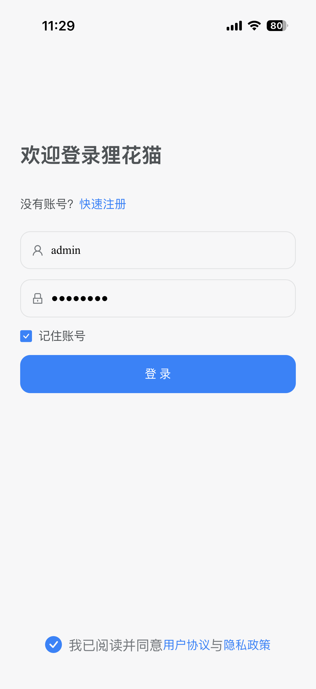
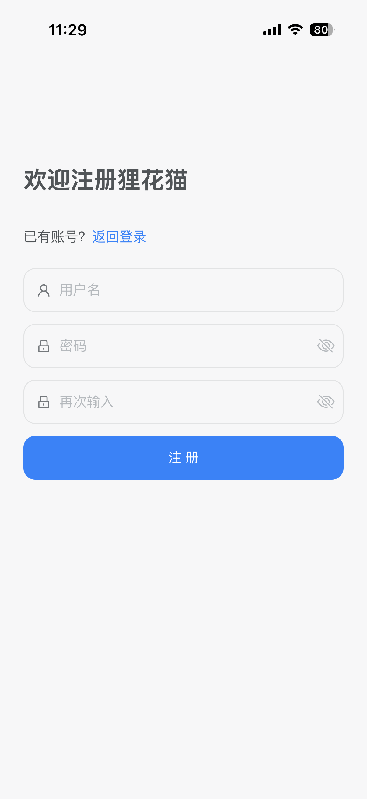
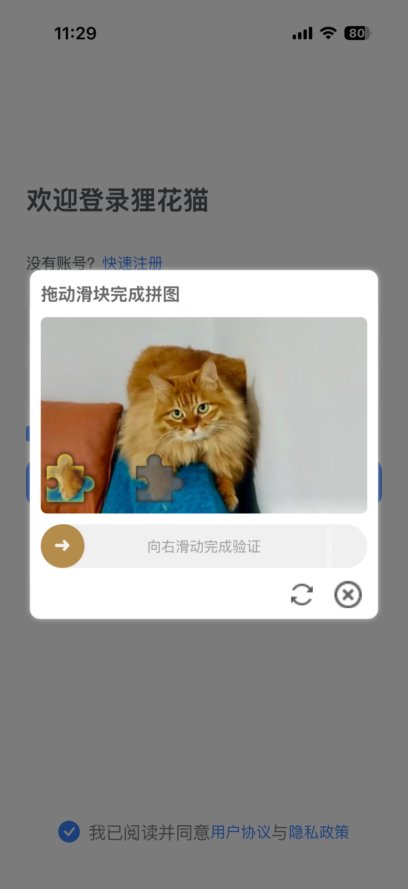
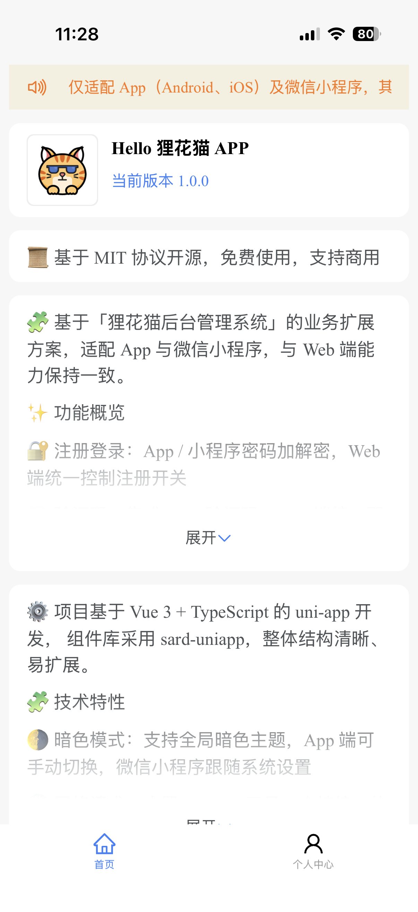
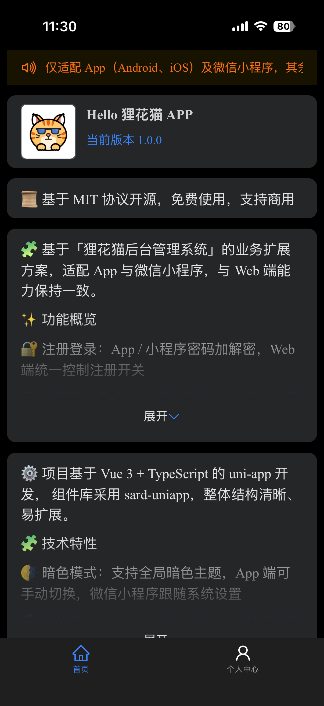
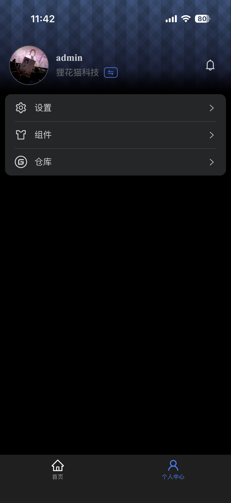

# Lihua App
**SpringBoot单体版 与 SpringCloud微服务版 可共用App端**

基于「狸花猫后台管理系统」的业务扩展方案，使用 **uni-app** 开发，适配 **App（Android、iOS、鸿蒙）与微信小程序**，并与 Web 端能力保持一致。


## ✨ 功能特性

- 🔐 **注册登录**：协议确认 + 图形验证码，Web 端统一控制注册开关，登录后待补全项自动进入设置向导
- 🧠 **验证码**：集成 tianai 验证码（滑块/旋转/拼图/点选），Web 端统一配置启用状态
- 👤 **个人中心**：头像、昵称等基础信息与后端保持一致
- 🛡️ **权限体系**：支持角色、权限、部门标识，`user store` 可直接获取
- 🔔 **通知公告**：WebSocket 实时消息推送，App 支持原生通知横幅与全局轻量通知抽屉
- 🌗 **暗色模式**：全端 `darkmode` 适配，App 端支持手动切换，其余平台跟随系统


## 🛠️ 技术特性

- 🔧 **基础框架**：uni-app（Vue 3 + TypeScript + Vite），CLI 工程方式，同时保留 HBuilderX 运行能力
- 🧱 **UI 组件库**：[sard-uniapp](https://sard.wzt.zone/sard-uniapp-docs/)，easycom 自动引入
- 🗂️ **状态管理**：内置 Pinia，统一管理全局状态，数据流清晰可维护
- 🌐 **网络请求**：基于 sard-uniapp Request 封装，支持请求 / 响应统一拦截处理
- 🧭 **路由管理**：基于 sard-uniapp Router 的路由封装，支持前置拦截与权限校验
- 🧩 **虚拟根组件**：集成 `@uni-ku/root`，模拟 Web 端全局根组件，集中处理全局逻辑
- 🔀 **平台分叉归一**：附件等平台差异逻辑收敛到 `utils/attachment/platform/` 域目录，业务层零感知


## 📦 下载体验（APK）

- 👉 [狸花猫 APP 下载](https://gitee.com/yukino_git/lihua-assets/releases/download/2.1.0/Lihua.apk)

::: info 提示
以上为历史版本安装包，最新版本请前往 [lihua-assets releases](https://gitee.com/yukino_git/lihua-assets/releases) 页面获取。
:::


## 🧩 组件库 & 关键依赖

- **UI 组件库**：[sard-uniapp](https://sard.wzt.zone/sard-uniapp-docs/)
- **虚拟根组件方案**：[Uni Ku Root](https://uni-ku.js.org/projects/root/introduction)
- **加解密**：crypto-js（记住密码 AES 加密）
- **日期处理**：dayjs；**工具库**：lodash-es


## 🖼️ 项目截图

::: info 部分截图

<div style="display:flex; flex-wrap:wrap; gap:8px;">
	
	
	
	
	
	
</div>
:::


## 📁 项目目录结构
项目采用cli方式创建
```text
├── .env.development                # 开发环境配置文件
├── .env.production                 # 生产环境配置文件
├── .hbuilderx/                     # HBuilderX 项目配置（可用 HBuilderX 运行）
├── .npmrc                          # npm 配置（legacy-peer-deps）
├── index.html                      # 入口 HTML 文件
├── package.json                    # 项目依赖与脚本配置
├── tsconfig.json                   # TypeScript 配置
├── vite.config.ts                  # Vite 配置文件（含 UniKuRoot 插件）
├── src/
│   ├── App.vue                     # 应用级根组件（全局生命周期、WebSocket 监听接线）
│   ├── AppRoot.vue                 # 虚拟根组件（@uni-ku/root）
│   ├── api/                        # API 接口定义（App 专用 /app 前缀接口）
│   ├── components/                 # 公共组件
│   ├── composables/                # 组合式函数
│   ├── constants/                  # 常量（公开路由表等）
│   ├── helpers/                    # 业务辅助（字典、通知、红点、令牌、向导）
│   ├── main.ts                     # 应用入口文件
│   ├── manifest.json               # 应用清单文件（darkmode、themeLocation）
│   ├── pages.json                  # 页面路由配置（含 easycom、分包、preloadRule）
│   ├── pages/                      # 主包页面视图
│   ├── router/                     # 路由封装与拦截逻辑
│   ├── static/                     # 静态资源（tabBar 图标、原生通知图等）
│   ├── stores/                     # Pinia 状态管理
│   ├── subpackages/                # 业务子包模块
│   ├── theme.json                  # 暗色模式主题变量映射
│   ├── types/                      # 全局类型声明
│   ├── uni.scss                    # 全局样式变量
│   └── utils/                      # 工具函数
│       └── attachment/             # 附件域工具
│           └── platform/           # 平台分叉实现（h5/app/mp 同签名导出）
```


## 📄 许可证

本项目采用 **MIT License** 开源协议，详情请查看 `LICENSE` 文件。
