# 项目启动

## 前期准备

- 开发环境：[node 20+](https://nodejs.cn/download/)
-  开发工具：[HbuilderX](https://www.dcloud.io/hbuilderx.html)
- 小程序开发工具：[微信开发者工具](https://developers.weixin.qq.com/miniprogram/dev/devtools/devtools.html) 

::: info 两种运行方式
项目为 **CLI 工程方式**（vite + @dcloudio/vite-plugin-uni），同时保留了 `.hbuilderx` 配置：

- **App 真机/基座（含鸿蒙）**：使用 HBuilderX 导入项目后运行（App 端推荐）
- **H5 / 微信小程序**：使用命令行 `npm run dev:h5` / `npm run dev:mp-weixin` 运行
:::

## 拉取项目代码

1. 3.0 起 App 端已拆分为独立仓库，前往 [lihua-app 仓库](https://gitee.com/yukino_git/lihua-app) 下载 master 分支代码，或直接执行 `git clone https://gitee.com/yukino_git/lihua-app.git`

   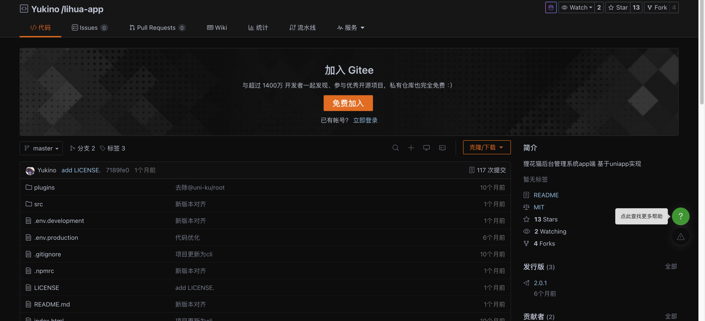

2. 使用 `HbuilderX` 导入克隆下的 `lihua-app` 项目源码（文件 → 导入 → 从本地目录导入）

   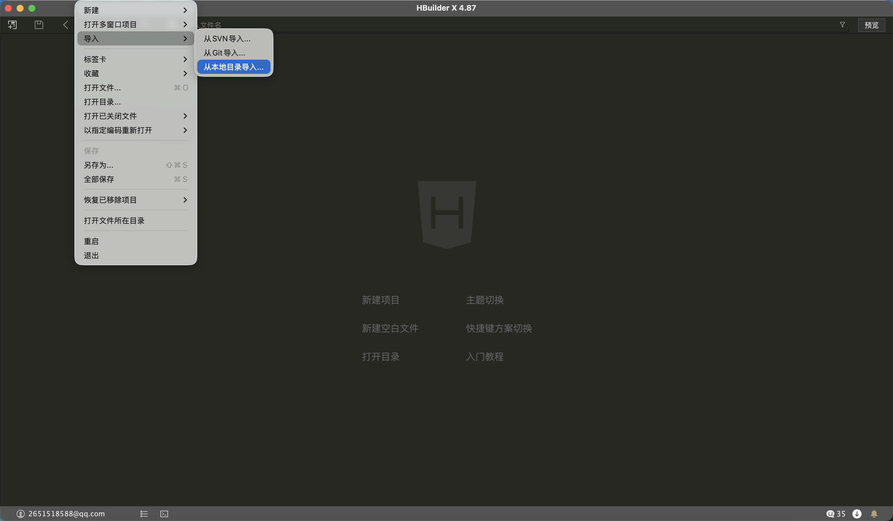

3. 导入后在终端执行`npm install`命令安装依赖（项目已通过 `.npmrc` 配置 `legacy-peer-deps=true`，无需额外参数）

   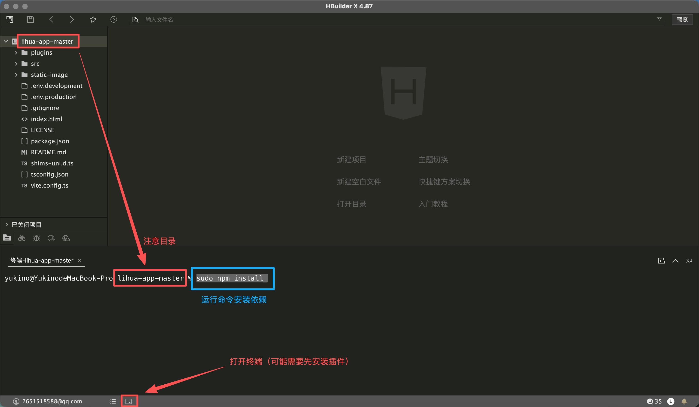

   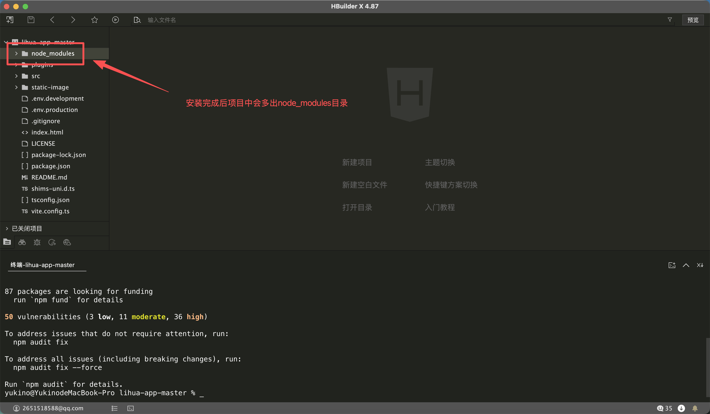

## 基础配置

> 请确保狸花猫后台已正常启动，填写正确的ip及端口 [后台启动教程](/3.0/doc-server/basic/overview)

1. 找到项目下`.env.development` 环境变量配置，根据自己后台情况配置 `VITE_APP_BASE_API`（后台接口地址）和 `VITE_APP_WS_API`（websocket地址）

   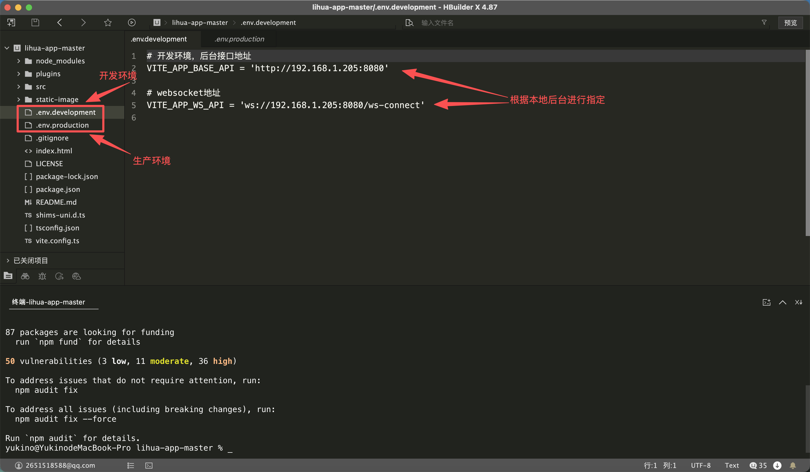

2. 在项目目录`src/manifest.json`中 `基础配置` 获取Uniapp的AppId

   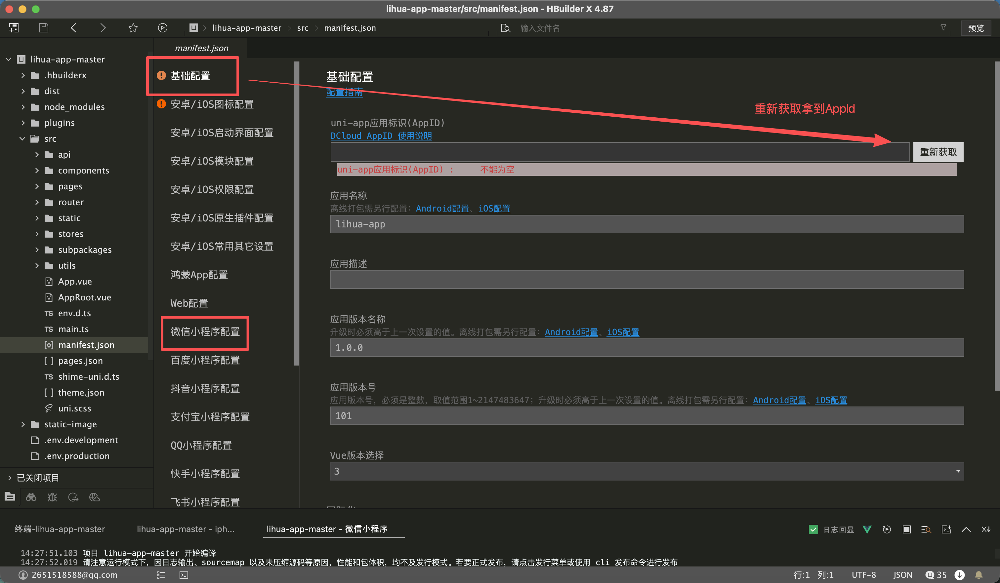

   

## 运行

> 本项目适配 App（Android、iOS、鸿蒙）与微信小程序，其余平台请自行测试

### 运行到App

> 运行到iOS基座需要 Apple 颁发的证书及签名，[详见](https://uniapp.dcloud.net.cn/tutorial/run/ios-apple-certificate-signature.html)

1. HbuilderX `运行` ` 运行到手机或模拟器` ` 运行到安卓或iOS App基座`

   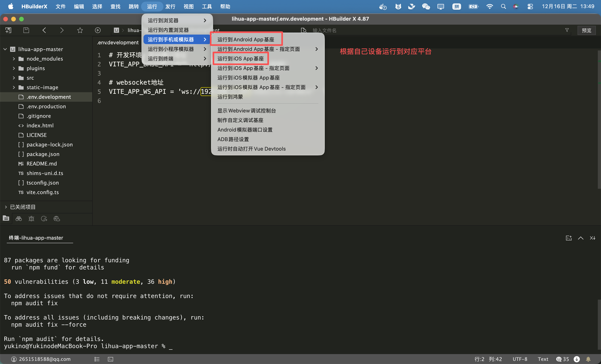

2. 手机使用数据线连接电脑（安卓需要打开开发者模式，开启usb调试）找到自己的手机，选择基座类型后点击运行

   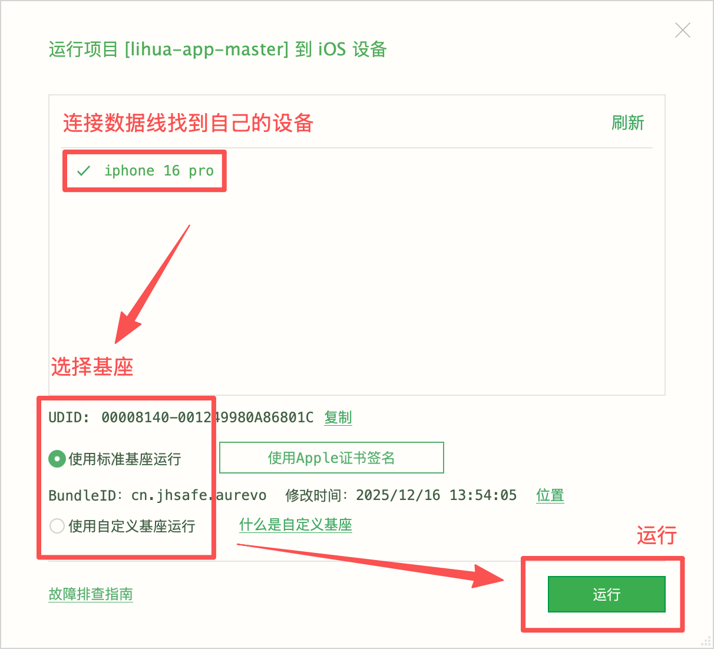

3. 编译完成后控制台会打印项目已启动，手机上会出现对应app

   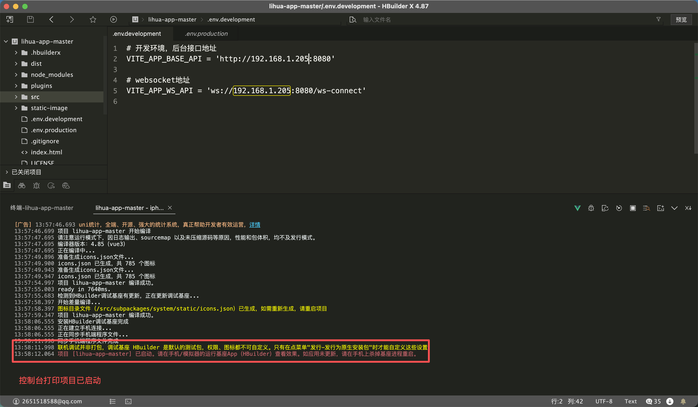

4. 打开App显示此页面即启动成功

   ::: info 如显示 连接服务器失败，点击重试 则表示**后台服务未启动**或**.env**配置有误

   

       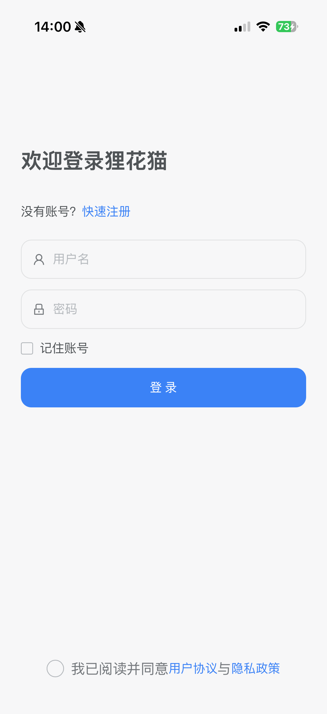
       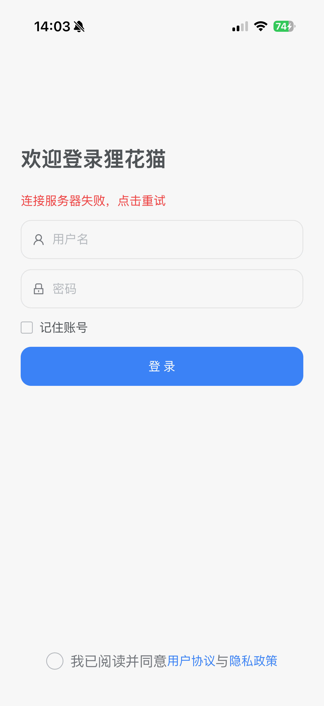
   

   :::

### 运行到微信小程序

> 运行到微信小程序需提前[注册](https://mp.weixin.qq.com/cgi-bin/wx)，并确保电脑上安装了[微信开发者工具](https://developers.weixin.qq.com/miniprogram/dev/devtools/devtools.html)

1. HbuilderX `运行` ` 运行到手机或模拟器` ` 微信开发者工具`（或终端执行 `npm run dev:mp-weixin` 后用微信开发者工具导入 `dist/dev/mp-weixin`）

   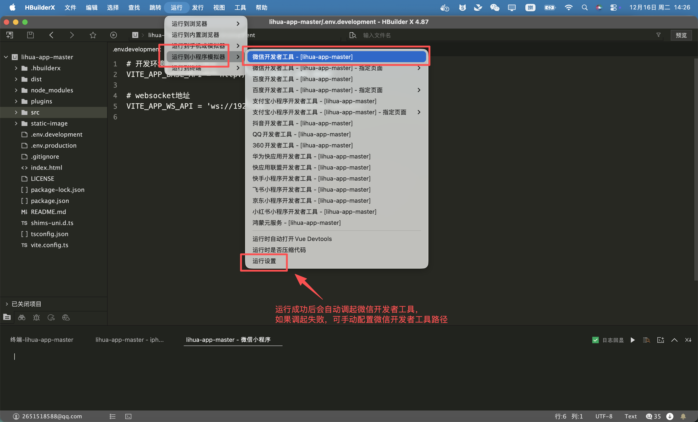

2. 运行成功会自动调起微信开发者工具，第一次启动需要从 `设置` `通用设置` `安全` 中将 `服务端口` 打开

   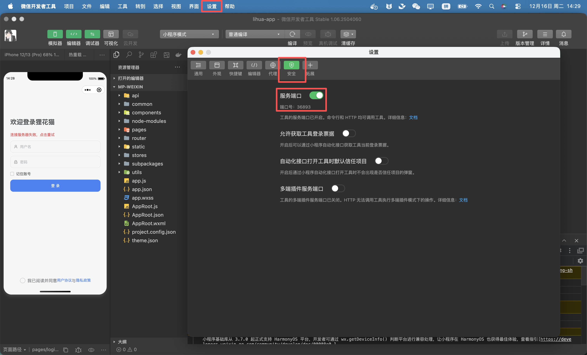

3. 运行成功后会提示 `fail appid missing` 将自己账号下的appid进行配置

   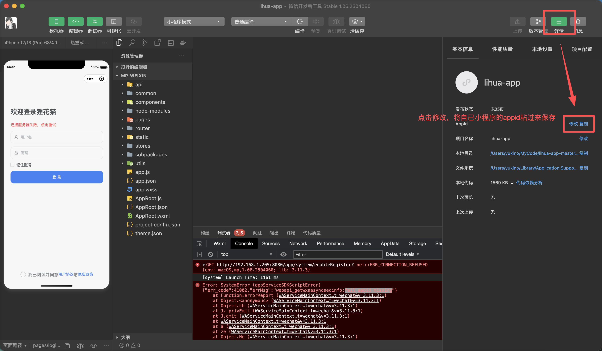

4. 从项目 `src/manifest.json` 中 ` 微信小程序配置` 也可进行配置

   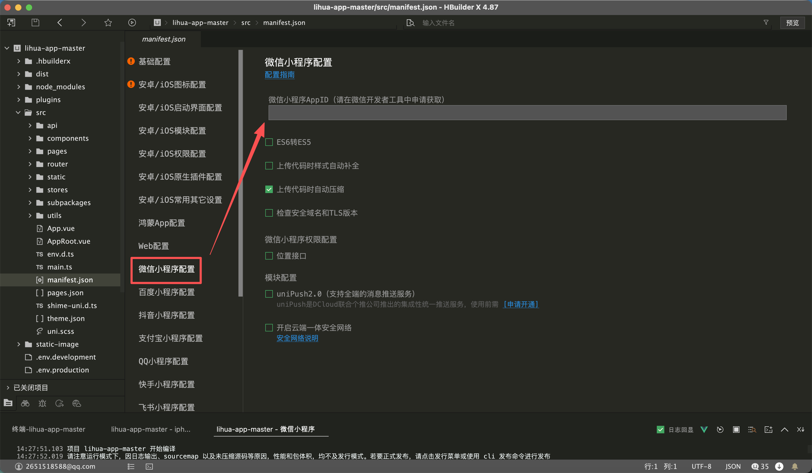
