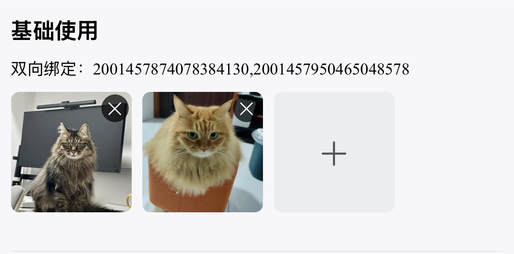
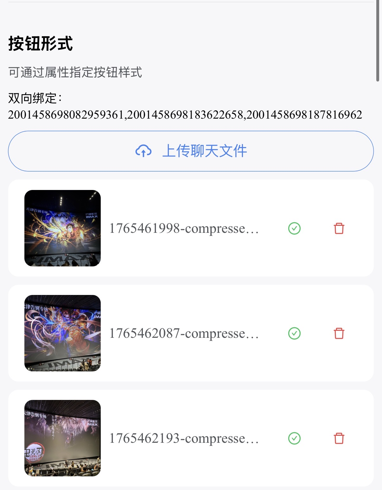
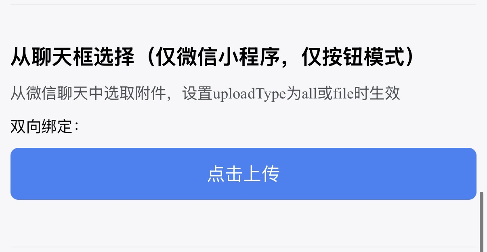

# 附件上传
业务场景中有需要上传照片或视频的场景

::: info 平台能力说明
`uploadType="file"` 或 `"all"` 时从文件中选取附件：微信小程序支持从聊天记录选取，H5 支持本地文件选择，**App 端暂无对应能力**（点击上传按钮会提示）。
:::

## 基础用法

引入组件 `import AttachmentUpload from "@/components/attachment-upload/index"` ，使用`v-model`进行双向绑定即可。双向绑定的数据为逗号分隔格式，返回的数据为后台附件表`sys_attachment`的主键id



``` vue
<template>
  <sar-space direction="vertical">
    <view class="title">基础使用</view>
    <view class="model-val">双向绑定：{{attachmentValue1}}</view>
    <attachment-upload v-model="attachmentValue1"/>
  </sar-space>
</template>
<script lang="ts" setup>
import AttachmentUpload from "@/components/attachment-upload/index"
const attachmentValue1 = ref<string>()
</script>
```


## 按钮形式

设置  `mode="button"` 即可以按钮形式上传。附件预览以卡片形式展示



``` vue
<template>
  <sar-space direction="vertical">
    <view class="title">按钮形式</view>
    <view class="model-val">双向绑定：{{attachmentValue1}}</view>
    <attachment-upload 
     v-model="attachmentValue2"  
     mode="button" 
     button-type="outline" 
     buttonText="上传聊天文件" 
     buttonIsRound 
     buttonIcon="CloudUploadOutlined" 
     buttonIconFamily="icon"/>
  </sar-space>
</template>
<script lang="ts" setup>
import AttachmentUpload from "@/components/attachment-upload/index"
const attachmentValue2 = ref<string>()
</script>
```


## 从文件选择<Badge type="warning" text="仅微信小程序与H5支持" />

设置 `uploadType="file"` 或 `uploadType="all"` 时生效，此模式下只能使用按钮形式。支持通过 `extension` 属性指定附件类型



``` vue
<template>
  <sar-space direction="vertical">
    <view class="title">从文件选择</view>
    <view class="model-val">双向绑定：{{attachmentValue1}}</view>
    <attachment-upload v-model="attachmentValue3" uploadType="file" :extension="['pdf']"/>
  </sar-space>
</template>
<script lang="ts" setup>
import AttachmentUpload from "@/components/attachment-upload/index"
const attachmentValue3 = ref<string>()
</script>
```


## 数量大小限制

设置 `:max-count="2"` 指定最多上传数量，设置  `:max-size="10 * 1024"` 指定单个附件大小


```  vue
<template>
  <sar-space direction="vertical">
    <view class="title">数量大小限制</view>
    <view class="model-val">双向绑定：{{attachmentValue1}}</view>
    <attachment-upload v-model="attachmentValue4" :max-count="2" :max-size="10 * 1024"/>
  </sar-space>
</template>
<script lang="ts" setup>
import AttachmentUpload from "@/components/attachment-upload/index"
const attachmentValue4 = ref<string>()
</script>
```


## 上传链路与平台分叉

- **秒传**：上传前先计算文件 md5，调用 `existsAttachmentByMd5` 查重——命中则走 `fastUpload` 秒传（不传输文件内容），未命中才执行真实上传；上传请求使用独立 60s 超时
- **平台分叉**：文件信息读取与 multipart 请求头组装收敛在 `utils/attachment/platform/`（H5 经 fetch+crypto-js 计算 md5、请求头交由浏览器生成 boundary；App/小程序走原生文件 API 并手动声明 multipart），业务层无感知，[详见](/3.0/doc-app/utils/utils)
- **回显**：`v-model` 有值时组件自动按 id 批量查询附件信息回显列表，访问链经统一解析器补网关前缀

::: info businessCode 缺省规则
未显式传入 `businessCode` 时，组件自动取当前页面路由路径的末两段以 `_` 连接作为业务编码（如 `system_notice`，与 Web 端 `businessCode ?? route.name` 兜底同语义）；`businessName` 缺省时由后端回显 businessCode。
:::

## API

### 双向绑定

| 属性名称 | 描述     | 类型   | 默认值 | 是否必填 |
| -------- | -------- | ------ | ------ | -------- |
| v-model  | 双向绑定 | string | -      | 是   |

### 属性

| 属性名称         | 描述                                                         | 类型                                                         | 默认值                       | 是否必填 |
| ---------------- | ------------------------------------------------------------ | ------------------------------------------------------------ | ---------------------------- | ---- |
| businessCode     | 业务编码（用于后台附件管理区分附件对应的业务，缺省取当前页面路由末两段） | string                                                       | -                            | 否   |
| businessName     | 业务名称（用于后台附件管理区分附件对应的业务，缺省后端回显 businessCode） | string                                                       | -                            | 否   |
| mode             | 模式切换                                                     | 'button' \| 'picture'                                        | 'picture'                    | 否   |
| uploadType       | 可上传附件类型（file/all 从文件中选取，仅微信小程序与H5支持） | 'image' \| 'video' \| 'file' \| 'all'                        | 'image'                      | 否   |
| extension        | 包含的文件后缀，仅 uploadType === 'file' 时生效，数组后缀名不带. | string[]                                                     | -                            | 否   |
| maxCount         | 最大上传数量                                                 | number                                                       | 6                            | 否   |
| maxSize          | 单个附件最大上传大小（单位：字节）                           | number                                                       | 1\*1024\*1024 (1MB)          | 否   |
| disabled         | 禁用状态                                                     | boolean                                                      | false                        | 否   |
| readonly         | 只读状态                                                     | boolean                                                      | false                        | 否   |
| removable        | 可否删除                                                     | boolean                                                      | true                         | 否   |
| autoRemove       | 自动删除（点击删除按钮是否自动进行业务删除）                 | boolean                                                      | true                         | 否   |
| removeText       | 删除描述（自动删除开启后，点击删除弹框提示文本）             | string                                                       | '删除后无法恢复，是否删除？' | 否   |
| buttonText       | 按钮文本                                                     | string                                                       | '点击上传'                   | 否   |
| buttonType       | 按钮类型                                                     | 'default' \| 'pale' \| 'mild' \| 'outline' \| 'text' \| 'pale-text' | 'default'                    | 否   |
| buttonTheme      | 按钮主题                                                     | 'primary' \| 'secondary' \| 'success' \| 'info' \| 'warning' \| 'danger' | 'primary'                    | 否   |
| buttonIsRound    | 是否为圆形按钮                                               | boolean                                                      | false                        | 否   |
| buttonIsSquare   | 是否为方形按钮                                               | boolean                                                      | false                        | 否   |
| buttonSize       | 按钮尺寸                                                     | 'mini' \| 'small' \| 'medium' \| 'large'                     | 'medium'                     | 否   |
| buttonIcon       | 按钮图标                                                     | string                                                       | -                            | 否   |
| buttonIconFamily | 按钮图标字体                                                 | string                                                       | -                            | 否   |

### 事件

| 事件名称           | 描述                       | 参数           |
| ------------------ | -------------------------- | -------------- |
| update:model-value | 绑定值变化时触发           | 附件id串（逗号分隔） |
| uploadSuccess      | 上传成功时触发             | 附件，附件列表 |
| uploadError        | 上传失败时触发             | 附件，错误信息 |
| exceedMaxSize      | 超出附件大小限制时触发     | 附件列表       |

### 方法

| 方法名称       | 描述                     | 参数           |
| -------------- | ------------------------ | -------------- |
| businessRemove | 提交业务删除（`autoRemove` 关闭时，删除动作仅暂存id，需在表单保存成功后调用此方法统一提交业务删除） | - |
