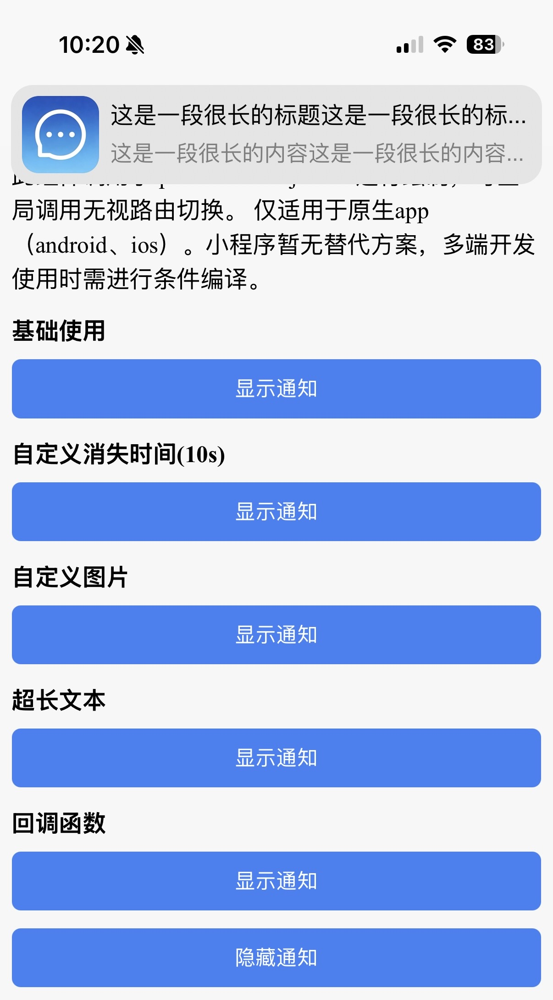

# 消息通知

收到 websocket 消息推送时，在任意页面轻量预览通知内容的场景使用

组件名为 `notice-lite`（`src/components/notice-lite/index.vue`），基于 `sar-popout` 抽屉实现，内部以 `mp-html` 富文本组件解析通知正文

::: info 全局挂载
组件挂载在虚拟根组件 `AppRoot.vue` 中全局注册，业务中无需重复引入。配套的原生通知横幅（仅 App 端）由 `helpers/notice-notify.ts` 在收到 `WS_NOTICE` 推送时弹出，横幅向下滑动即调用根节点的 `showNoticeLite(id)` 打开本抽屉。
:::

## 基础使用



组件已在 `AppRoot.vue` 中全局挂载，打开方式为：经 rootStore 拿到根节点实例，调用其暴露的 `showNoticeLite(id)` 方法（传入通知公告id）：

``` vue
<template>
	<view>
		<sar-button @click="openNotice">预览通知</sar-button>
	</view>
</template>

<script setup lang="ts">
import { useRootRefStore } from "@/stores/root"

const rootRefStore = useRootRefStore()

const openNotice = () => {
	const ref = rootRefStore.getRootRef()
	if (ref && ref.showNoticeLite) {
		ref.showNoticeLite("通知公告id")
	}
}
</script>
```

::: info 自动标记已读
抽屉打开即调用 noticeStore 的 `previewNotice(id)` 拉取通知详情（标题、发布人、发布时间、正文），并自动调用 `markAsRead(id)` 标记已读、联动刷新未读数量红点。加载失败时展示「加载失败」空态，与「正文为空」空态区分。
:::

正文为 HTML 富文本，经 `mp-html` 组件解析渲染（图片自适应宽度、表格横向滚动），通知详情页也复用同一渲染方式。


## API

### 属性

| 属性名称   | 描述           | 类型    | 默认值 | 是否必填 |
| ---------- | -------------- | ------- | ------ | -------- |
| v-model    | 抽屉显隐       | boolean | -      | 是       |
| noticeId   | 通知公告id     | string  | -      | 是       |

### 行为说明

| 行为         | 描述                                                         |
| ------------ | ------------------------------------------------------------ |
| 打开抽屉     | `modelValue` 置为 true 时自动拉取 `noticeId` 对应的通知详情并标记已读 |
| 关闭抽屉     | 手动下滑关闭或置 `modelValue` 为 false，组件内部自动清空已加载数据 |
| 关联红点     | 标记已读后经 noticeStore 联动刷新未读数量与 tabBar 红点       |
