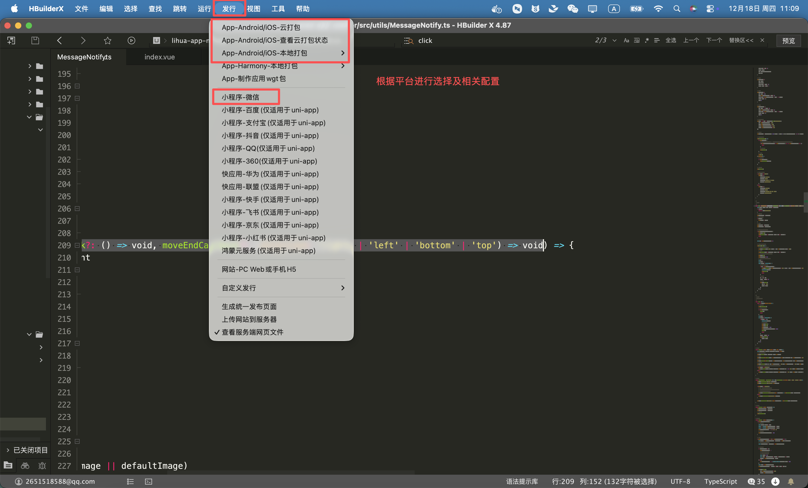

# 打包部署

应用发行时将使用`.env.production`中的配置，请在打包前确认已按**生产环境**完成相关参数配置（`VITE_APP_BASE_API` 后台接口地址与 `VITE_APP_WS_API` websocket地址）

## 打包步骤

1. 使用 **HBuilderX** 打开项目
2. 在顶部菜单中点击 **「发行」**
3. 根据需要选择对应的平台进行打包

### App 打包（Android / iOS / 鸿蒙）

- 原生App-云打包：HBuilderX `发行` `原生App-云打包`，按向导选择证书（Android 可用公共测试证书，iOS 需 Apple 证书及签名，鸿蒙需签名证书）
- 需要自定义基座调试时，使用 `运行` `运行到手机或模拟器` `制作自定义调试基座`
- 应用图标、启动图等在 `src/manifest.json` 的 App 图标配置中维护

### 微信小程序

1. 终端执行 `npm run build:mp-weixin`，产物在 `dist/build/mp-weixin`
2. 使用微信开发者工具导入该目录，点击「上传」提交审核发布

### H5

1. 终端执行 `npm run build:h5`，产物在 `dist/build/h5`，部署到任意静态资源服务器即可

::: warning pages.json 条件编译
`pages.json` 中存在平台条件编译注册的页面（如主题设置页仅在 `APP-PLUS` 内注册）。修改 `pages.json` 的条件编译后，**必须执行 `npm run build:h5` 验证 H5 构建是否通过**，避免带病发布。
:::

## 注意事项

> 具体配置方式及发布流程，请参考各平台官方文档说明

- 不同平台在打包时对 **证书配置**、**签名方式**、**分发规则** 等要求各不相同
- 请根据实际发布的平台，提前准备并配置好相关证书
- 项目已在 `manifest.json` 中开启全端暗色模式（`darkmode: true` 并配置 `themeLocation: theme.json`），`src/theme.json` 维护暗色变量映射（tabBar/导航栏颜色等）；调整亮暗色基线时需同步检查 `theme.json` 与相关样式，避免暗色下出现色差
