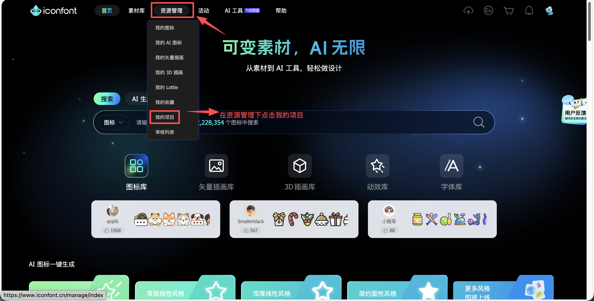
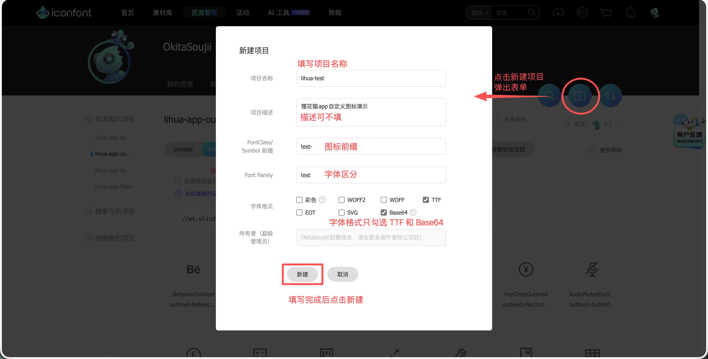
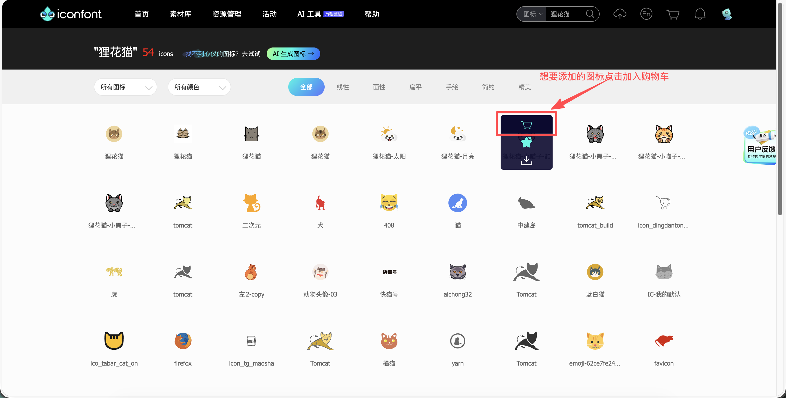
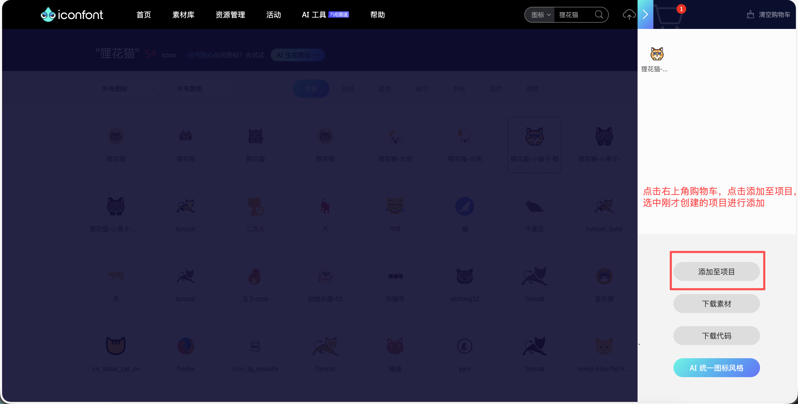
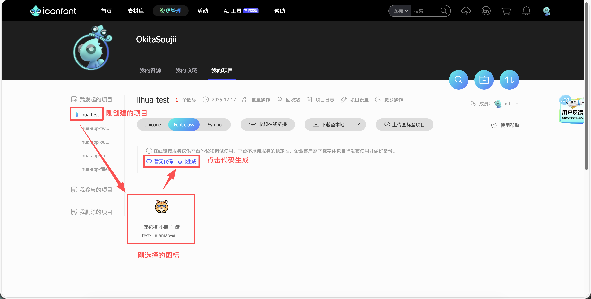
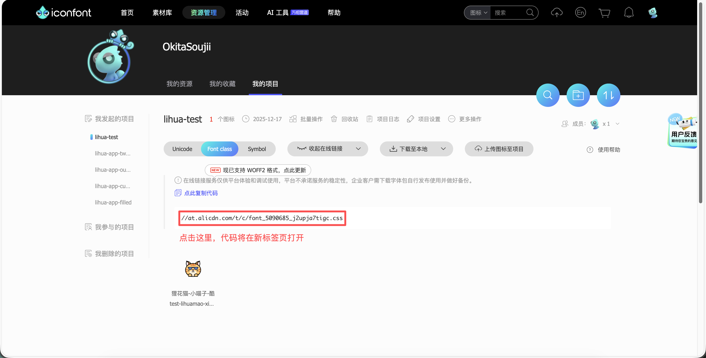
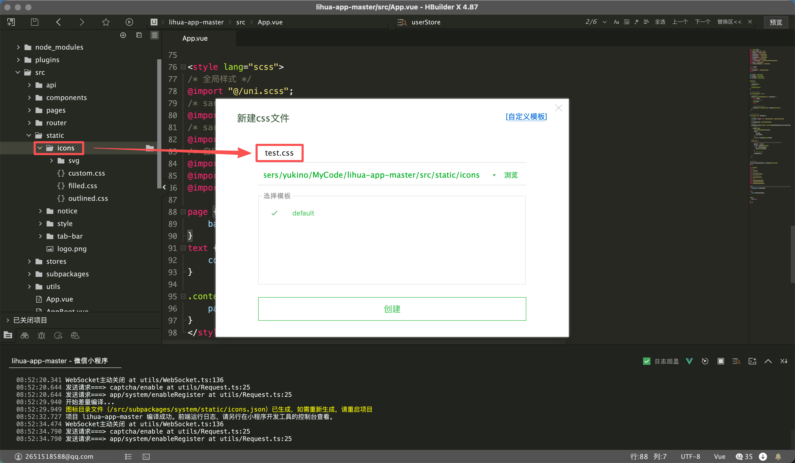
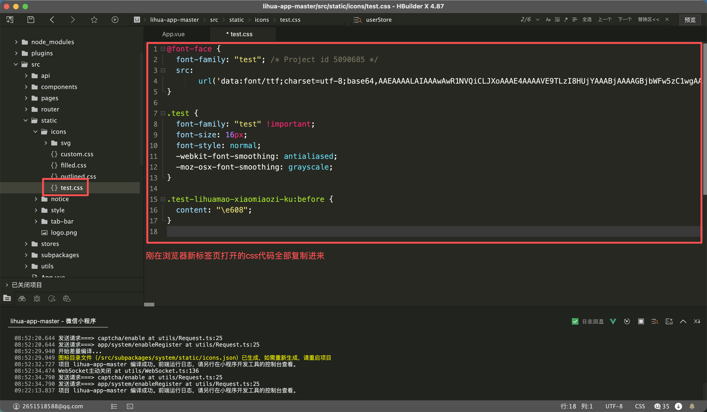
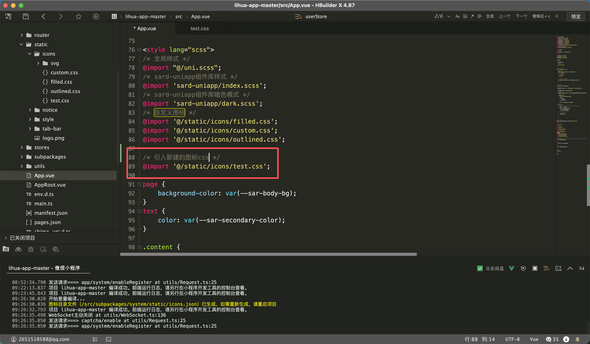

# 图标

> 3.0 移除了自定义图标构建脚本（`plugins/buildIcons.ts` 已删除），不再自动转换图标资源。图标的使用方式为：**sard-uniapp 内置图标** + **项目静态图标字体** + **static 静态图**，直接使用，无构建环节。

## sard-uniapp 内置图标

图标组件使用 `sard-uniapp` 组件库提供的图标组件，组件库内置了全套图标，可通过 `name` 直接使用（内置图标无需传 `icon-family`）：

``` html
<sar-icon name="check" color="#fff" />
```

可用图标列表详见 [sard-uniapp 图标文档](https://sard.wzt.zone/sard-uniapp-docs/components/icon)


## 项目静态图标字体

项目在 `src/static/icons` 下维护了两套 iconfont 图标字体，已在 `App.vue` 中全局引入：

- `icon.css`：业务图标（ant-design 风格，字体 family 为 `icon`），如 `UserOutlined`、`SettingOutlined` 等
- `custom.css`：自定义图标（字体 family 为 `custom`），如 `GiteeCustom`

::: warning 注意事项

css图标会将图标原本颜色抹去，如需要保持图标原本颜色，请使用静态图

:::

使用时通过 `icon-family` 指定字体、`icon` 指定图标名：

``` html
<!-- family="icon" 为业务图标字体 -->
<sar-icon color="var(--sar-tertiary-color)" family="icon" name="UserOutlined" />
<sar-list-item title="设置" icon-family="icon" icon="SettingOutlined" hover arrow/>
<!-- family="custom" 为自定义图标字体 -->
<sar-list-item title="仓库" icon-family="custom" icon="GiteeCustom" hover arrow/>
```

### 新增/更新图标

::: info 维护方式
静态图标字体由 iconfont 平台维护导出，**新增图标整体替换对应 css 文件**（`icon.css` / `custom.css`），无本地构建步骤。字体以 base64 内联在 css 中，替换文件即完成更新。
:::

1. 登录 [iconfont](https://www.iconfont.cn/) 后在顶部导航栏找到 `资源管理` `我的项目`

   

   

2. 挑选图标，加入到项目

   

   

3. 生成图标代码，在刚创建的项目中点击生成代码

   

   

4. 将浏览器新标签页中的代码全部复制，整体替换 `src/static/icons` 下对应的 css 文件，保存文件

   

   

5. css 文件已由 `App.vue` 全局引入，无需额外操作

   

6. 使用图标，name为图标名称（可在iconfont自行修改）family为图标字体（对应css中的font-family）

   ``` html
   <sar-icon name="lihuamao-xiaomiaozi-ku" family="test"></sar-icon>
   ```


## static 静态图

不依赖字体的图片资源（tabBar 图标、原生通知图标、错误页插画等）放置在 `src/static` 下，以路径方式直接引用：

``` html
<!-- image 标签 -->
<image src="/static/tab-bar/home.png" />
<!-- sard 图标组件传入图片路径 -->
<sar-icon name="/static/icons/xxx.svg" />
```

::: info 提示
静态图可保留图标原本的颜色。tabBar 图标在 `pages.json` 中经 `theme.json` 变量映射以适配暗色模式（如 `@home-icon`），新增 tabBar 图标时需同步维护。
:::
