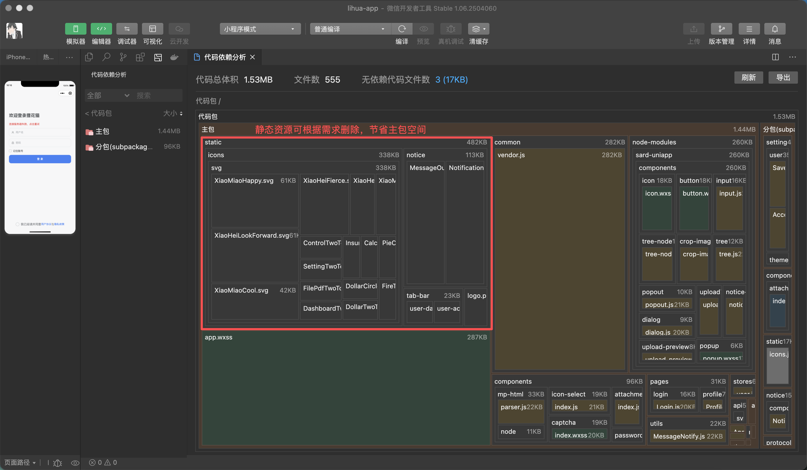

# 页面与组件
> 因小程序平台有主包大小限制，项目创建时就完成了分包处理，建议只有公共页面和tabBar页面放在主包下

## 分包

- 主包为：`src/pages` 下的所有页面（splash 首屏页、login/user-setup 登录与向导、index/profile tabBar 页、webview、error 错误兜底页）
- 分包为：`src/subpackages` 下的所有页面（protocol 协议、setting 设置族、user 用户设置、notice 消息、components 组件演示等）

对应的`pages.json`中主包 在 pages 下，分包在 subPackages 下，例：
```json
// 主包
"pages": [
  {
    "path": "pages/splash/index",
    "style": {
      "navigationStyle": "custom"
    }
  }
],
// 分包
"subPackages": [{
  "root": "subpackages/system",
  "pages": [{
    "path": "protocol/PrivacyPolicy",
    "style": {
      "navigationBarTitleText": "隐私政策"
    }
  }]
}],
```

> 首页为 splash 空页，onMounted 中 reLaunch 到真实首页，作为路由守卫的统一入口；进入个人中心时会通过 `preloadRule` 预下载 system 分包，避免首次跳转的卡顿感。



::: warning 条件编译注册页面
部分平台专属页面通过条件编译注册，如主题设置页 `setting/theme/index` 仅在 `#ifdef APP-PLUS` 内注册（主题持久化与 `plus.nativeUI.setUIStyle` 均为 App 端能力）。新增 App-only 页面时按同款方式注册，修改 pages.json 条件编译后请执行 `npm run build:h5` 验证 H5 构建。
:::


## 页面

页面根据实际需求在 `pages` 或 `subpackages` 下创建对应模块和 `vue`文件，与web端用法相同，支持vue3 和 uniapp 的生命周期钩子函数 [详见uniapp文档](https://uniapp.dcloud.net.cn/tutorial/page.html#vue3-lifecycle-flow)

## 组件

组件根据实际需求在 `src/components` 或 `subpackages/system/components` 下，模块单独使用的组件建议放在分包，全局共用组件可放在外层。

组件的引入方式：

- **sard-uniapp 组件**：`pages.json` 中已配置 easycom 规则 `"^sar-(.*)": "sard-uniapp/components/$1/$1.vue"`，模板中直接写 `<sar-xxx>` 即可，无需 import
- **app-loading 组件**：同样注册了 easycom 规则 `"^app-loading$"`，直接使用 `<app-loading />`
- **其余业务组件**（attachment-upload、dict-tag 等）：常规 `import` 后使用，详见 [组件文档](/3.0/doc-app/components/dict-tag)
