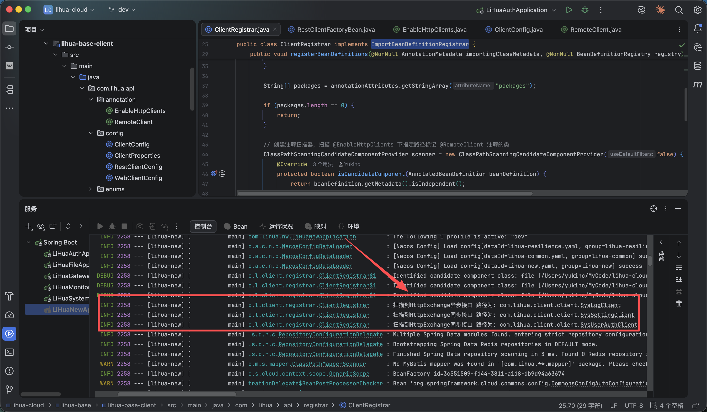

# 远程调用
远程调用基于 Spring 6 中提供的声明式 HTTP 接口 `http-interface` ，无需引入第三方依赖，更轻量。

为提升开发效率，系统对 `http-interface` 进行了一定程度整合，包括自定义注解、基于包与注解的客户端自动扫描注册、HMAC 签名与请求头透传等封装。完整教程参考 [远程调用](/3.0/doc-cloud/standard/api)，本篇为模块能力速查。

## 配置

连接族超时与连接池通过 `rpc` 配置段配置（`ClientProperties`），随服务启动一次性构建，**修改后需重启生效**：

```yaml
rpc:
  signKey: xxxxxxxx                  # 内部调用签名密钥（缺失启动失败，换值需四个 servlet 服务同步重启）
  connectTimeout: 3s                 # 连接超时时间
  connectionRequestTimeout: 3s       # 等池超时（从连接池租借连接最长等待）
  maxConnTotal: 200                  # 连接池最大总连接数
  maxConnPerRoute: 50                # 单路由（单下游服务）最大连接数
```

```java 
@Data
@Configuration
@ConfigurationProperties(prefix = "rpc")
public class ClientProperties {

    /**
     * 连接超时时间（网络环境特征，全接口统一）
     */
    private Duration connectTimeout = Duration.ofSeconds(3);

    /**
     * 等待从连接池租借连接的超时时间（不计入 responseTimeout，并发排队超此值快速失败而非傻等）
     */
    private Duration connectionRequestTimeout = Duration.ofSeconds(3);

    /**
     * 连接池最大总连接数
     */
    private Integer maxConnTotal = 200;

    /**
     * 连接池单路由（单下游服务）最大连接数，须不大于 maxConnTotal
     */
    private Integer maxConnPerRoute = 50;
}
```

响应等待超时是接口特征，不走本配置，由各 `@RemoteClient(timeout)` 接口级声明（默认 5s）。连接池三参数仅作用于同步侧（HC5/RestClient），WebClient 异步侧走 reactor-netty 默认池。

## 基础方法

### @EnableHttpClients

```java
@EnableHttpClients(packages = "com.lihua")
```

- 属性：`packages` - 扫描包名（可多个）
- 返回值：无（配置类注解，经 `@Import(ClientRegistrar.class)` 生效）
- 说明：启用 `@HttpExchange` 客户端自动扫描注册，业务开发无需关心，`lihua-base-client` 的 `ClientConfig` 已默认声明

### @RemoteClient

```java
@RemoteClient(serverName = "lihua-system")
@HttpExchange("system/user/auth")
public interface SysUserAuthClient { ... }
```

- 属性：`serverName` - 服务名称（必填）；`scheme` - 请求协议（默认 HTTP）；`executionMode` - 执行模式 SYNC/ASYNC（默认 SYNC）；`timeout` - 响应等待超时秒数（默认 5）
- 返回值：无（接口注解）
- 说明：标记远程调用客户端对应的服务名，baseUrl 为 `http://{serverName}`，可自动负载均衡进行远程调用；`executionMode = ASYNC` 时底层走 WebClient，接口返回值须为 `Mono<T>`

### HmacUtils.hmacSha256（生成 HMAC 签名）

```java
String sign = HmacUtils.hmacSha256(signKey, data);
```

- 参数：`key` - 签名密钥（rpc.signKey），`data` - 签名材料（`METHOD:PATH:timestampMillis`）
- 返回值：`String` - Base64 编码后的 HMAC-SHA256 签名
- 说明：客户端拦截器生成签名、服务端 `InternalRequestInterceptor` 重算签名共用此工具，算法为 `HmacSHA256` + Base64

### CustomHttpHeader（自定义请求头枚举）

```java
request.getHeaders().add(CustomHttpHeader.TRACE_ID.getValue(), traceId);
```

- 枚举值：`TIMESTAMP`（Timestamp 时间戳）、`IP`（Request-IP 客户端IP）、`CLIENT_TYPE`（Client-Type 客户端类型）、`TRACE_ID`（Trace-Id 链路追踪id）、`SIGN`（Internal-Sign 签名）、`TOKEN`（Authorization 令牌）
- 说明：RPC 请求头统一在此维护，客户端拦截器透传 `Authorization/Trace-Id/Request-IP/Client-Type` 并追加 `Sign + Timestamp` 两个签名头

## 请求拦截与签名

同步请求拦截器（`RestClientConfig`）与异步请求过滤器（`WebClientConfig`）逻辑一致，发送前完成：

1. 透传 `Authorization`（token）、`Trace-Id`（MDC 中的 traceId）、`Request-IP` 与 `Client-Type`（仅请求线程可透传）
2. 生成 HMAC 签名并追加 `Sign` + `Timestamp` 头

```java 
// 生成签名（同步侧）
long timeMillis = DateUtils.nowTimeStamp();
String sign = HmacUtils.hmacSha256(internalSignKey, String.format("%s:%s:%s",
        request.getMethod().name(),
        request.getURI().getPath(),
        timeMillis));
request.getHeaders().add(CustomHttpHeader.SIGN.getValue(), sign);
request.getHeaders().add(CustomHttpHeader.TIMESTAMP.getValue(), String.valueOf(timeMillis));
```

服务端验签使用 `@InternalOnly`（`lihua-base-web`）+ `InternalRequestInterceptor`，原理与示例参考 [远程调用](/3.0/doc-cloud/standard/api#hmac-签名机制)。

## 自动客户端创建

> 相关代码位于 `lihua-base-client` 下 config 和 registrar 包中

在网络搜索@HttpExchange使用方式时，都需要根据接口自行创建对应的 Client Bean，业务开发上太过繁琐。为了消除下方样板代码，项目使用 `ImportBeanDefinitionRegistrar` 方式按包和注解扫描自动注册Client Bean，根据配置信息自动加载 `同步` `异步` 两套客户端（`RestClientFactoryBean` / `WebClientFactoryBean`）。

```java 
// 样板代码
@Configuration
public class WebClientConfiguration {
    @Bean
    public OrderApiInterface albumsClient(WebClient.Builder webClientBuilder) {
        WebClient webClient = webClientBuilder.baseUrl("http://localhost:8898").build();
        return HttpServiceProxyFactory.builder().clientAdapter(WebClientAdapter.forClient(webClient)) //
                .build().createClient(OrderApiInterface.class);
    }
}
```

项目启动时会打印扫描到的客户端接口


