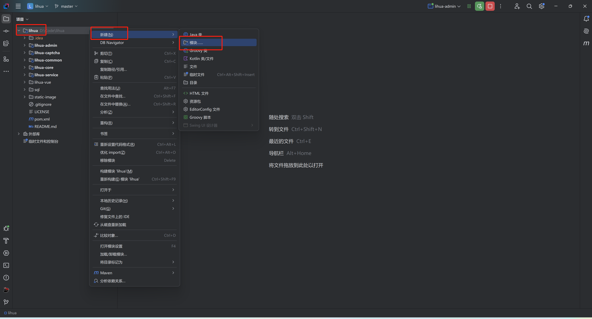
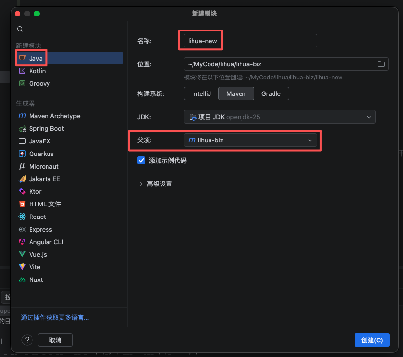
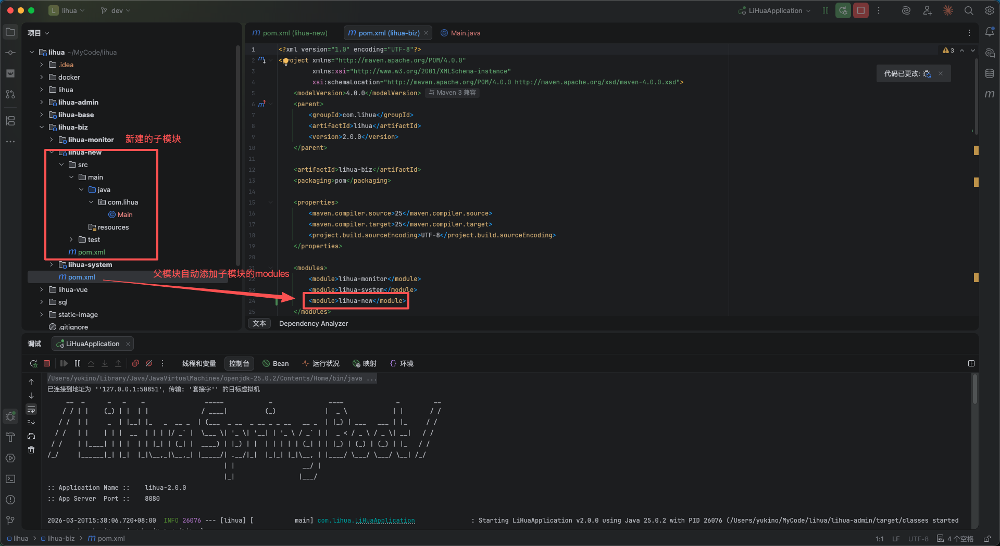
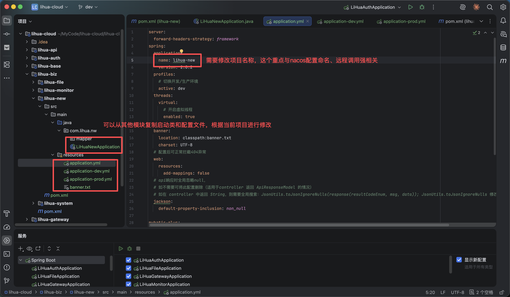
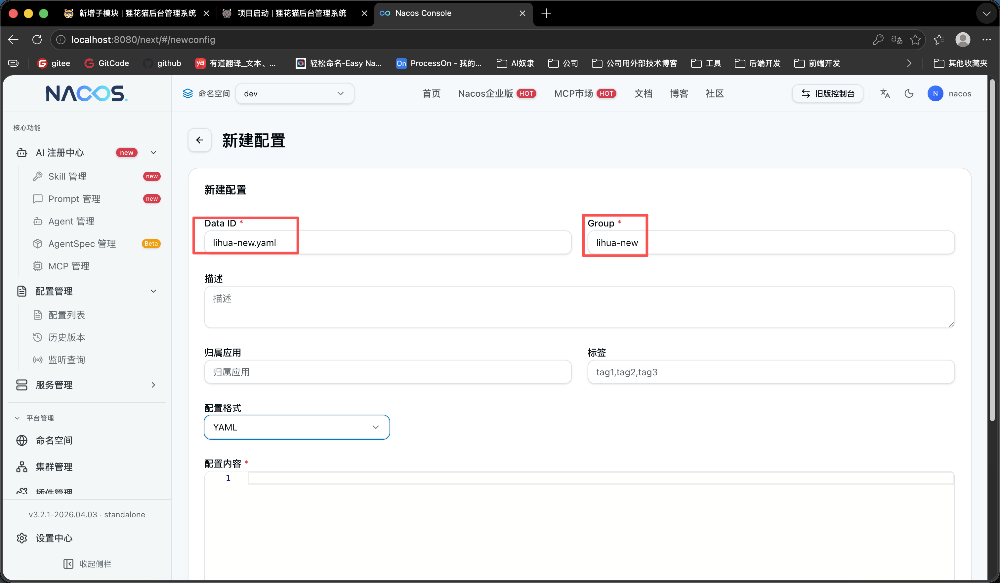
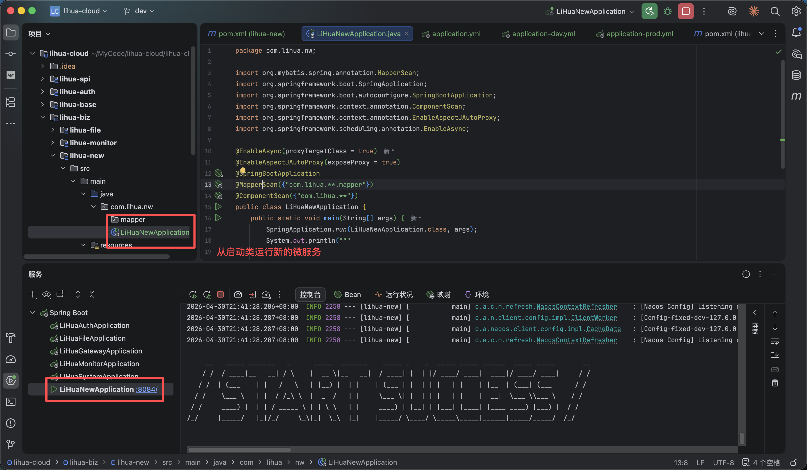
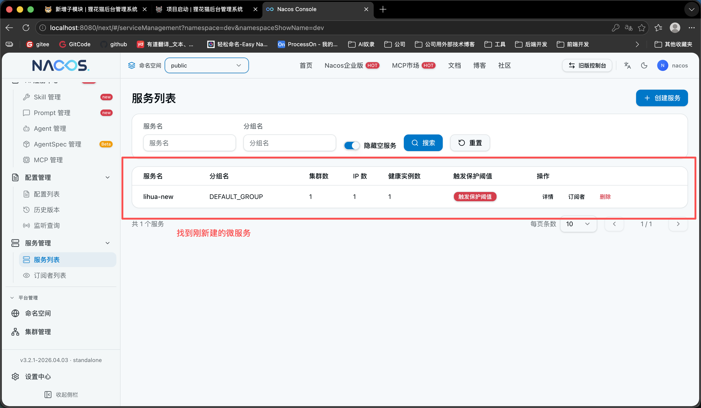

# 新增子模块

> 3.0 版本中，子模块按模块类型划分，并分别归属到对应父模块下进行维护。

- `lihua-biz`：业务模块（即独立部署的微服务），面向具体业务场景，对外提供接口能力（可被前端直接调用）
- `lihua-base`：基础模块，提供通用能力与底层实现，供 `lihua-biz` 依赖使用，命名规范为 `lihua-base-xxx`
- `lihua-api`：API 契约模块，维护跨服务远程调用的 client 接口、facade 门面与 model，命名规范为 `lihua-api-xxx`

---

**以lihua-biz为例（新增一个业务微服务）**
1. 使用IDEA新建子模块，在项目`目录右键->新建->模块`

   

2. 选择左侧 Java，填好名称，构建系统选择Maven，选择父项目为 `lihua-biz` 点击创建

   

3. 创建后可以看到新模块目录结构，根据需求可自行修改。创建完成后父级pom会自动添加新模块的module信息

   

4. 创建项目启动类、yml配置文件、nacos对应配置。启动类参照现有服务声明 `@SpringBootApplication`、`@MapperScan("com.lihua.**.mapper")`、`@ComponentScan("com.lihua.**")`，yml 中 `spring.application.name` 与端口保持全局唯一

   

5. Nacos 新建对应配置：新建 `${serverName}.yaml` 配置文件并放入 `${serverName}` 分组，同时不要忘了在配置中通过 `spring.config.import` 引入 `lihua-common.yaml` 与 `lihua-resilience.yaml` 两组公共配置

   

6. 启动对应微服务，注意端口号不要与现有服务重复

   

7. nacos 服务列表能正确识别到服务

   
