# 项目启动


## 环境准备

- Java：25+
- MySQL：8.0+
- Redis：7.0+
- Maven：3.9+
- Nacos：3.1.1+


## 开发工具

- IDEA：2025+
- Navicat


## 拉取项目代码

1. 前往仓库下载master分支代码 [仓库](https://gitee.com/yukino_git/lihua-cloud)

   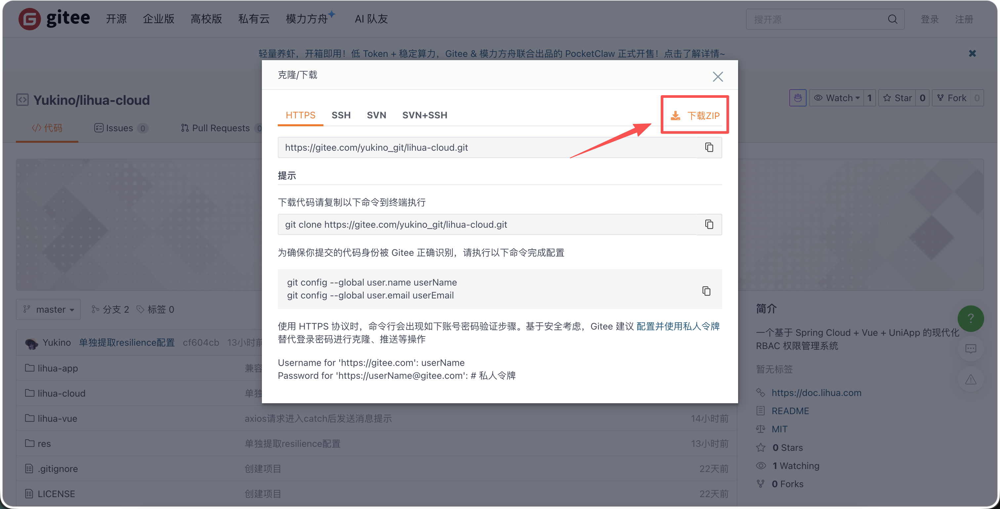

2. 下载后项目包含 web端、App端、服务端。使用 idea 打开后端服务

   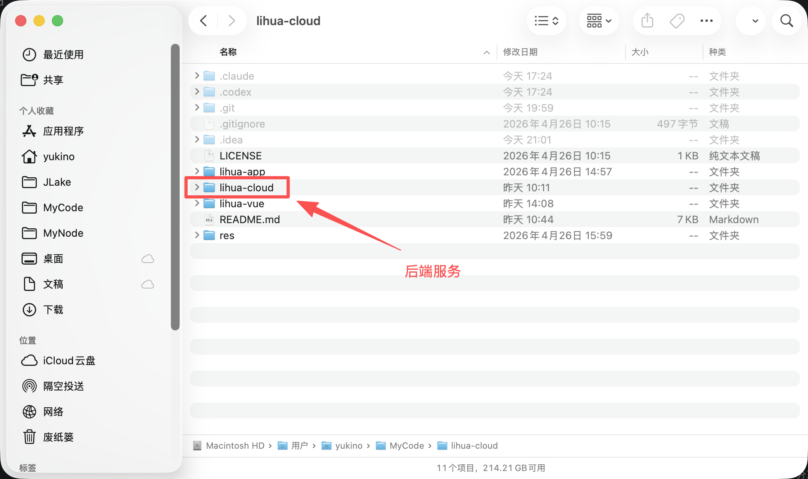

3. 使用IDEA打开 `lihua-cloud`

   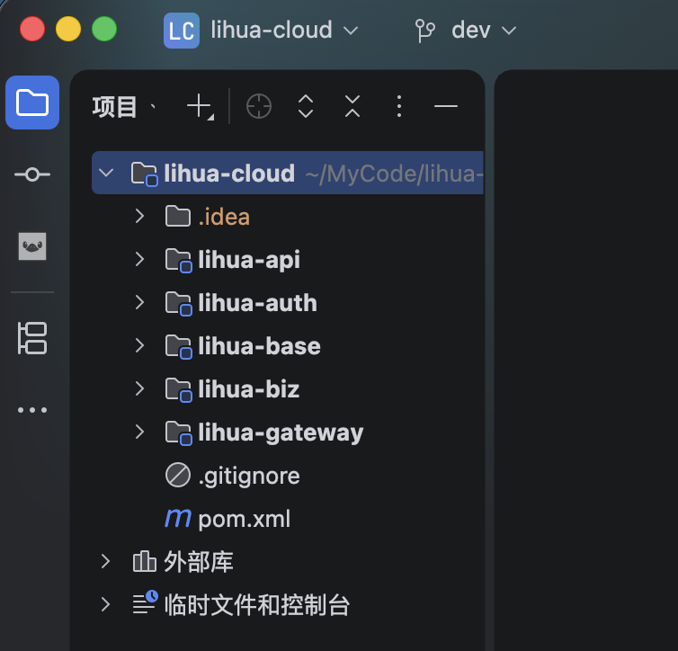

   


## 导入数据库脚本

1. 新建数据库

   以Navicat为例，找到连接的MySQL数据库，右键新建数据库，输入数据库名称，字符集选择 `utf8mb4` 后点击确定

   

2. 导入SQL文件

   新建数据库后鼠标在新建的数据库上右键点击 “运行SQL文件” ，选择项目 `lihua-cloud/deploy/db/lihua.sql` 文件后点击开始；如果此前运行过 2.x 版本，再执行一次 `deploy/db/upgrade-3.0.0.sql` 完成升级（全新安装 lihua.sql 已是基线，无需再跑升级脚本）。默认管理员账号 `admin / 123456`

   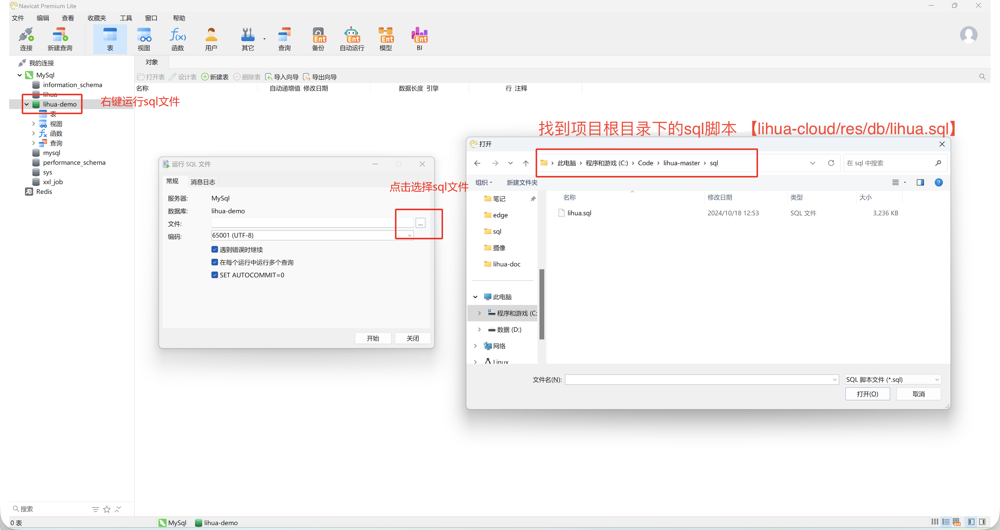


## 项目配置

### 中间件启动

微服务运行依赖 **MySQL、Redis、Nacos** 三个中间件，MySQL 与 Redis 可自行准备，Nacos 推荐直接使用 Docker 启动（见下节）。

### Nacos

1. 启动Nacos

   **默认已集成Docker环境** 终端运行下面docker命令

   ```shell
   docker run --name nacos-standalone-derby \
     -e MODE=standalone \
     -e NACOS_AUTH_ENABLE=true \
     -e NACOS_AUTH_TOKEN=JYqM3550lhDOdPXhcA9MTacVLYQeMtTfygzn9Hl+BcY= \
     -e NACOS_AUTH_IDENTITY_KEY=nacos \
     -e NACOS_AUTH_IDENTITY_VALUE=nacos \
     -p 8080:8080 \
     -p 8848:8848 \
     -p 9848:9848 \
     -d nacos/nacos-server:v3.1.1
   ```

   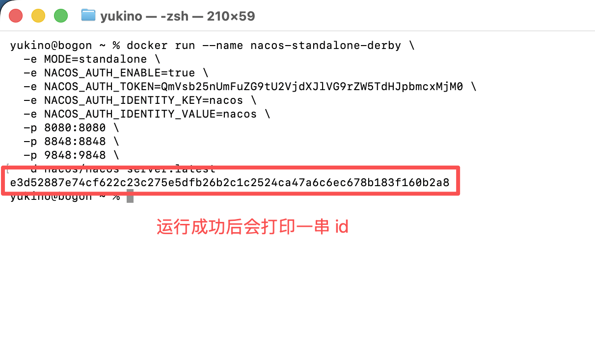

   

   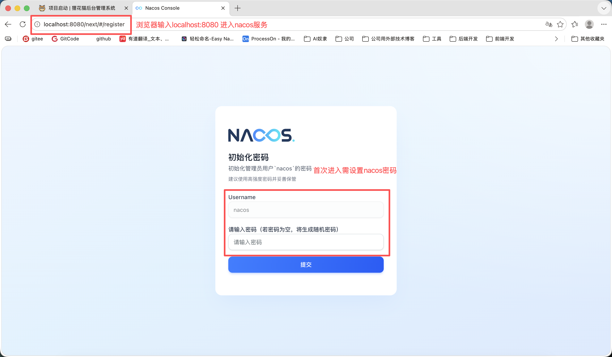

2. 创建命名空间，登录进系统后创建命名空间 **命名空间ID也需要设置为dev** 

   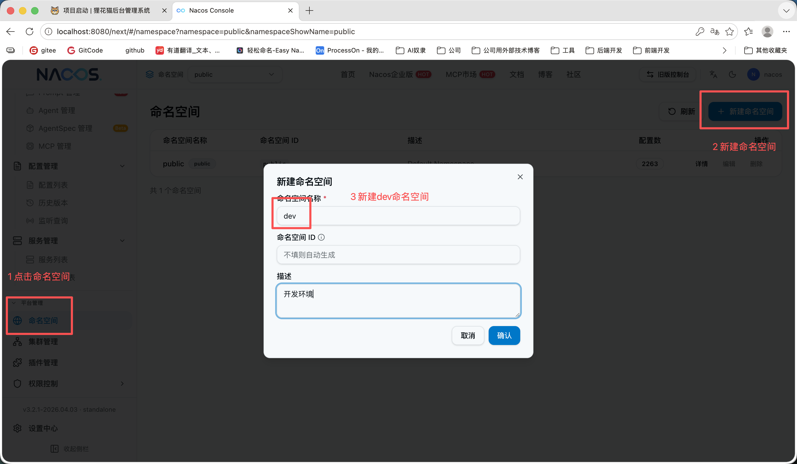

3. 导入配置，工程根路径 `lihua-cloud/deploy/nacos` 下 `nacos_config_export.zip` 导入到nacos（共 8 组配置：lihua-common、lihua-resilience 两组公共配置 + 六个服务各自的 yaml，各自独立分组）

   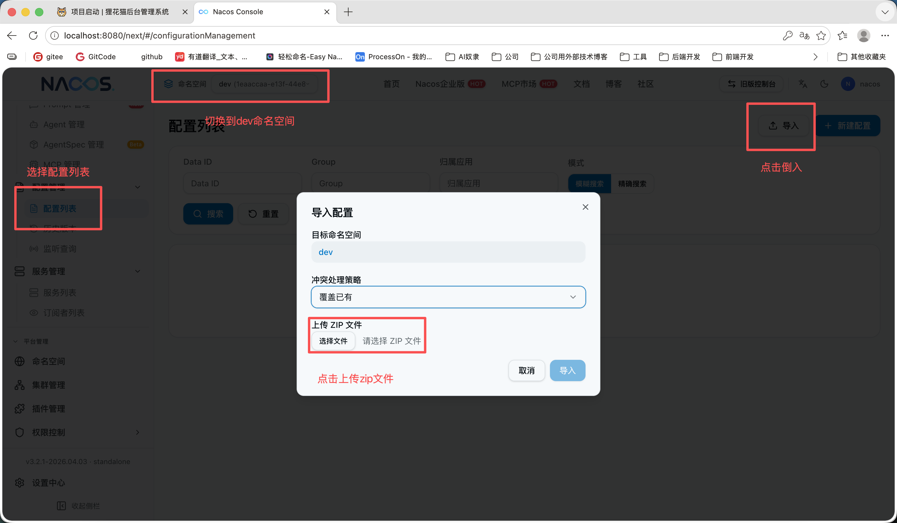

   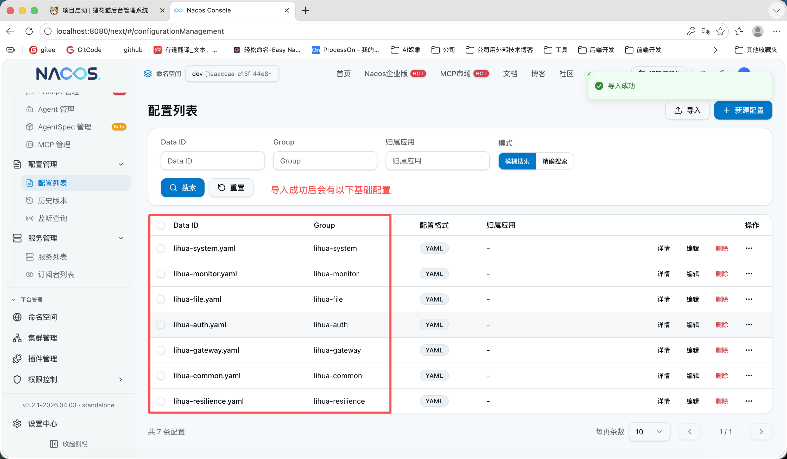

> ⚠️ 导入后请检查 `lihua-common.yaml` 中的 `token.tokenSecret` 与 `rpc.signKey`、`lihua-file.yaml` 中的 `attachment.downloadSignKey`，三把密钥均为必配项（缺失或过短对应服务会拒绝启动）。开发环境可先沿用导出包中的默认值。


### 配置文件

1. 配置总揽，项目下有 `6` 个可启动服务，每个服务都包含 `application.yml` 配置文件

   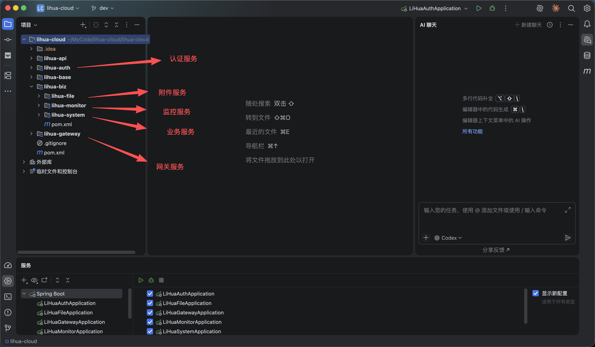

2. 本地配置包含nacos服务发现、配置中心和编码相关配置，业务配置全部托管在 Nacos 中

   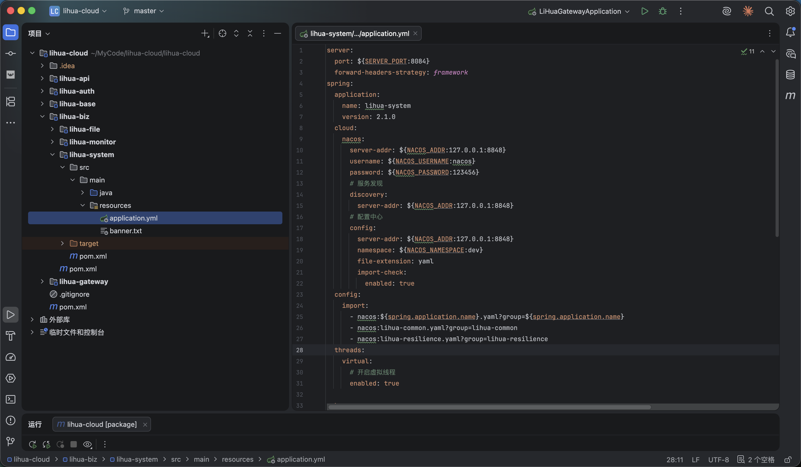

3. 微服务配置规范为

   - 配置文件名称：$\{serverName\}.yaml

   - 分组：$\{serverName\}

   - 每个服务通过 `spring.config.import` 引入三条 Nacos 配置：自身 yaml + `lihua-common.yaml`（公共配置）+ `lihua-resilience.yaml`（熔断降级配置）


## 启动项目

> 需确保Mysql、Redis、Nacos启动中并连接正常

1. IDEA 可识别到微服务中各个服务，可右键一键启动。**推荐启动顺序：lihua-system → lihua-file → lihua-monitor → lihua-auth → lihua-websocket → lihua-gateway**（网关最后启动可避免下游未就绪时的请求失败）

   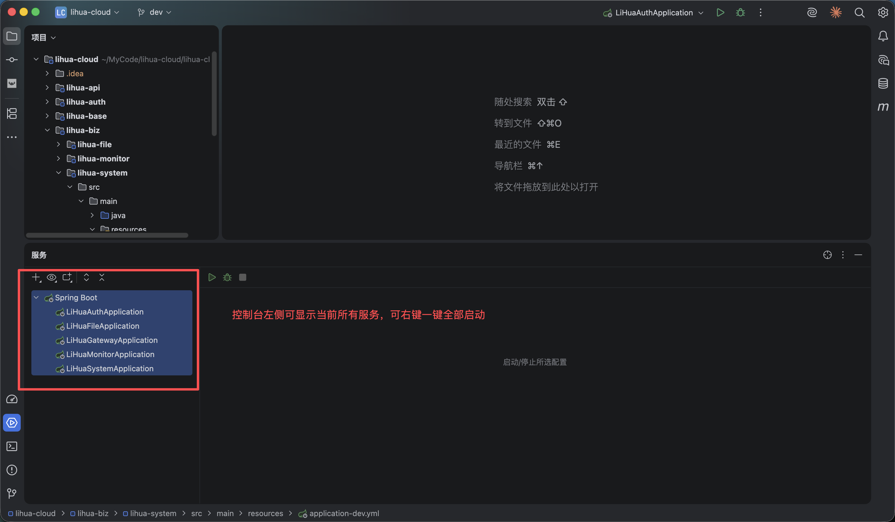

   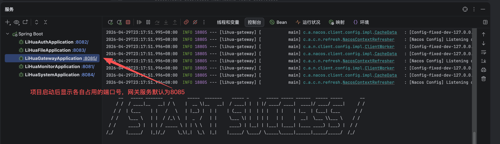

   

2. 浏览器输入 `http://localhost:8085/system/auth/onceToken`  返回 401 表示接口调用成功；也可访问任意服务的 `http://localhost:{端口}/actuator/health` 探活（返回 `UP` 即健康）

   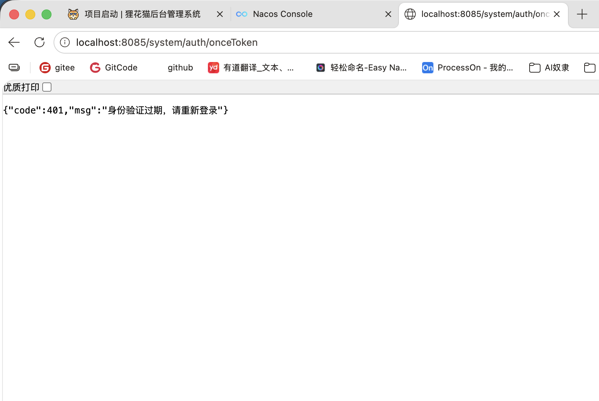
   
   
   
   nacos服务列表可以看到对应服务
   
   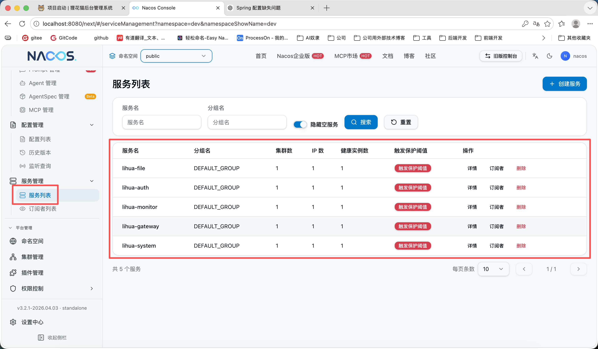


