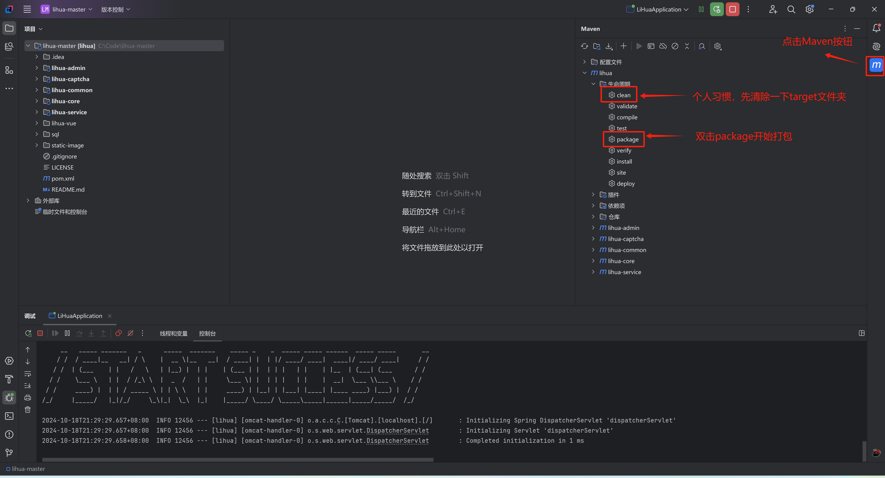
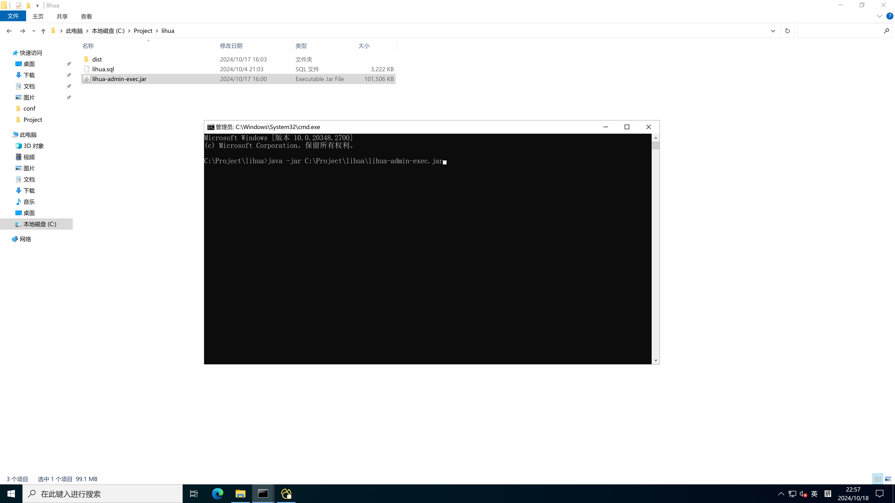

# 打包部署

::: info

打包前请确认 Nacos 中各服务配置是否为生产环境（springdoc.enabled 置 false、密钥使用生产值等）

:::

微服务版需要部署 6 个后端服务 + 1 个前端。推荐使用 [Docker 部署](/3.0/doc-cloud/deploy/docker)（compose 全家桶），本篇介绍 jar 包手动部署流程。

## 1. 打包

找到IDEA右侧 `Maven` 按钮，在`lihua-cloud/生命周期` 下先点击`clean` 后控制台会打印清空log，清空完成后点击`package`进行项目打包



或使用命令行打包：

```shell
cd lihua-cloud
mvn clean package -DskipTests
```

打包成功，控制台会输出 `BUILD SUCCESS`，各服务子项目下会生成对应的 `*-exec.jar`：

```text
lihua-auth/target/lihua-auth-exec.jar
lihua-biz/lihua-system/target/lihua-system-exec.jar
lihua-biz/lihua-file/target/lihua-file-exec.jar
lihua-biz/lihua-monitor/target/lihua-monitor-exec.jar
lihua-gateway/target/lihua-gateway-exec.jar
```


## 2. 初始化数据库

1. 新建数据库（字符集 `utf8mb4`）
2. 导入基线脚本 `deploy/db/lihua.sql`
3. 从 2.x 升级的存量环境：追加执行 `deploy/db/upgrade-3.0.0.sql`（幂等可重复执行；完成后请在「系统管理-字典管理」页点击「刷新缓存」）
4. 默认管理员账号：`admin / 123456`

## 3. 初始化 Nacos

1. 登录 Nacos 控制台（v3.1.1）
2. 创建生产命名空间（如 `prod`，命名空间 ID 需与后端 `NACOS_NAMESPACE` 一致）
3. 导入 `deploy/nacos/nacos_config_export.zip`，共 8 组配置，各自独立分组：

| dataId | group | 说明 |
| ------ | ----- | ---- |
| `lihua-common.yaml` | `lihua-common` | 公共配置：token、rpc、优雅停机、redisson、探针、日志、springdoc |
| `lihua-resilience.yaml` | `lihua-resilience` | 熔断降级配置：TimeLimiter、CircuitBreaker |
| `lihua-gateway.yaml` | `lihua-gateway` | 网关路由、CORS、响应头去重 |
| `lihua-auth.yaml` | `lihua-auth` | 登录失败锁定、文档前缀 |
| `lihua-system.yaml` | `lihua-system` | 数据源、定时任务模板、文档前缀 |
| `lihua-file.yaml` | `lihua-file` | 附件配置、数据源、文档前缀 |
| `lihua-monitor.yaml` | `lihua-monitor` | 文档前缀 |
| `lihua-websocket.yaml` | `lihua-websocket` | WS 连接服务（当前为占位，Redis 经 lihua-common） |

4. 将配置中的占位值替换为生产值，重点检查：

| 配置项 | 说明 |
| ------ | ---- |
| `token.tokenSecret` | JWT 密钥（HMAC-SHA256），**gateway 与 auth 必须一致**，缺失/过短拒启 |
| `rpc.signKey` | 服务间 RPC 签名密钥，缺失拒启；**换值需四个 servlet 服务同步重启** |
| `attachment.downloadSignKey` | 附件下载签名密钥，缺失或过短 lihua-file 拒启 |
| `MYSQL_ADDR/MYSQL_USERNAME/MYSQL_PASSWORD` | 数据库连接（lihua-system 与 lihua-file 两份需一致） |
| `REDIS_ADDR/REDIS_PASSWORD` | Redis 连接 |
| `springdoc.api-docs.enabled` | 生产环境置 `false` 整体关闭接口文档 |

## 4. 环境变量

各服务启动时经环境变量注入运行参数（全部有本地默认值，生产环境按需覆盖）：

| 环境变量 | 说明 | 默认值 |
| -------- | ---- | ------ |
| `SERVER_PORT` | 服务端口 | 各服务本地默认端口 |
| `NACOS_ADDR` | Nacos 地址 | `127.0.0.1:8848` |
| `NACOS_USERNAME` / `NACOS_PASSWORD` | Nacos 账号密码 | `nacos` / `123456` |
| `NACOS_NAMESPACE` | 命名空间 | `dev` |
| `MYSQL_ADDR` / `MYSQL_USERNAME` / `MYSQL_PASSWORD` | MySQL 连接（system/file） | `localhost:3306` / `root` / `123456` |
| `REDIS_ADDR` / `REDIS_PASSWORD` | Redis 连接 | `127.0.0.1:6379` / 空 |
| `LIHUA_LOG_FILE` | 文件日志路径（空=仅控制台输出） | 空 |
| `ATTACHMENT_DOWNLOAD_SIGN_KEY` | 附件下载签名密钥（file 服务，**必配**，缺失启动失败） | 无 |

## 5. 启动服务

服务器启动（云服务器请确认控制面板的入栈配置及系统防火墙/入站规则端口），**启动顺序：lihua-system → lihua-file → lihua-monitor → lihua-auth → lihua-websocket → lihua-gateway**：

```shell
java -jar lihua-system-exec.jar
java -jar lihua-file-exec.jar
java -jar lihua-monitor-exec.jar
java -jar lihua-auth-exec.jar
java -jar lihua-websocket-exec.jar
java -jar lihua-gateway-exec.jar
```

生产环境建议以 systemd / supervisor 等守护进程方式启动，或直接使用 [Docker 部署](/3.0/doc-cloud/deploy/docker)。



## 6. 验证与端口

各服务 `SERVER_PORT` 未覆盖时默认端口如下，**注意与 Docker 部署的容器内端口存在错位**（compose 中 `SERVER_PORT` 依次前移）：

| 服务 | jar 本地默认端口 | compose 容器内端口 |
| ---- | ---------------- | ------------------ |
| lihua-gateway | `8085` | `8080` |
| lihua-auth | `8082` | `8081` |
| lihua-system | `8084` | `8082` |
| lihua-file | `8083` | `8083` |
| lihua-monitor | `8081` | `8084` |
| lihua-websocket | `8086` | `8086` |

验证方式：

- 浏览器访问 `http://{gateway}:{port}/system/auth/onceToken` 返回 401 表示网关链路正常
- 访问各服务 `http://{host}:{port}/actuator/health` 返回 `UP` 即健康（compose healthcheck 同样走此端点）
- Nacos 服务列表可看到 6 个服务实例

## 7. Nginx 前端代理

前端页面由 Nginx 托管，接口经 `/prod-api/` 反代到网关，WebSocket 走 `/ws-connect`：

``` nginx
# 前端页面
location / {
    root /usr/share/nginx/html/dist;
    try_files $uri $uri/ /index.html;
}

# 接口反代到网关（jar 手动部署默认 8085；compose 部署由 client 容器内 nginx 反代 lihua-gateway-server:8080）
location /prod-api/ {
    proxy_pass http://127.0.0.1:8085/;
}

# WebSocket 代理
location /ws-connect {
    proxy_pass http://127.0.0.1:8085;
    proxy_http_version 1.1;
    proxy_set_header Upgrade $http_upgrade;
    proxy_set_header Connection "upgrade";
}
```
