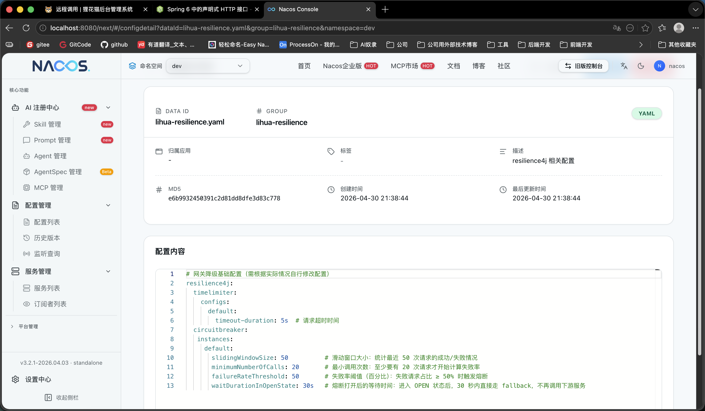

# 远程调用

> 远程调用是微服务版的核心机制：servlet 服务之间全部通过声明式 HTTP 客户端互调，认证服务 `lihua-auth` 自身无数据库，用户数据均经 RPC 取自 `lihua-system`。
>
> API 契约统一维护在 `lihua-api` 下，不同业务模块提供的远程调用接口在 `lihua-api` 下以子模块的形式维护。

## 目录结构

```text
lihua-api/                                   # api层
└── lihua-api-system/                        # 系统模块 API 子模块
    └── src/
        └── main/
            └── java/
                └── com/lihua/client/
                    ├── client               # client接口，用于httpExchange接口定义
                    ├── facade               # client门面扩展，用于集成resilience4j治理
                    └── model                # 远程调用相关的业务模型
```


## 实现方案

远程调用使用  [HTTP Interface](https://springdoc.cn/spring-6-http-interface/) 此方案同时支持 `同步` 与 `异步` 调用。官方示例中每个接口需要单独注册对应的Client客户端，本项目将这一过程进行封装简化，项目启动时自动扫描创建，使用过程与OpenFeign一样丝滑。

调用地址使用 `http://{serverName}` 形式，由 Spring Cloud LoadBalancer 完成服务名寻址与负载均衡，无需关心具体实例 IP 与端口。


## 自定义注解 @RemoteClient

`HTTP Interface` 只是一个客户端工具，并没有集成远程调用相关业务功能，本项目在集成时进行了一定的服务发现扩展。使用自定义注解 `@RemoteClient` 可指定服务名，用于服务发现和负载均衡的远程调用地址切换和同步异步方法的指定。

``` java
// serverName 为服务名称
// executionMode 指定同步/异步调用，默认同步
// timeout 为响应等待超时时间（秒），默认 5s
@RemoteClient(serverName = "lihua-system", executionMode = ExecutionModeEnum.ASYNC)
@HttpExchange("system/log")
public interface SysLogClient {

    /**
     * 保存操作日志
     */
    @PostExchange("operate/insert")
    Mono<ApiResponseModel<String>> insertOperate(@RequestBody LogModel logModel);

    /**
     * 保存登录日志
     */
    @PostExchange("login/insert")
    Mono<ApiResponseModel<String>> insertLogin(@RequestBody LogModel logModel);
}
```

**属性说明**

| 属性 | 类型 | 默认值 | 说明 |
| ---- | ---- | ------ | ---- |
| `serverName` | String | 必填 | 目标服务名（即对方的 `spring.application.name`），拼接为 `http://{serverName}` 后经 LoadBalancer 寻址 |
| `scheme` | SchemeEnum | `HTTP` | 请求协议，内网服务间调用默认 HTTP 即可 |
| `executionMode` | ExecutionModeEnum | `SYNC` | 执行模式：`SYNC` 同步（底层 RestClient），`ASYNC` 异步（底层 WebClient，返回值须为 `Mono<T>`） |
| `timeout` | int | `5` | 响应等待超时时间（秒）。属接口特征故在接口处声明，启动期一次性构建，修改需重启 |

配合 `@HttpExchange` 系列注解声明路径与方法（与 Spring MVC 注解同形）：`@HttpExchange` 类级根路径，`@GetExchange`/`@PostExchange` 方法级子路径，参数支持 `@PathVariable`、`@RequestBody` 等。

设置执行模式为 `executionMode = ExecutionModeEnum.ASYNC` 后，远程调用接口返回值为 `Mono<ApiResponseModel<T>>`。当前框架内异步客户端的唯一消费方是系统日志 fire-and-forget 落库。

## 客户端自动注册

在配置类上标记 `@EnableHttpClients(packages = "com.lihua")` 即可启用扫描（`lihua-base-client` 的 `ClientConfig` 已声明，业务服务零配置）。项目使用 `ImportBeanDefinitionRegistrar` 方式按包和注解自动注册Client Bean：扫描到 `@RemoteClient` 接口后，按 `executionMode` 分别注册 `RestClientFactoryBean`（同步）或 `WebClientFactoryBean`（异步）。项目启动时会打印扫描到的客户端接口，效果见 [远程调用模块](/3.0/doc-cloud/base/client#自动客户端创建)。

## 服务治理

HTTP Interface 没有提供OpenFeign类似的简单服务治理方案，项目集成了 `resilience4j` 在 `facade` 包下统一处理服务治理，业务服务可直接调用相关Facade类提供的方法进行远程调用，无需在业务层关注服务治理相关逻辑。

``` java
/**
 * 系统日志相关远程调用
 */
@Component
public class SysLogClientFacade {

    @Resource
    private SysLogClient sysLogClient;

    /**
     * 保存操作日志
     */
    @CircuitBreaker(name = "sysLog", fallbackMethod = "logFallback")
    public Mono<ApiResponseModel<String>> insertOperate(LogModel logModel) {
        return sysLogClient.insertOperate(logModel);
    }

    /**
     * 保存登录日志
     */
    @CircuitBreaker(name = "sysLog", fallbackMethod = "logFallback")
    public Mono<ApiResponseModel<String>> insertLogin(LogModel logModel) {
        return sysLogClient.insertLogin(logModel);
    }


    public Mono<ApiResponseModel<String>> logFallback(LogModel logModel, Throwable throwable) {
        return Mono.error(throwable);
    }

```

写 fallback 时需注意两点：

- **登录链 fallback 须抛异常保 503 语义**。`SysUserAuthClientFacade.loginFallback` 中抛出 `InternalAuthenticationServiceException`，让 DaoAuthenticationProvider 以系统级故障透出；若返回 error 响应码，消费方只能抛 `UsernameNotFoundException`，会被防枚举机制掩盖成「用户名或密码错误」，503 伪装成 401 误导排障。
- **fire-and-forget 链路勿重复打日志**。`SysLogClient` 为异步日志通道，失败留痕统一由消费端 subscribe 的 onError 回调负责，fallback 仅 `Mono.error(throwable)` 透传。

Nacos `lihua-resilience.yaml` 中提供了基础的resilience4j配置，详细配置许根据业务情况自行调整。**注意熔断参数只认 `configs.default` 模板，写在 `instances.<name>` 下的条目不会被注解实例消费（预创建同名实例但不被具名引用时不生效），这是 Resilience4j 的已知坑。**

**此配置可立即生效**



## HMAC 签名机制

服务间调用防伪造是 3.0 的核心安全机制：每个 RPC 请求自动附加 HMAC-SHA256 签名，服务端对标记了 `@InternalOnly` 的端点验签放行。

**签名规则**

```text
sign = Base64( HmacSHA256( rpc.signKey, "METHOD:PATH:timestampMillis" ) )
```

- 密钥：Nacos `lihua-common.yaml` 的 `rpc.signKey`（缺失启动失败）
- 签名材料：`请求方法:请求路径:当前毫秒时间戳`，时间戳使每个请求签名互异（单个签名泄露无法复用到其他请求/参数）
- 服务端使用 `MessageDigest.isEqual` 常量时间比对，防时序侧信道；时间戳仅作签名材料、不校验时效（内部网络无截获重放面，多机时钟漂移反而会误杀合法调用）
- **`rpc.signKey` 换值需四个 servlet 服务（auth/system/file/monitor）同步重启**，否则实例间签名不一致互相拒绝

**客户端侧**：`RestClientConfig`/`WebClientConfig` 中的请求拦截器在发送前完成三件事——

1. 透传原始请求上下文头：`Authorization`（token）、`Trace-Id`、`Request-IP`、`Client-Type`
2. 追加 `Internal-Sign` 签名头与 `Timestamp` 时间戳头
3. 经 LoadBalancer 拦截器完成服务名寻址

``` java
// 生成签名（同步侧 RestClient 拦截器，异步侧 WebClient 过滤器同逻辑）
long timeMillis = DateUtils.nowTimeStamp();
String sign = HmacUtils.hmacSha256(internalSignKey, String.format("%s:%s:%s",
        request.getMethod().name(),
        request.getURI().getPath(),
        timeMillis));
request.getHeaders().add(CustomHttpHeader.SIGN.getValue(), sign);
request.getHeaders().add(CustomHttpHeader.TIMESTAMP.getValue(), String.valueOf(timeMillis));
```

**服务端侧**：方法级注解 `@InternalOnly`（`lihua-base-web`）+ `InternalRequestInterceptor` 拦截器。

``` java
// 1. 端点方法上标记 @InternalOnly
@InternalOnly
@PostMapping("loginSelect/{username}")
public ApiResponseModel<CurrentUser> loginSelect(@PathVariable("username") String username) { ... }
```

``` java
// 2. InternalRequestInterceptor 用 rpc.signKey 重算签名并常量时间比对
String confirmSign = HmacUtils.hmacSha256(internalSignKey, String.format("%s:%s:%s",
        request.getMethod(),
        request.getRequestURI(),
        timestamp));
if (sign == null || !MessageDigest.isEqual(
        confirmSign.getBytes(StandardCharsets.UTF_8),
        sign.getBytes(StandardCharsets.UTF_8))) {
    // 签名不匹配：HTTP 200 + code 401 拒绝
    WebUtils.renderJson(StrResponse.error(ResultCodeEnum.AUTHENTICATION_EXPIRED, "签名错误"));
    return false;
}
```

> 放行规则与签名的搭配：仅「调用时无用户 token」的端点（登录链、注册、日志落库）在 SecurityConfig 中 permitAll、由签名独扛；其余 RPC 端点（如 `system/setting/cacheIpBlack`）保持 `authenticated` 叠加签名墙——调用方恒带透传 token。详见 [安全模块](/3.0/doc-cloud/base/security)。

## 连接池配置

RPC 客户端连接族超时与连接池统一走 `rpc` 配置段（`ClientProperties`），随服务启动一次性构建进 HTTP 客户端，**Nacos 修改后需重启生效**：

``` yaml
rpc:
  # 内部调用签名密钥（HMAC-SHA256；缺失启动失败。换值需四个 servlet 服务同步重启）
  signKey: xxxxxxxx
  # RPC 客户端连接超时
  connectTimeout: 3s
  # RPC 连接池最大总连接数（须不小于 maxConnPerRoute）
  maxConnTotal: 200
  # RPC 连接池单路由（单下游服务）最大连接数
  maxConnPerRoute: 50
  # 等池超时（从连接池租借连接最长等待；并发排队超此值快速失败而非傻等）
  connectionRequestTimeout: 3s
```

- 响应等待超时是接口特征，不走本段，由各 `@RemoteClient(timeout)` 接口级声明（默认 5s）
- 连接池三参数仅作用于同步侧（HC5/RestClient）；WebClient 异步侧走 reactor-netty 默认池
- 显式配置连接池的原因：HC5 默认池仅 25 总连接/每路由 5，高峰期会等池排队

## 现有客户端一览

| Client 接口 | 目标服务 | 模式 | 用途 |
| ----------- | -------- | ---- | ---- |
| `SysUserAuthClient` | lihua-system | 同步 | 登录用户查询、登录用户全量信息、用户注册 |
| `SysSettingClient` | lihua-system | 同步 | 缓存 IP 黑名单、同账号最大登录数、验证码开关 |
| `SysDictDataClient` | lihua-system | 同步 | 按字典类型编码批量回源字典数据（缓存回源通道） |
| `SysLogClient` | lihua-system | 异步 | 操作日志/登录日志 fire-and-forget 落库 |
