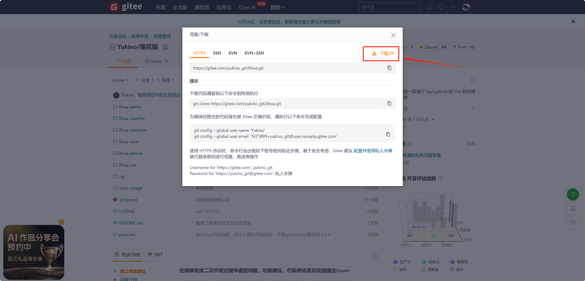
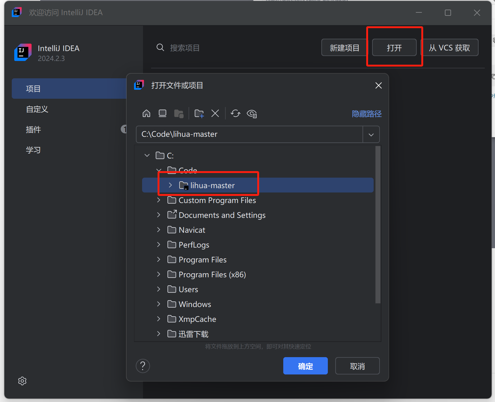
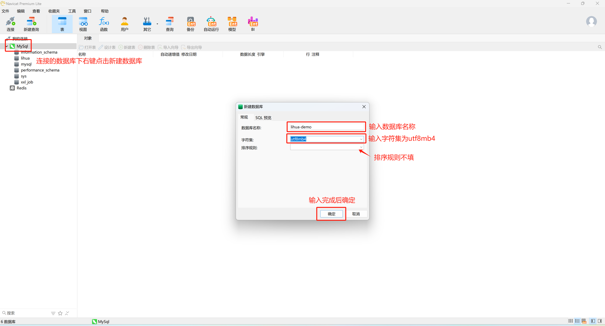
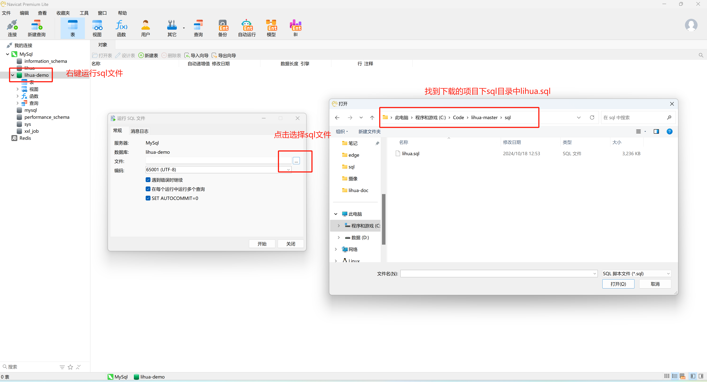
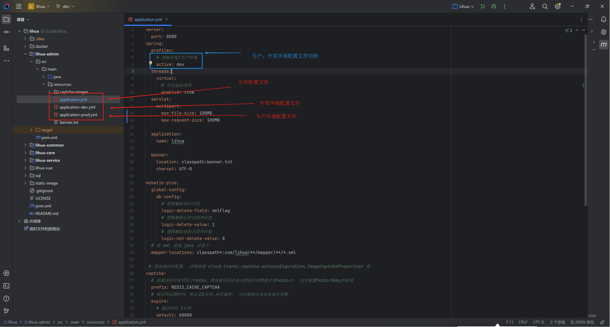

# 项目启动

## 环境准备

- Java：25+
- MySQL：8.0+
- Redis：3.0+
- Maven：3.0+

## 开发工具

- IDEA：2025+
- Navicat

## 拉取项目代码

1. 前往仓库下载master分支代码 [仓库](https://gitee.com/yukino_git/lihua)

   

2. 使用IDEA打开项目

   

   

## 导入数据库脚本

1. 新建数据库

   以Navicat为例，找到连接的MySQL数据库，右键新建数据库，输入数据库名称，字符集选择 `utf8mb4` 后点击确定

   

2. 导入SQL文件

   新建数据库后鼠标在新建的数据库上右键点击 “运行SQL文件” ，选择项目 `deploy/db/lihua.sql` 文件后点击开始

   

   > 从低版本升级时，全量执行 `deploy/db/lihua.sql` 后再执行 `deploy/db/upgrade-3.0.0.sql` 即可完成升级

3. 导入完成后使用默认账号 `admin / 123456` 登录系统

## 基础配置

### 配置文件

`lihua-admin` 子工程下 `src/main/resources` 下`.yml` 为项目的配置文件

- `application.yml` 开发、生产环境公共配置

- `application-dev.yml`  开发环境配置

- `application-prod.yml` 生产环境配置

  

### 配置项

**application.yml**

- 运行端口： `server.port` 可配置项目运行端口，默认8085
- 虚拟线程：`spring.threads.virtual.enabled` 默认开启，无需修改
- 登录失败锁定：`login.lock` 默认关闭（`enabled: false`），可按需开启

**application-dev.yml**

- 令牌配置：`token` 下配置 `tokenExpireTime`（过期时间）、`refreshThreshold`（刷新阈值）、`tokenSecret`（JWT签名密钥）
- 附件配置：`attachment` 下配置 `downloadSignKey`（下载链签名密钥）、`uploadFileModel`（LOCAL/ALIYUN-OSS）、`uploadFilePath`（上传路径）
- 数据库连接：`spring.datasource.dynamic.datasource.master` 下配置 `url` `username` `password`
- Redis连接：`spring.redis.redisson.config` 下配置 `address` `password`
- 日志路径：`logging.file.name` 配置日志保存路径

## 启动项目

> 需确保Mysql、Redis启动中并连接正常

1. `lihua-admin` 子项目下找到 `com/lihua/LiHuaApplication.java` 启动类，点击IDEA启动按钮，控制台打印 `LI HUA` 字符画即表示启动成功

2. 浏览器输入 `localhost:8085`  显示返回结果即启动成功

