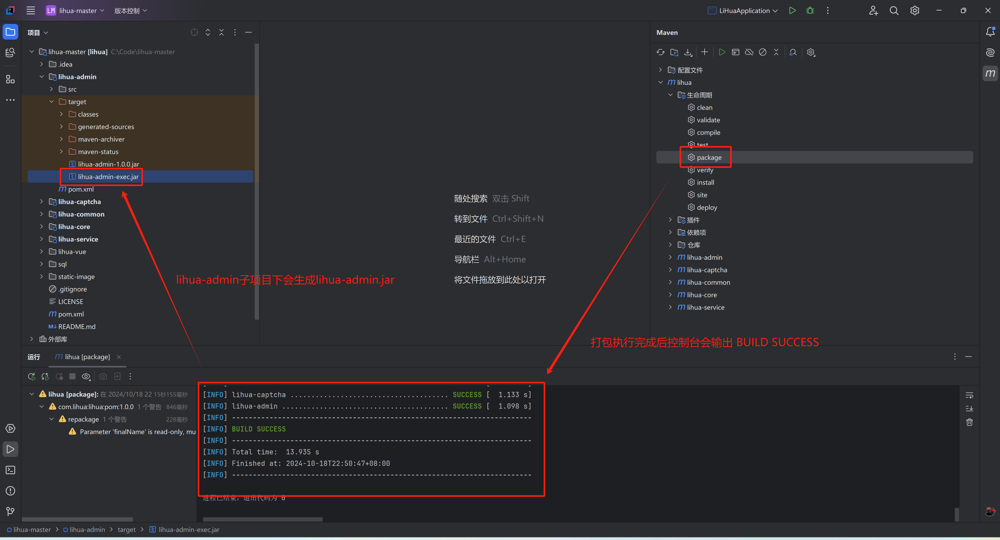

# 打包部署

::: info

打包前请确认配置文件是否为生产环境（`application.yml` 中 `spring.profiles.active: prod`）

:::

1. 打包，找到IDEA右侧 `Maven` 按钮，在`lihua/生命周期` 下先点击`clean` 后控制台会打印清空log，清空完成后点击`package`进行项目打包

   

2. 打包成功，后控制台会输出 `BUILD SUCCESS` 同时 `lihua-admin` 子项目下会生成 `lihua-admin-exec.jar` 将此jar包部署到服务器即可

   

3. 服务器启动，将jar包拷贝到服务器，运行 `java -jar jar包路径` 启动成功即部署完成（云服务器请确认控制面板的入栈配置及系统防火墙/入站规则端口，服务端口为 `8085`；服务器需安装 Java 25+ 运行环境）

   

## 生产环境变量

`application-prod.yml` 中关键配置均读取自环境变量，启动前必须注入以下变量（密钥类变量**无默认值，缺失直接启动失败**，禁止回退硬编码）：

| 环境变量 | 说明 |
| -------- | ---- |
| `TOKEN_SECRET` | JWT 签发/验签密钥（HMAC-SHA256），建议 32+ 随机字符，如 `openssl rand -hex 32`；换值=全员重新登录 |
| `ATTACHMENT_DOWNLOAD_SIGN_KEY` | 附件下载链接签名密钥（HMAC-SHA256），建议 32+ 随机字符，避免 `$`、`#`、空格等需转义字符 |
| `BASE_FILE_PATH` | 文件根目录（附件上传、日志、tomcat临时目录均在其下），如 `/lihua/data/` |
| `DB_HOST` / `DB_PORT` | MySQL 地址与端口 |
| `DB_USERNAME` / `DB_PASSWORD` | MySQL 用户名与密码 |
| `REDIS_HOST` / `REDIS_PORT` | Redis 地址与端口 |
| `REDIS_PASSWORD` | Redis 密码 |

> 令牌过期时间 `token.tokenExpireTime` 生产默认 `24h`；SpringDoc 接口文档在生产环境默认关闭（`springdoc.api-docs.enabled: false`）

## 升级提示

- 从低版本升级：全量执行 `deploy/db/lihua.sql` 后，再执行 `deploy/db/upgrade-3.0.0.sql` 完成增量升级
- 替换jar包重启前，建议先在测试环境验证新版本与存量数据的兼容性
