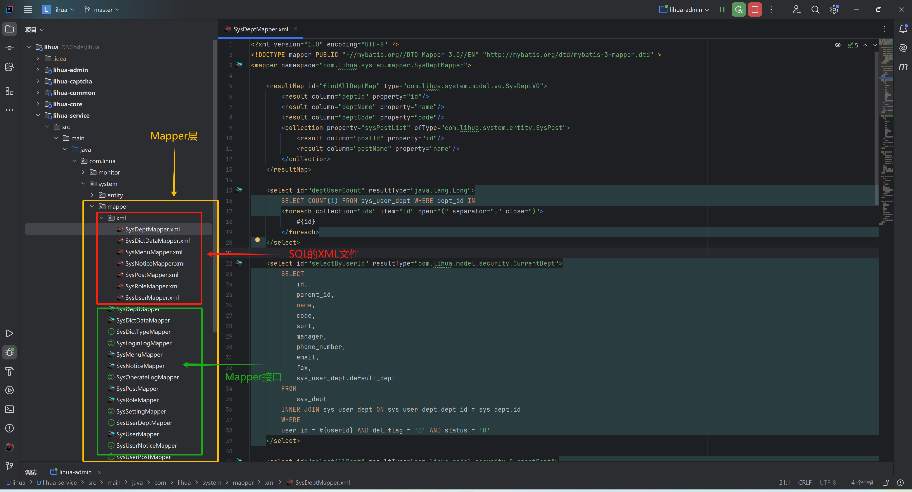

# Mapper 开发

复杂的多表查询需在xml中手写SQL


## 接口

mapper 接口继承 `BaseMapper` 泛型为实体类

``` java
public interface SysAttachmentMapper extends BaseMapper<SysAttachment> {

    List<String> queryDeletablePathByIds(@Param("ids") List<String> ids);

}
```


## XML

为保证Mapper层与Service层结构一致，将xml文件放置到了mapper包下




## 配置

新建模块请在启动类`LiHuaApplication`下`@MapperScan` 注解中新增对应mapper路径，防止扫描不到Mapper

``` java
// @EnableSnailJob
@SpringBootApplication
@EnableAsync(proxyTargetClass = true)
@MapperScan({"com.lihua.**.mapper"})
@ComponentScan({"com.lihua.**"})
public class LiHuaApplication {
    public static void main(String[] args) {
        SpringApplication.run(LiHuaApplication.class, args);
    }
}
```

> `@MapperScan` 已使用 `com.lihua.**.mapper` 通配，正常情况下新建模块无需修改；`@EnableSnailJob` 默认注释，启用定时任务时再放开
