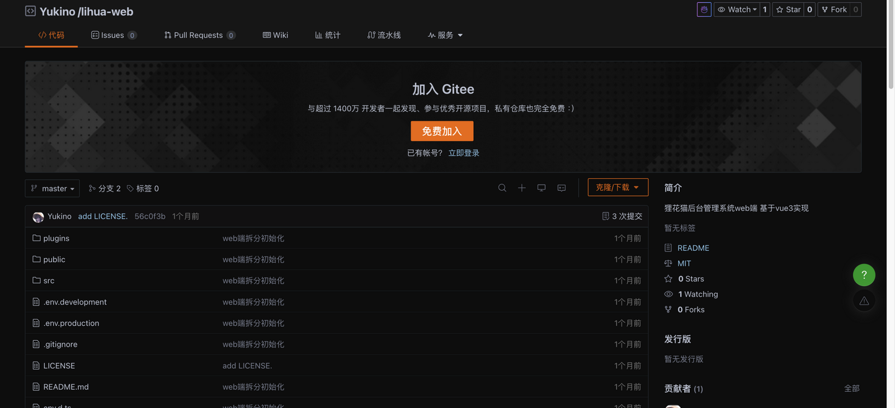
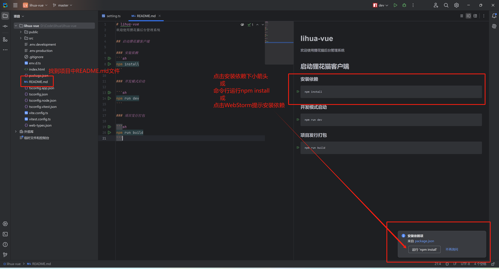
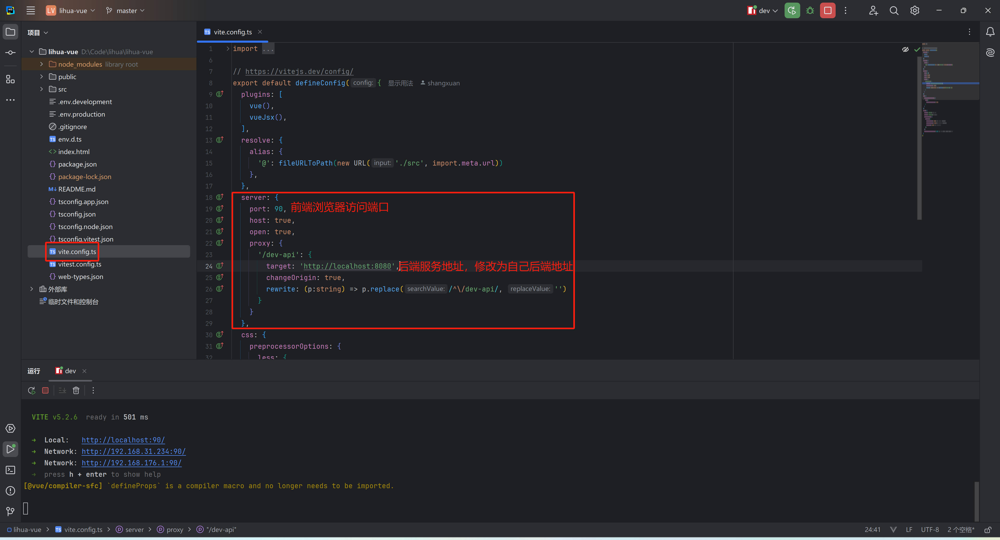
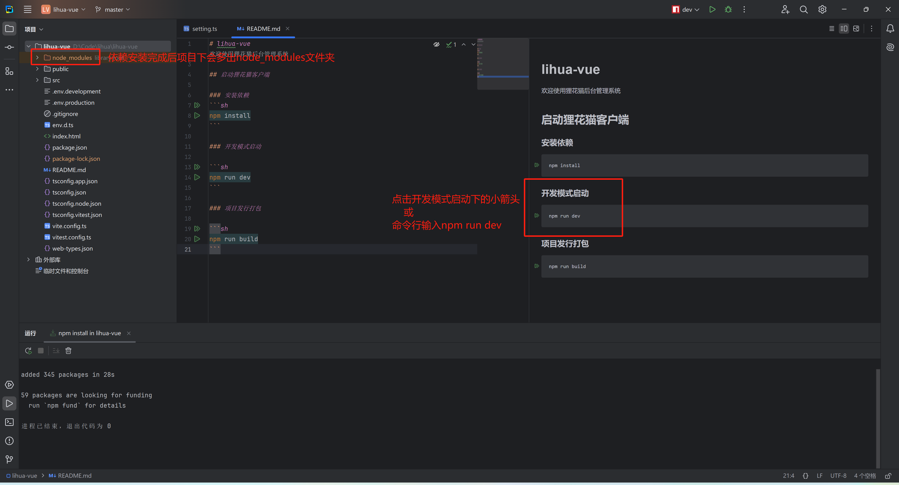
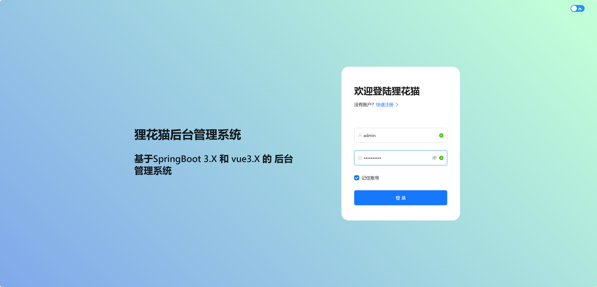

# 项目启动

## 前期准备

- 开发环境：[node 22.12+](https://nodejs.cn/download/)
- 开发工具：[WebStorm](https://www.jetbrains.com.cn/webstorm/)

## 拉取项目代码

1. 3.0 起 Web 端已拆分为独立仓库，前往 [lihua-web 仓库](https://gitee.com/yukino_git/lihua-web) 下载 master 分支代码，或直接执行 `git clone https://gitee.com/yukino_git/lihua-web.git`

   

2. 使用 WebStorm（VSCode 亦可根据个人习惯）打开 `lihua-web` 工程

## 安装依赖

1. 项目使用 `npm` 管理依赖，在工程根目录下执行 `npm install`，或找到项目中 `README.md` 文件后点击安装依赖下的小箭头

   

   ::: info 出现依赖下载失败时可尝试以下操作

   清空缓存 `npm cache clear --force`

   切换镜像仓库 `npm config set registry https://registry.npmmirror.com/`

   执行依赖安装 `npm install`

   :::

## 修改配置

1. 请求前缀配置在 `.env.development` 文件中，`VITE_APP_BASE_API` 默认为 `/dev-api`，`VITE_APP_WS_API` 为 WebSocket 连接前缀，一般无需修改

2. 修改代理配置，找到项目中 `vite.config.ts` 文件，修改 `server` 下 `port` 和 `proxy（重点）`，开发服务默认端口 `90`，`/dev-api` 请求代理到 `http://localhost:8085`（重写去掉前缀），`/ws-connect` 代理到 `ws://localhost:8085`

   

**对应后端配置**

单体版配置在 `lihua-admin/src/main/resources/application.yml` 下，代理目标为单体服务地址 `http://localhost:8085`

微服务版配置在 `lihua-gateway/src/main/resources/application-dev.yml` 下，代理目标改为网关地址

## 启动项目

1. 启动项目，依赖安装完成后点击开发模式启动或控制台输入 `npm run dev` 即可执行启动命令

   

2. 启动完成，启动完成后浏览器会自动打开页面，默认账号密码为 `admin` / `123456`

   

## 构建项目

1. 控制台执行 `npm run build` 即可执行构建命令，构建前会先执行 `vue-tsc` 类型检查（type-check）再进行 `vite build`，两者并行执行，任一失败则构建终止

2. 构建产物输出至 `dist` 目录，生产环境请求前缀由 `.env.production` 的 `VITE_APP_BASE_API`（默认 `/prod-api`）控制；构建产物已通过 esbuild 自动移除 `console` 与 `debugger`
