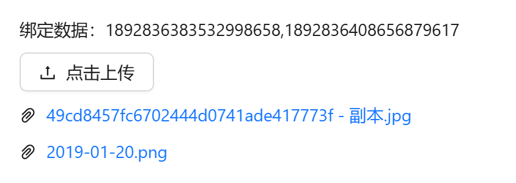
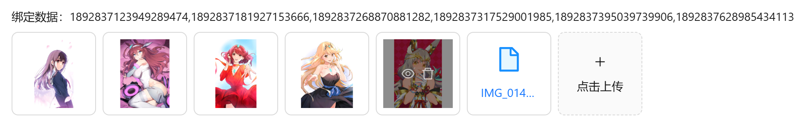
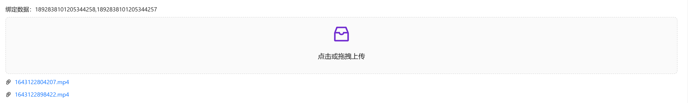
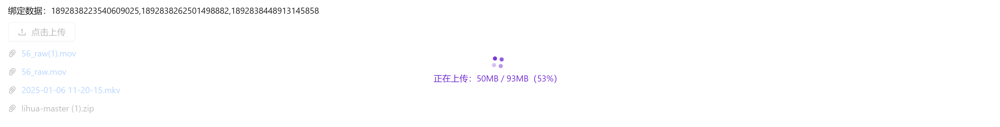

# 附件上传

表单中需要附件上传时使用

## 基础用法

引入组件 `import AttachmentUpload from "@/components/attachment-upload/index.vue"` 使用`v-model`进行双向绑定即可。双向绑定的数据为逗号分隔格式，返回的数据为后台附件表`sys_attachment`的主键id



```vue
<template>
  <a-flex vertical :gap="8">
    <a-typography-title :level="4">基础用法</a-typography-title>
    <a-typography-text>绑定数据：{{modelValue}}</a-typography-text>
    <attachment-upload v-model="modelValue"/>
  </a-flex>
</template>

<script setup lang="ts">
import AttachmentUpload from "@/components/attachment-upload/index.vue";
import {ref} from "vue";
const modelValue = ref<string>('')
</script>
```

## 图片预览

设置`mode="picture"`即可



```vue
<template>
  <a-flex vertical :gap="8">
    <a-typography-title :level="4">图片预览</a-typography-title>
    <a-typography-text>绑定数据：{{modelValue}}</a-typography-text>
    <attachment-upload v-model="modelValue" mode="picture"/>
  </a-flex>
</template>

<script setup lang="ts">
import AttachmentUpload from "@/components/attachment-upload/index.vue";
import {ref} from "vue";
const modelValue = ref<string>('')
</script>
```

## 拖拽上传

设置`mode="dragger"`即可



```vue
<template>
  <a-flex vertical :gap="8">
    <a-typography-title :level="4">拖拽上传</a-typography-title>
    <a-typography-text>绑定数据：{{modelValue}}</a-typography-text>
    <attachment-upload v-model="modelValue" mode="dragger"/>
  </a-flex>
</template>

<script setup lang="ts">
import AttachmentUpload from "@/components/attachment-upload/index.vue";
import {ref} from "vue";
const modelValue = ref<string>('')
</script>
```

## 分片上传

分片上传也支持图片预览、拖拽上传模式

设置`chunk` 即可，还可以设置每个片段大小，分片同时上传数量。分片上传会对文件计算 md5（hash-wasm），上传期间组件内展示「处理中/上传中/合并中」进度条；分片模式下不支持多选与文件夹上传



```vue
<template>
  <a-flex vertical :gap="8">
    <a-typography-title :level="4">分片上传</a-typography-title>
    <a-typography-text>绑定数据：{{modelValue}}</a-typography-text>
    <attachment-upload v-model="modelValue" :max-size="100" chunk :chunk-size="10" :chunk-upload-count="2"/>
  </a-flex>
</template>

<script setup lang="ts">
import AttachmentUpload from "@/components/attachment-upload/index.vue";
import {ref} from "vue";
const modelValue = ref<string>('')
</script>
```

## 业务删除

设置 `auto-remove` 后，点击附件列表的删除按钮会弹确认框，确认后自动执行业务删除并回传业务结果；也可通过 ref 调用组件暴露的 `businessRemove` 方法手动触发。未开启时删除仅从列表移除，回传列表内移除的文件对象

## API

### 双向绑定

| 属性名称 | 描述     | 类型   | 默认值 | 是否必填 |
| -------- | -------- | ------ | ------ | -------- |
| v-model  | 双向绑定 | string | ''     | 是       |

### 属性

| 属性名称         | 描述                                     | 类型                     | 默认值   | 是否必填 |
| ---------------- | ---------------------------------------- | ------------------------ | -------- | -------- |
| mode             | 模式：按钮/图片/拖拽                     | 'button' \| 'picture' \| 'dragger' | 'button' | 否 |
| icon             | 附件图标                                 | string（图标组件名称）   | -        | 否       |
| text             | 描述文本                                 | string                   | -        | 否       |
| uploadType       | 可上传的附件类型                         | string[]                 | -        | 否       |
| description      | 详细说明（仅支持拖拽上传）               | string                   | -        | 否       |
| maxCount         | 最大上传数量（超出后不会调用上传）       | number                   | 10       | 否       |
| maxSize          | 最大上传大小，分片上传注意调整大小（mb） | number                   | 10       | 否       |
| multiple         | 是否支持多附件上传（分片上传不支持）     | boolean                  | true     | 否       |
| directory        | 是否支持附件夹上传（分片上传不支持）     | boolean                  | false    | 否       |
| businessCode     | 业务编码                                 | string                   | 路由名称 | 否       |
| businessName     | 业务名称                                 | string                   | 菜单名称 | 否       |
| chunk            | 是否分片上传                             | boolean                  | false    | 否       |
| chunkSize        | 最大分片片段大小                         | number                   | 20       | 否       |
| chunkUploadCount | 分片上传同时上传数量                     | number                   | 3        | 否       |
| fileName         | 指定附件名称（自动保留原附件扩展名）     | string                   | -        | 否       |
| autoRemove       | 自动删除（点击删除按钮是否自动进行业务删除） | boolean              | false    | 否       |
| public           | 公开附件模式：上传公开附件，双向绑定收发附件 path（对象键）而非附件 id；免登录可下载（App 安装包等），列表删除仅解除引用不做业务删除 | boolean | false | 否 |

### 事件

| 事件名称       | 描述                     | 回调参数       |
| -------------- | ------------------------ | -------------- |
| uploadSuccess  | 上传成功触发             | { file, fileList } |
| remove         | 附件移除时触发           | 列表内移除回调整文件对象；autoRemove 确认删除回传 { id, status } 业务结果 |
| uploadError    | 上传失败触发             | (file, errorMsg?) |
| exceedMaxCount | 超出附件最大数限制被拒收时触发 | 超出的附件 |

### 方法

| 方法名称       | 描述                     | 参数           |
| -------------- | ------------------------ | -------------- |
| businessRemove | 手动触发业务删除         | -              |
