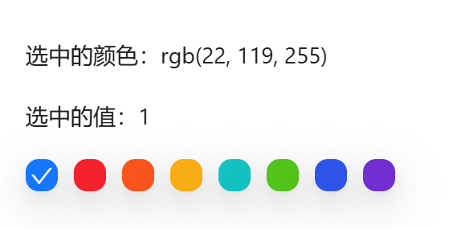

# 颜色选择

表单中需要选择指定颜色时使用


## 基础用法

引入组件`import ColorSelect from "@/components/color-select/index.vue"` 

`v-model:color` 对颜色值进行双向绑定

`v-model:value="value"` 对颜色key进行双向绑定

`dataSource` 指定颜色列表



```vue
<template>
  <a-typography-title :level="4">最简单的颜色选择</a-typography-title>
  <a-typography-text>选中的颜色：{{targetColor}}</a-typography-text>
  <a-typography-text>选中的值：{{targetKey}}</a-typography-text>
  <color-select :data-source="colorSource" v-model:color="targetColor" v-model:value="targetKey"/>
</template>

<script setup lang="ts">
import ColorSelect from "@/components/color-select/index.vue"
import {ref} from "vue";
const colorSource = [
  {
    name: '拂晓蓝',
    color: 'rgb(22, 119, 255)',
    key: '1'
  },
  {
    name: '薄暮',
    color: 'rgb(245, 34, 45)',
    key: '2'
  },
  {
    name: '火山',
    color: 'rgb(250, 84, 28)',
    key: '3'
  },
  {
    name: '日暮',
    color: 'rgb(250, 173, 20)',
    key: '4'
  },
  {
    name: '明青',
    color: 'rgb(19, 194, 194)',
    key: '5'
  },
  {
    name: '极光绿',
    color: 'rgb(82, 196, 26)',
    key: '6'
  },
  {
    name: '极客蓝',
    color: 'rgb(47, 84, 235)',
    key: '7'
  },
  {
    name: '酱紫',
    color: 'rgb(114, 46, 209)',
    key: '8'
  }
]

const targetColor = ref<string>()
const targetKey = ref<string>()
</script>
```

## 自定义颜色

开启 `allow-custom` 后（仅 `v-model:color` 模式生效），颜色列表尾部追加取色器入口。必须同时指定 `custom-color-storage-key` 作为自定义色的 localStorage 记忆键（共享键会跨场景相互覆盖，开启时未传会在控制台报错）。自定义入口为三态：未自定义时显示「A」标记（任意色入口）；自定义过但当前选的是预置色时常显记忆色（可点击快捷重选）；当前即自定义色时显示该色并打勾

```vue
<template>
  <color-select :data-source="colorSource"
                v-model:color="targetColor"
                allow-custom
                custom-color-storage-key="my-scene-custom-color"/>
</template>
```

## 值与展示分离

选项支持 `displayColor` 字段：色块展示 `displayColor`，而 `v-model:color` 仍写入 `color`，用于「值与展示分离」的场景（如头像「跟随系统」存 `'auto'`、展示渐变色）。`checkColor` 可显式指定勾形颜色，未指定时按底色亮度动态取黑/白

```vue
<template>
  <color-select :data-source="[{name: '跟随系统', color: 'auto', displayColor: 'linear-gradient(135deg, #667eea, #764ba2)'}]" v-model:color="mode"/>
</template>
```

## API

### 双向绑定

| 属性名称      | 描述          | 类型   | 默认值 | 是否必填               |
| ------------- | ------------- | ------ | ------ | ---------------------- |
| v-model:color | 绑定的color值 | string | -      | 否（至少绑定一个属性） |
| v-model:value | 绑定的key值   | string | -      | 否（至少绑定一个属性） |

### 属性

| 属性名称   | 描述         | 类型                                                 | 默认值 | 是否必填 |
| ---------- | ------------ | ---------------------------------------------------- | ------ | -------- |
| dataSource | 可选颜色数组 | Array<{ name: string, color: string, key?: string, checkColor?: string, displayColor?: string }> | -      | 是       |
| allowCustom | 自定义颜色入口开关（仅 v-model:color 模式生效），开启后尾部追加取色器项 | boolean | false | 否 |
| customColorStorageKey | 自定义色记忆的 localStorage 键（开启 allowCustom 时必传，共享键会跨场景相互覆盖） | string | - | 否（开启 allowCustom 时必填） |

### 事件

| 事件名称 | 描述           | 回调参数           |
| -------- | -------------- | ------------------ |
| click    | 点选颜色时触发 | { color, name, key? } |
