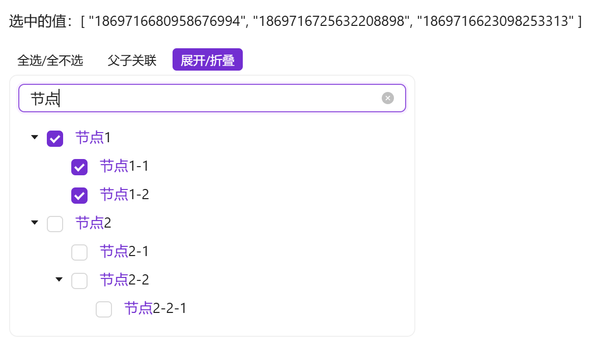
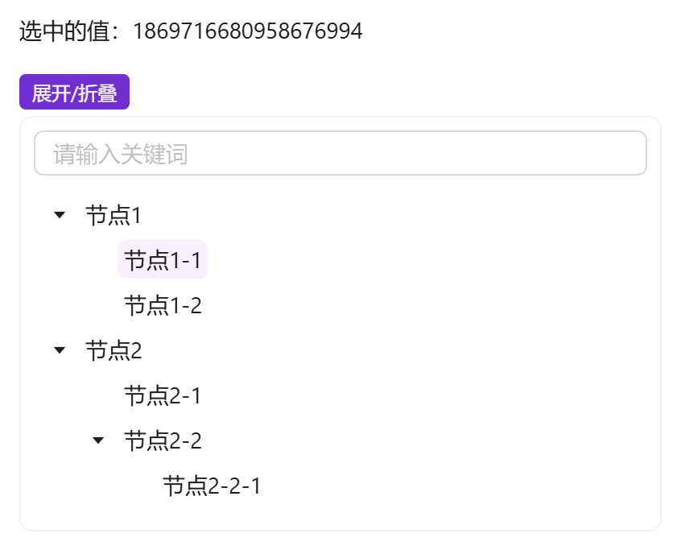
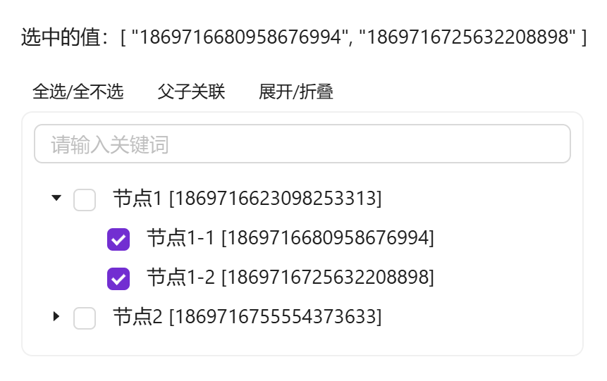

# 简单树形选择

表单中需要可筛选关键字的树形选择时使用

::: info 提示

`a-tree`使用双向绑定时有多种类型（选中复选框/展开折叠/选中）而且单选和多选绑定返回的数据结构差异较大。所以将最常用的功能进行封装，单选绑定定义的key值，多选绑定key值数组。另外也将展开折叠、父子关联、全选功能也进行了封装，不需要对应功能时可通过属性关闭

`a-tree`官方案例中有关键字检索的例子，但是由业务代码实现的，组件本身并没有封装。当多个业务都需要筛选树时，会造成重复代码过多的情况。所以将此功能也封装到组件中，不需要的话可通过属性关闭

:::


## 基础用法

引入组件`import EasyTreeSelect from '@/components/easy-tree-select/index.vue'` 使用`tree-data`树形即可展示树形结构，使用`v-model`双向绑定获取选中的`key`值，默认为多选，v-model绑定的值为key值数组。

需确保`tree-data`属性传入的值是有效的。如果通过异步获取的值，需在组件中使用 ` v-if="data && data.length > 0"`



```vue
<template>
  <a-typography-title :level="4">最简单的树形选择</a-typography-title>
  <a-typography-text>选中的值：{{value}}</a-typography-text>
  <a-row>
    <a-col :span="6">
      <easy-tree-select v-if="test_tree.length > 0" :tree-data="test_tree" v-model="value"/>
    </a-col>
  </a-row>
</template>
<script setup lang="ts">
import EasyTreeSelect from '@/components/easy-tree-select/index.vue'
import {initDict} from "@/helpers/dict"
import {ref} from "vue";
const {test_tree} = initDict("test_tree")
const value = ref<string[]>([])
</script>
```

## 单选的树形选择

使用 ` :multiple="false"` 来指定树形结构为单选模式，这时v-model绑定的值为key值



```vue
<template>
  <a-typography-title :level="4">单选树形结构</a-typography-title>
  <a-typography-text>选中的值：{{value}}</a-typography-text>
  <a-row>
    <a-col :span="6">
      <easy-tree-select v-if="test_tree.length > 0" :tree-data="test_tree" v-model="value" :multiple="false"/>
    </a-col>
  </a-row>
</template>
<script setup lang="ts">
import EasyTreeSelect from '@/components/easy-tree-select/index.vue'
import {initDict} from "@/helpers/dict"
import {ref} from "vue";
const {test_tree} = initDict("test_tree")
const value = ref<string>()
</script>
```

## 使用自定义插槽

可自定义节点显示插槽，通过` #title="{keyword, segments, ...item}" `可获取到关键词 `keyword`、关键词命中的高亮分段 `segments` 及每个节点的属性。不使用插槽时节点标题自带关键词命中高亮



```vue
<template>
  <a-typography-title :level="4">自定义插槽</a-typography-title>
  <a-typography-text>选中的值：{{value}}</a-typography-text>
  <a-row>
    <a-col :span="6">
      <easy-tree-select v-if="test_tree.length > 0" :tree-data="test_tree" v-model="value">
        <template #title="{keyword, segments, label, id}">
          {{label + ' [' + id + ']'}}
        </template>
      </easy-tree-select>
    </a-col>
  </a-row>
</template>
<script setup lang="ts">
import EasyTreeSelect from '@/components/easy-tree-select/index.vue'
import {initDict} from "@/helpers/dict"
import {ref} from "vue";
const {test_tree} = initDict("test_tree")
const value = ref<string[]>([])
</script>
```

## 虚拟滚动与容器滚动

两种滚动模式互斥，同传时以 `height` 为准：

- **虚拟滚动**：设置 `height`（px，树渲染高度）后启用（配合 `virtual`，默认 true），树体内部滚动、仅渲染可视区域节点，适合上千节点的大树
- **容器滚动**：设置 `max-height`（px）时限制外层容器高度、超出滚动，节点 DOM 全量渲染，适合中小规模树

## 关键词过滤

搜索框按关键词过滤树（仅保留命中节点及其链路，命中片段高亮），输入经防抖处理（`search-debounce` 默认 300ms，大树可调大以减少过滤频率）；过滤只影响展示，未显示的已勾选项保持不变。`tree-data` 刷新后会自动剔除已不存在于树中的勾选项，避免旧勾选残留污染双向绑定值

## 命令式 API

组件暴露了与工具栏同源的动作方法（基于当前可见节点范围）：`reset()` 重置、`checkAll()` 全选、`uncheckAll()` 全不选、`expandAll()` 展开全部、`collapseAll()` 折叠全部

```typescript
const treeRef = useTemplateRef<InstanceType<typeof EasyTreeSelect>>("treeRef")
// 重置组件：恢复展开与关联初始状态、全部取消选中、清空关键词
treeRef.value?.reset()
```

## API

### 双向绑定

| 属性名称 | 描述     | 类型                                          | 默认值 | 是否必填 |
| -------- | -------- | --------------------------------------------- | ------ | -------- |
| v-model  | 双向绑定 | 与Key定义类型相同（单选） Key类型数组（多选） | -      | 是       |

### 属性

| 属性名称          | 描述                  | 类型                                             | 默认值                                              | 是否必填 |
| ----------------- | --------------------- | ------------------------------------------------ | --------------------------------------------------- | -------- |
| treeData          | 可选的树形结构数据    | 具有树形结构的数组                               | -                                                   | 是       |
| fieldNames        | 树形结构字段对应别名  | \{children: string, title: string, key: string\} | \{children: 'children', title: 'label', key: 'id'\} | 否       |
| defaultExpandAll  | 是否默认展开全部      | boolean                                          | false                                               | 否       |
| checkRelate       | 是否父子关联勾选      | boolean                                          | false                                               | 否       |
| multiple          | 是否支持多选          | boolean                                          | true                                                | 否       |
| showToolbar       | 显示工具栏            | boolean                                          | true                                                | 否       |
| showSearch        | 显示搜索框            | boolean                                          | true                                                | 否       |
| searchPlaceholder | 搜索框提示词          | string                                           | 请输入关键词                                        | 否       |
| searchDebounce    | 搜索过滤防抖时间（ms） | number                                          | 300                                                 | 否       |
| bodyStyle         | 树形卡片body样式      | Object                                           | \{padding: 'var(--ant-padding-xs)', borderRadius: 'var(--ant-border-radius-lg)'\} | 否 |
| maxHeight         | 可视最大高度（px）：限制外层容器高度、超出滚动，节点全量渲染；与 height 互斥，同传时失效 | number | - | 否 |
| height            | 树渲染高度（px）：设置后启用虚拟滚动，适合大树；与 maxHeight 互斥，同传时优先 | number | - | 否 |
| virtual           | 是否启用虚拟滚动（默认 true，需设置 height 后才生效） | boolean | true | 否 |
| bordered          | 是否展示边框          | boolean                                          | true                                                | 否       |

### 插槽

| 插槽名称 | 描述               | 返回参数                | 是否必须 |
| -------- | ------------------ | ----------------------- | -------- |
| title    | 自定义树形节点插槽 | \{keyword, segments, ...节点属性\} | 否       |

### 事件

| 事件名称 | 描述             | 回调参数                                  |
| -------- | ---------------- | ------------------------------------- |
| change   | 选中值变化时触发 | 选中的key（单选为key，多选为key数组） |

### 方法

| 方法名称    | 描述     | 参数 |
| ----------- | -------- | ---- |
| reset       | 重置组件 | -    |
| checkAll    | 全选     | -    |
| uncheckAll  | 全不选   | -    |
| expandAll   | 展开全部 | -    |
| collapseAll | 折叠全部 | -    |
