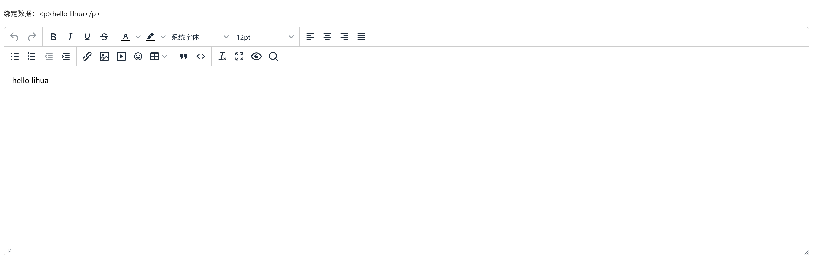

# 富文本编辑器

表单中需要富文本编辑器时使用

::: info 提示

此组件为`TinyMCE 8`的二次封装（3.0 由 Vditor 迁移而来），基于 @tinymce/tinymce-vue 集成，依赖文件在 `public/tinymce` 中（将`node_modules/tinymce` 中的内容复制到 `public/tinymce` ）

`public/tinymce/langs/zh_CN.js` 中为汉化包；`public/tinymce/skins` 中包含自定义主题（含暗色皮肤 `custom-dark`），需要覆盖时请谨慎操作

:::


## 基础用法

引入组件`import Editor from "@/components/tinymce-editor/index.vue"`  后使用 `v-model="value"` 双向绑定即可



```vue
<template>
  <a-typography-title :level="4">基础用法</a-typography-title>
  <a-typography-text>绑定数据：{{value}}</a-typography-text>
  <editor v-model="value"/>
</template>

<script setup lang="ts">
import Editor from "@/components/tinymce-editor/index.vue"
import {ref} from "vue";

const value = ref<string>('')
</script>

```

## 图片/媒体/文件上传

编辑器工具栏中的图片、媒体、文件按钮均接入系统附件上传（公开附件），上传成功后正文写入附件的公开永久链接。通过 `image-type` / `media-type` / `file-type` 限制各类型的后缀名白名单（忽略大小写），`image-max-size` 等系列属性限制大小（字节）。未显式传 `business-code` 时业务编码自动跟随当前路由名（keep-alive 复用切路由后不过期）

```vue
<template>
  <a-typography-title :level="4">限制上传类型</a-typography-title>
  <editor v-model="value"
          business-code="notice"
          :image-type="['.png', '.jpg', '.jpeg', '.webp']"
          :image-max-size="1024 * 1024 * 5"
  />
</template>

<script setup lang="ts">
import Editor from "@/components/tinymce-editor/index.vue"
import {ref} from "vue";
const value = ref<string>('')
</script>
```

## 粘贴图片自动转存

`auto-download-paste-img` 默认开启：粘贴含外链图片的内容时，编辑器会自动拉取图片二进制并转存为系统附件，正文中的 `src` 替换为站内永久链（外链跨域拒绝或已失效时保留原 src 并提示）。编辑器随亮暗主题自动切换皮肤，切换暗色模式后编辑器自动重载

## API

### 双向绑定

| 属性名称 | 描述     | 类型   | 默认值 | 是否必填 |
| -------- | -------- | ------ | ------ | -------- |
| v-model  | 双向绑定 | string | -      | 是       |

### 属性

| 属性名称             | 描述                             | 类型                     | 默认值          | 是否必填 |
| -------------------- | -------------------------------- | ------------------------ | --------------- | -------- |
| height               | 编辑器高度                       | string \| number         | '50vh'          | 否       |
| autoDownloadPasteImg | 是否自动下载剪贴板中的图片       | boolean                  | true            | 否       |
| businessCode         | 业务编码，用于附件归属           | string                   | 当前路由名      | 否       |
| imageType            | 允许上传的图片类型（后缀名数组） | string[]                 | []              | 否       |
| imageMaxSize         | 图片最大上传大小（字节）         | number                   | 1024 * 1024 * 2 | 否       |
| mediaType            | 允许上传的媒体类型（后缀名数组） | string[]                 | []              | 否       |
| mediaMaxSize         | 媒体文件最大上传大小（字节）     | number                   | 1024 * 1024 * 2 | 否       |
| fileType             | 允许上传的文件类型（后缀名数组） | string[]                 | []              | 否       |
| fileMaxSize          | 文件最大上传大小（字节）         | number                   | 1024 * 1024 * 2 | 否       |
