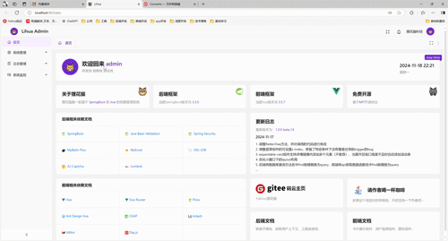
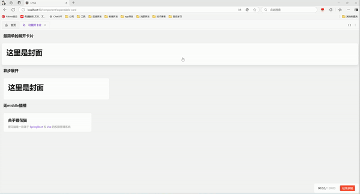
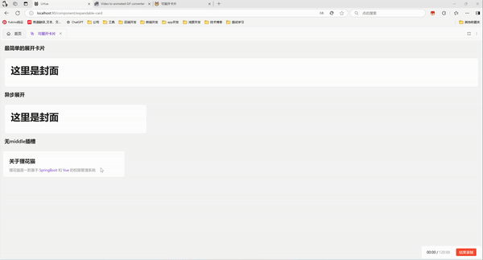
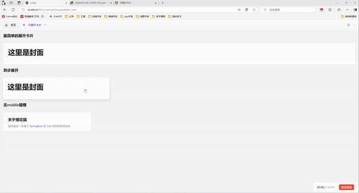

# 可展开卡片

仪表盘页面用来展示概述和详情时使用

小卡片展示汇总数据，展开后大卡片展示明细/历史/详细数据

## 组件效果

可以展开/收回的卡片组件，类似手机小组件，提供从哪来回哪去的弹簧飞行效果（阻尼弹簧动画，支持中途打断续跑），支持页面任意缩放。3.0 起动画引擎迁移至 Web Animations API 并重新调校了弹簧手感




## 基础用法

引入组件`import ExpandableCard from '@/components/expandable-card/index.vue'` 后使用`overview` `detail` 插槽实现最简单的展开卡片。插槽内容按契约只管满铺背景与排版，不写圆角/边框/阴影（表面由组件常驻提供）



3.0 起展开层为 overview → detail 两层结构（无独立过渡层），封面在交接点直接与详情相交渐变；纯静态 detail 的直接过渡效果如下



```vue
<template>
  <a-typography-title :level="4">基础用法</a-typography-title>
  <expandable-card :expanded-width="600" :expanded-height="610">
    <template #overview>
      <!-- 封面：标题 + 主题色关键词描述 + 右上角图标点缀 -->
      <div class="face">
        <div class="min-w-0">
          <a-typography-title :level="4" ellipsis>关于狸花猫</a-typography-title>
          <a-typography-text ellipsis type="secondary">
            基于
            <a-typography-text :style="{color: themeStore.getColorPrimary()}"> SpringBoot </a-typography-text>
            和
            <a-typography-text :style="{color: themeStore.getColorPrimary()}"> Vue </a-typography-text>
            的权限管理系统
          </a-typography-text>
        </div>
        <rocket-outlined class="face-icon" :style="{color: themeStore.getColorPrimary()}"/>
      </div>
    </template>
    <template #detail>
      <div class="scrollbar p-ant-lg">
        <a-typography-title :level="4" ellipsis>这里是展开</a-typography-title>
        <a-typography-text>详情内容，首个子元素会被自动加上滚动条样式并钉最终高度</a-typography-text>
      </div>
    </template>
  </expandable-card>
</template>

<script setup lang="ts">
import ExpandableCard from '@/components/expandable-card/index.vue'
import {RocketOutlined} from '@antdv-next/icons'
import {useThemeStore} from '@/stores/theme.ts'

const themeStore = useThemeStore()
</script>
```

## 异步展开

设置`:auto-complete="false"` 后展开动画播完会停在等待层（默认居中 `a-spin`），由外部通过 `is-complete` 控制内容就绪（通常配合异步请求，结果返回后置 true）。通过 `before-card-expand` 发起请求、`after-card-close` 中复位 `isComplete` 供下一轮复用；可通过 `#loading` 插槽自定义等待层内容



```vue
<template>
  <a-typography-title :level="4">异步展开</a-typography-title>
  <expandable-card class="w-[300px]"
                   :expanded-width="600"
                   :expanded-height="400"
                   :auto-complete="false"
                   :is-complete="loadSuccess"
                   @before-card-expand="loadData"
                   @after-card-close="resetLoad"
  >
    <template #overview>
      <div class="stat-card">
        <div class="stat-card-name">今日订单</div>
        <div class="stat-card-value">3,128</div>
      </div>
    </template>
    <template #detail>
      <div class="scrollbar p-ant-lg">
        <a-typography-title :level="4">今日订单概览</a-typography-title>
      </div>
    </template>
    <!-- 自定义等待层：不传该插槽时默认居中展示 a-spin -->
    <template #loading>
      <a-flex vertical align="center" :gap="12">
        <a-spin size="large"/>
        <a-typography-text type="secondary">正在加载喵…</a-typography-text>
      </a-flex>
    </template>
  </expandable-card>
</template>

<script setup lang="ts">
import ExpandableCard from '@/components/expandable-card/index.vue'
import {ref} from "vue";
// 控制卡片是否切换到展开状态
const loadSuccess = ref<boolean>(false)
// 处理点击卡片模拟异步请求
const loadData = () => {
  setTimeout(() => {
    loadSuccess.value = true
  }, 1500)
}
// 关闭卡片后复位，供下一轮展开复用
const resetLoad = () => {
  loadSuccess.value = false
}
</script>
```

## 静态卡片

设置 `:is-detail-visible="false"` 后卡片不具备展开能力（点击仅抛出 `cardClick` 事件，无键盘语义、不进 tab 序），`elevated` 缺省时跟随此值自动去掉阴影与悬停上浮；显式传入 `:elevated` 可解耦覆盖（如可展开但不浮起、或静态卡仍要浮起）。`bordered` 可关闭边框（底色/圆角/阴影恒走主题 token）

## 受控展开

`v-model:expanded` 由外部驱动开合（类似 Modal 的 open）：置 true 展开、置 false 关闭，挂载时携带 true 亦会直接展开；点击/Esc/蒙版等内部触发同样会经 `update:expanded` 回写同步状态

```vue
<template>
  <a-button @click="expanded = !expanded">外部控制展开/关闭</a-button>
  <expandable-card :expanded-width="600" :expanded-height="400" v-model:expanded="expanded">
    <template #overview>封面</template>
    <template #detail>详情</template>
  </expandable-card>
</template>

<script setup lang="ts">
import {ref} from "vue";
const expanded = ref<boolean>(false)
</script>
```

## API

### 属性

| 属性名称        | 描述                                                         | 类型    | 默认值 | 是否必填 |
| --------------- | ------------------------------------------------------------ | ------- | ------ | -------- |
| expandedWidth   | 展开后的宽度（可展开卡必配：缺失时点击展开被拒绝并告警；静态卡可免填） | number  | 0      | 是       |
| expandedHeight  | 展开后的高度（同 expandedWidth）                             | number  | 0      | 是       |
| expandedTop     | 展开后距离页面顶端像素                                       | number  | 100    | 否       |
| stretch         | overview 过渡期贴合方式：true 拉伸填满容器（适合整面背景卡片）；false 等比缩放（适合纯文字内容卡片） | boolean | true   | 否       |
| autoComplete    | 展开动画结束后是否直接显示 detail（异步调用时配合 isComplete 使用） | boolean | true   | 否       |
| isComplete      | autoComplete 为 false 时，置 true 触发 loading 渐隐、detail 渐显；关闭后应由外部在 afterCardClose 中复位 | boolean | -      | 否       |
| isDetailVisible | 是否可展开（false 即静态卡，点击仅抛 cardClick 事件）        | boolean | true   | 否       |
| elevated        | 卡片浮起外观（阴影 + 悬停上浮 + 按钮语义）：缺省跟随 isDetailVisible，显式传入可解耦覆盖 | boolean | -      | 否       |
| bordered        | 边框开关（底色/圆角/阴影恒走主题 token，仅边框可关）         | boolean | true   | 否       |
| minWindowSpace  | 窗口缩小时的最小间距（窗口缩小到比展开卡片小时，卡片周围到浏览器视口的距离，类似margin） | number  | 16     | 否       |
| expanded        | v-model:expanded 受控开关：外部置 true 展开、置 false 关闭，内部触发同步回写 | boolean | -      | 否       |

### 插槽

| 插槽名称 | 描述                                                   | 是否必须 |
| -------- | ------------------------------------------------------ | -------- |
| overview | 卡片封面（ready 态在流内撑起卡片自然尺寸）             | 是       |
| detail   | 卡片展开后的详情（按最终尺寸渲染，首个子元素自动加滚动条样式） | 可展开卡必传 |
| loading  | 异步等待层内容（autoComplete=false 且数据未就绪时居中展示，默认 a-spin） | 否       |

### 事件

| 事件名称         | 描述                                           | 参数                                |
| ---------------- | ---------------------------------------------- | ----------------------------------- |
| cardClick        | 点击卡片触发（卡片就绪状态下触发）             | expandable:boolean 该卡是否可展开 |
| beforeCardExpand | 卡片展开前触发（点击或 v-model:expanded 编程式展开） | -                                   |
| afterCardExpand  | 卡片展开完成后触发                             | -                                   |
| beforeCardClose  | 卡片关闭前触发（Esc/蒙版/编程式关闭）          | -                                   |
| afterCardClose   | 卡片关闭完成后触发                             | -                                   |
| update:expanded  | v-model:expanded 的状态回写（展开开始置 true、关闭完成置 false） | value:boolean |
