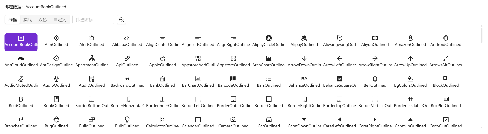
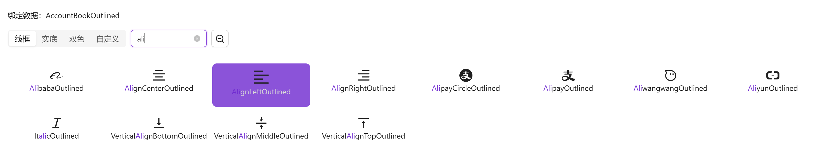
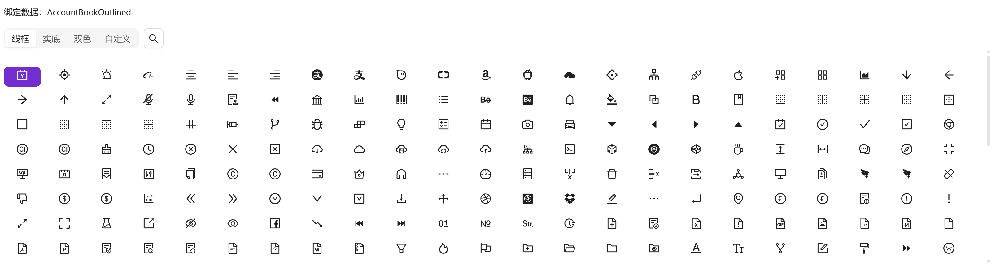

# 图标选择

表单中需要选择图标时使用

::: info 提示

图标取自antdv-next官方图标，并依据官方导出名后缀分为线框（Outlined）、实底（Filled）、双色（TwoTone）风格

在官方图标的基础上新增自定义图标分类，可自行从[阿里巴巴矢量图标库](https://www.iconfont.cn/)下载使用，教程详见[自定义图标](/3.0/doc-web/development/icon)

:::


## 基础用法

引入组件`import IconSelect from "@/components/icon-select/index.vue"` 绑定`v-model`使用。面板顶部提供线框/实底/双色/自定义四类筛选与图标搜索框（按名称过滤，命中关键词高亮），图标区按容器实测宽度自适应列数并虚拟滚动



```vue
<template>
  <a-typography-title :level="4">基础用法</a-typography-title>
  <a-typography-text>绑定数据：{{value}}</a-typography-text>
  <icon-select v-model="value"/>
</template>

<script setup lang="ts">
import IconSelect from "@/components/icon-select/index.vue"
import {ref} from "vue";
const value = ref<string>()
</script>
```

## 大号组件

通过`size`属性可修改组件中图标大小，以适应不同容器



```vue
<template>
  <a-typography-title :level="4">大号组件</a-typography-title>
  <a-typography-text>绑定数据：{{value}}</a-typography-text>
  <icon-select v-model="value" size="large"/>
</template>

<script setup lang="ts">
import IconSelect from "@/components/icon-select/index.vue"
import {ref} from "vue";
const value = ref<string>()
</script>
```

## 小号组件

小号组件隐藏了组件名称，适合在 a-popover 等小型弹窗下使用



```vue
<template>
  <a-typography-title :level="4">小号组件</a-typography-title>
  <a-typography-text>绑定数据：{{value}}</a-typography-text>
  <icon-select v-model="value" size="small"/>
</template>

<script setup lang="ts">
import IconSelect from "@/components/icon-select/index.vue"
import {ref} from "vue";
const value = ref<string>()
</script>
```

## 取消选中

再次点击已选中的图标即可取消选中（`update:modelValue` 回写 null）

## API

### 双向绑定

| 属性名称 | 描述     | 类型   | 默认值 | 是否必填 |
| -------- | -------- | ------ | ------ | -------- |
| v-model  | 双向绑定的图标名（图标包导出名） | string | -      | 是       |

### 属性

| 属性名称  | 描述                      | 类型                      | 默认值  | 是否必填 |
| --------- | ------------------------- | ------------------------- | ------- | -------- |
| maxHeight | 图标区最大高度（例：400px） | string                    | '350px' | 否       |
| width     | 组件宽度（例：100%）      | string                    | '100%'  | 否       |
| size      | 尺寸档位，驱动图标格与字号的三档几何 | small \| large \| default | default | 否       |

### 事件

| 事件名称 | 描述           | 回调参数             |
| -------- | -------------- | -------------------- |
| click    | 点选/取消图标时触发 | 选中的图标名（取消时为 null） |
