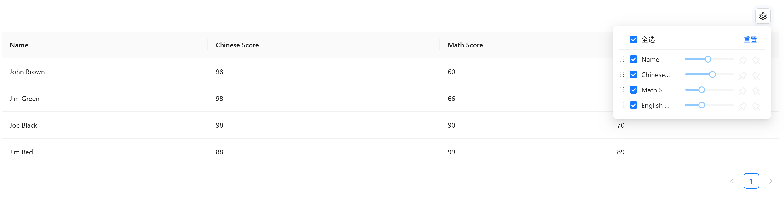

# 表格设置

允许用户自己调整表头 `显示`、`顺序`、`固定`、`宽度` 时使用

::: warning 提示

- 表格出现下列形式将`无法调整宽度`
  - 多级表头
  - 配置文件中有title属性，但表头自定义时没有title属性对应的值（自定义表头渲染会破坏宽度测量前提）
  - `table-setting` 组件没有置于 `a-table` 组件的 `#title`插槽中，且未通过 `anchor` 属性指定表格位置
- 使用时请将 `columns` 属性设置为`响应式结构`，否则修改不会生效
- 每列必须配置 `key`，key 为空的列无法参与设置

:::


## 基础用法

引入组件`import TableSetting from "@/components/table-setting/index.vue"` 后通过`v-model`绑定`columns`即可，同一vue组件有多个表格需指定`settingKey`，应在`a-table`的`#title插槽`中使用

用户的调整结果会自动持久化到 `localStorage`（键为 `table-setting-<路由名称>-<settingKey>`），刷新后自动恢复；组件同时记录列签名（key 与 title 的有序集合），发版后列增删改会使存量配置自动失效；「重置」按钮可一键恢复默认列配置



```vue
<template>
  <a-typography-title :level="4">基础用法</a-typography-title>
  <a-table :columns="columns" :data-source="data">
    <template #title>
      <a-flex>
        <table-setting v-model="columns" settingKey="1"/>
      </a-flex>
    </template>
  </a-table>
</template>
<script lang="ts" setup>
import TableSetting from "@/components/table-setting/index.vue";
import {ref} from "vue";

const columns = ref([
  {
    title: 'Name',
    dataIndex: 'name',
    key: 'name',
  },
  {
    title: 'Chinese Score',
    dataIndex: 'chinese',
    key: 'chinese',
  },
  {
    title: 'Math Score',
    dataIndex: 'math',
    key: 'math',
  },
  {
    title: 'English Score',
    dataIndex: 'english',
    key: 'english',
  },
]);

const data = [
  {
    key: '1',
    name: 'John Brown',
    chinese: 98,
    math: 60,
    english: 70,
  },
  {
    key: '2',
    name: 'Jim Green',
    chinese: 98,
    math: 66,
    english: 89,
  },
  {
    key: '3',
    name: 'Joe Black',
    chinese: 98,
    math: 90,
    english: 70,
  },
  {
    key: '4',
    name: 'Jim Red',
    chinese: 88,
    math: 99,
    english: 89,
  },
];
</script>
```

## 表格外使用

组件默认从自身位置向上查找 `.ant-table` 定位表格（即 `#title` 插槽内的常规用法）；组件放在表格外时，通过 `anchor` 属性指定表格 DOM（CSS 选择器、元素或 getter 函数），否则宽度调节不可用

```vue
<template>
  <a-flex>
    <table-setting v-model="columns" settingKey="1" anchor="#target-table"/>
  </a-flex>
  <a-table id="target-table" :columns="columns" :data-source="data"/>
</template>
```

## 固定列与拖拽排序

设置面板内每列支持：显隐勾选、左右固定（图钉）、拖拽排序（基于 @dnd-kit，纵向轴锁，支持键盘操作）。固定列存在约束：普通列不可拖入固定区、固定列不可离开所属固定区，违规拖拽会被拒绝并提示，DOM 自动还原回拖前顺序

## API

### 双向绑定

| 属性名称 | 描述     | 类型                    | 默认值 | 是否必填 |
| -------- | -------- | ----------------------- | ------ | -------- |
| v-model  | 双向绑定 | a-table中`:columns`相同 | -      | 是       |

### 属性

| 属性名称   | 描述                                             | 类型   | 默认值 | 是否必填 |
| ---------- | ------------------------------------------------ | ------ | ------ | -------- |
| minWidth   | 宽度调节最小值                                   | number | 80     | 否       |
| maxWidth   | 宽度调节最大值                                   | number | 400    | 否       |
| settingKey | 组件唯一标识，同一vue组件中有多个table时区分使用 | string | ''     | 否       |
| anchor     | 宽度测量锚点：表格 DOM 的定位方式（selector / 元素 / getter），组件放在 a-table 子树外时必须提供 | string \| HTMLElement \| (() => string \| HTMLElement \| null \| undefined) | - | 否 |
