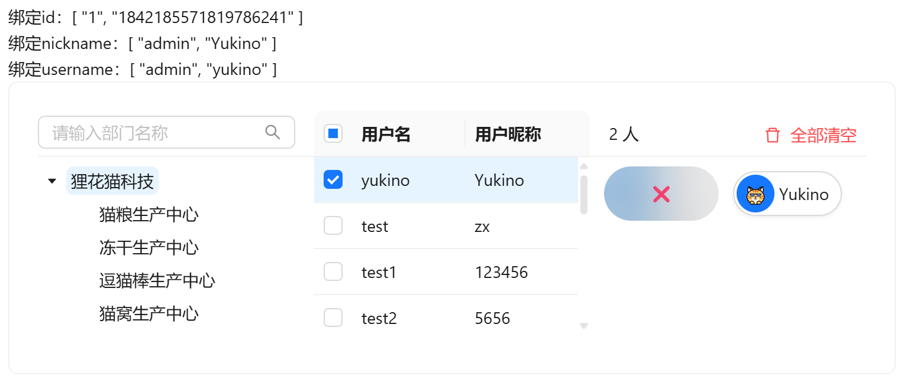
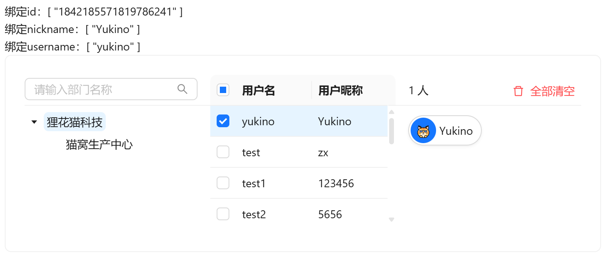
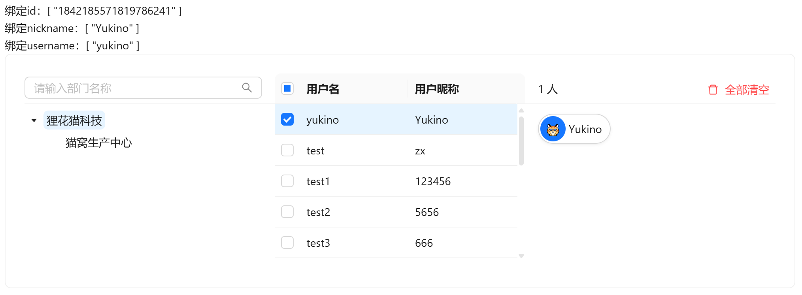

# 用户选择

需要通过部门筛选用户时使用

## 基础用法

引入组件`import UserSelect from "@/components/user-select/index.vue"`，默认查询全部部门，可通过不同的`v-model`进行多种属性绑定，提供`id` `nickname` `username`的双向绑定。可在已选用户中点击删除选中用户

组件为三栏结构（部门树 / 用户列表 / 已选用户），三栏间可拖拽竖条调整宽度（双击竖条重置为默认比例）；用户列表为虚拟滚动表格，支持跨页勾选与点击行选中；部门树支持按名称检索（命中关键词高亮）



```vue
<template>
  <div>
    <a-typography-title :level="4">基础用法</a-typography-title>
    <a-typography-text>绑定id：{{value}}</a-typography-text><br/>
    <a-typography-text>绑定nickname：{{nickname}}</a-typography-text><br/>
    <a-typography-text>绑定username：{{username}}</a-typography-text>
    <user-select v-model:id="value" v-model:nickname="nickname" v-model:username="username"/>
  </div>
</template>

<script setup lang="ts">
import UserSelect from "@/components/user-select/index.vue"
import {ref} from "vue";
const value = ref<string[]>([])
const nickname = ref<string[]>([])
const username = ref<string[]>([])
</script>
```

## 用户所属部门

通过`:all-dept-data="false"`指定仅获取当前登录用户拥有部门数据



```vue
<template>
  <div>
    <a-typography-title :level="4">用户所属部门</a-typography-title>
    <a-typography-text>绑定id：{{value}}</a-typography-text><br/>
    <a-typography-text>绑定nickname：{{nickname}}</a-typography-text><br/>
    <a-typography-text>绑定username：{{username}}</a-typography-text>
    <user-select v-model:id="value"
                 v-model:nickname="nickname"
                 v-model:username="username"
                 :all-dept-data="false"
    />
  </div>
</template>

<script setup lang="ts">
import UserSelect from "@/components/user-select/index.vue"
import {ref} from "vue";
const value = ref<string[]>([])
const nickname = ref<string[]>([])
const username = ref<string[]>([])
</script>
```

## 自定义宽高

通过`width`和`height`属性修改组件尺寸



```vue
<template>
  <div>
    <a-typography-title :level="4">自定义宽高</a-typography-title>
    <a-typography-text>绑定id：{{value}}</a-typography-text><br/>
    <a-typography-text>绑定nickname：{{nickname}}</a-typography-text><br/>
    <a-typography-text>绑定username：{{username}}</a-typography-text>
    <user-select v-model:id="value"
                 v-model:nickname="nickname"
                 v-model:username="username"
                 :all-dept-data="false"
                 :width="1000"
                 :height="200"
    />
  </div>
</template>

<script setup lang="ts">
import UserSelect from "@/components/user-select/index.vue"
import {ref} from "vue";
const value = ref<string[]>([])
const nickname = ref<string[]>([])
const username = ref<string[]>([])
</script>
```

## 回显

`v-model:id` 中传入已有用户id集合，组件挂载时会根据id反查用户信息（id、昵称、头像、部门）自动回显已选用户

## API

### 双向绑定

| 属性名称         | 描述               | 类型     | 默认值 | 是否必填             |
| ---------------- | ------------------ | -------- | ------ | -------------------- |
| v-model:id       | 双向绑定用户id     | string[] | -      | 否（最起码绑定一个） |
| v-model:username | 双向绑定用户用户名 | string[] | -      | 否（最起码绑定一个） |
| v-model:nickname | 双向绑定用户昵称   | string[] | -      | 否（最起码绑定一个） |

### 属性

| 属性名称         | 描述                                            | 类型    | 默认值 | 是否必填 |
| ---------------- | ----------------------------------------------- | ------- | ------ | -------- |
| height           | 三个分栏的滚动区高度                            | number  | 151    | 否       |
| width            | 卡片宽度                                        | number  | 750    | 否       |
| bordered         | 卡片边框                                        | boolean | true   | 否       |
| bodyStyle        | 卡片body样式                                    | object  | { padding: 0 } | 否 |
| allDeptData      | 部门树是否取全量数据（false仅取当前用户可见部门） | boolean | true  | 否       |
| emptyDescription | 部门为空时提示词                                | string  | -      | 否       |

### 事件

| 事件名称 | 描述               | 回调参数       |
| -------- | ------------------ | -------------- |
| change   | 选中用户变化时触发 | 选中的用户数组（SysUser[]） |
