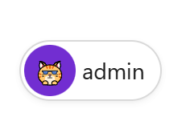
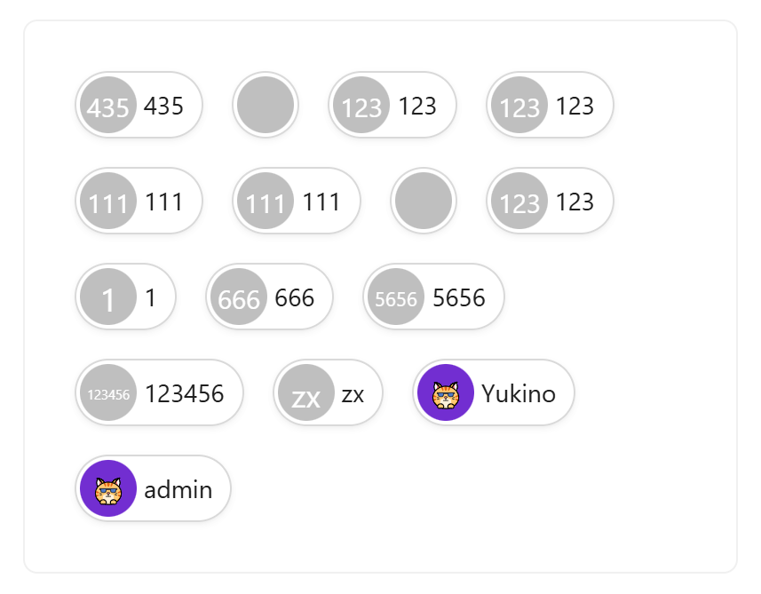

# 用户展示

需要展示用户的场景使用


## 基础用法

引入组件`import UserShow from "@/components/user-show/index.vue"`，通过传入`avatar-json`、`nickname`展示用户信息。未传头像json时自动回退为昵称文字头像



```vue
<template>
  <a-typography-title :level="4">基础用法</a-typography-title>
  <user-show :avatar-json="userStore.$state.userInfo.avatar" :nickname="userStore.$state.nickname" />
</template>

<script setup lang="ts">
import UserShow from "@/components/user-show/index.vue"
import {useUserStore} from "@/stores/user.ts";
const userStore = useUserStore();
</script>
```

## 多用户

通过a-flex组件配合 wrap="wrap" 属性包裹 user-show 组件，使用 v-for 循环 user-show 即可



```vue
<template>
  <div>
    <a-typography-title :level="4">多位用户</a-typography-title>
      <a-row>
        <a-col :span="6">
          <a-card v-if="userList.length > 0">
            <a-flex wrap="wrap" gap="small">
              <user-show
                  v-for="user in userList"
                  :avatar-json="user.avatar"
                  :nickname="user.nickname"/>
            </a-flex>
          </a-card>
        </a-col>
      </a-row>
  </div>
</template>

<script setup lang="ts">
import UserShow from "@/components/user-show/index.vue"
import {queryPage} from "@/api/system/user/user.ts";
import {onMounted, ref} from "vue";
import type {SysUserVO} from "@/api/system/user/type/sys-user.ts";
const userList = ref<SysUserVO[]>([])
onMounted(async () => {
  const resp = await queryPage({pageNum: 1, pageSize: 20})
  if (resp.code === 200) {
    userList.value = resp.data.records
  }
})
</script>
```

## 可点击与悬浮层

绑定 `@click` 后组件显示可点击光标并抛出 click 事件；提供 `#hover` 插槽时，整颗 chip 悬停会显示毛玻璃浮层（如删除场景放一个 × 图标，配合点击取消选中）

```vue
<template>
  <user-show :avatar-json="user.avatar" :nickname="user.nickname" @click="handleCancelSelect(user)">
    <template #hover>
      <close-outlined/>
    </template>
  </user-show>
</template>
```

## 相关组件

单独渲染头像时可用 `user-avatar` 组件（`@/components/user-avatar/index.vue`），头像配置 JSON 在组件内部解析，image 型相对链自动拼接部署态前缀：

| 属性名称   | 描述               | 类型   | 默认值 | 是否必填 |
| ---------- | ------------------ | ------ | ------ | -------- |
| avatarJson | 头像配置 JSON      | string | ''     | 否       |
| size       | 头像尺寸           | number | 32     | 否       |

## API

### 属性

| 属性名称   | 描述                                                       | 类型   | 默认值 | 是否必填 |
| ---------- | ---------------------------------------------------------- | ------ | ------ | -------- |
| avatarJson | 用户头像json字符串（从sys_user表中直接获取avatar字段即可，未传时回退昵称文字头像） | string | -      | 否       |
| nickname   | 用户昵称                                                   | string | -      | 否       |

### 事件

| 事件名称 | 描述             | 回调参数 |
| -------- | ---------------- | -------- |
| click    | 点击组件时触发   | -        |

### 插槽

| 插槽名称 | 描述                                             |
| -------- | ------------------------------------------------ |
| hover    | 悬浮层内容（提供后悬停显示毛玻璃浮层，贴合 chip 圆角） |
