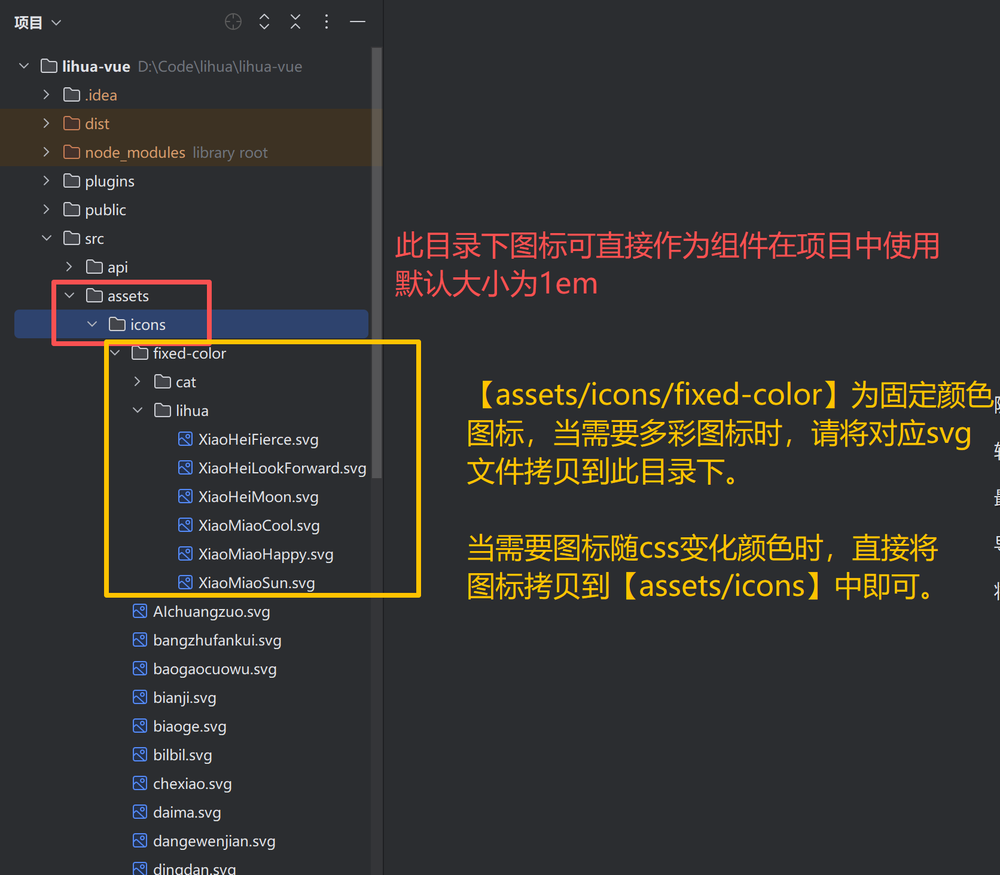

# 自定义图标

图标支持Antdv Next（antdv-next）官方图标及自定义图标

## 官方图标

官方案例在组件中使用图标需要将对应的图标组件进行导入，在实际开发中有些繁琐。在本项目`main.ts` 中对官方图标进行了全局组件注册，在组件中的图标使用上更加便利

``` typescript
// antdv-next 图标
import * as Icons from "@antdv-next/icons";
// ant 自带图标
const icons:Record<string, Component> = Icons
for (const i in icons) {
    app.component(i,icons[i])
}
```


## 自定义图标

当官方图标不足以满足业务需求时，可创建自定义图标组件。本项目通过 `vite-svg-loader` 将 `src/assets/icons` 下的svg文件转换为 Vue 组件，在 `main.ts` 中经 `registerIcons`（`src/components/icon/registry.ts`）统一注册为全局组件，直接将svg文件拷贝到该文件夹下，即可像官方图标一样使用（文件名即全局组件名，禁止与官方导出名撞名，撞名时自定义覆盖官方并在开发环境告警）

::: warning 提示

项目中使用了 vite 插件来对 `src/assets/icons` 下的`svg` 文件进行编辑（svgo 管线：`fill` 替换为 `currentColor`，使图标颜色受 css 控制跟随字体色，尺寸固定 1em 跟随 font-size，并追加 anticon 类对齐官方图标的行内对齐样式）；对于指定好颜色的彩色图标，可放在`src/assets/icons/fixed-color` 目录下，构建期不做 fill 替换，颜色不会被css改变

:::



图标注册与分组名单统一收口在 `src/components/icon/registry.ts`：官方图标按导出名后缀分为 `outlined`（线框）/`filled`（实底）/`twoTone`（双色）三组，自定义 svg 组成 `custom` 组，`icon-select` 组件的选择面板即消费该名单


## 项目中使用图标

具体图标使用方法请参考[官方文档](https://www.antdv-next.cn/components/icon-cn)项目中自定义图标用法与官方相同，下面例句中在项目中的简单用法


1. 直接使用图标组件：无需引入组件，直接在vue模板中使用图标组件名标签

   ``` vue
   <a-button type="primary" @click="handleModelStatus('新增用户')">
     <template #icon>
       <PlusOutlined />
     </template>
     新 增
   </a-button>
   ```

2. 使用vue `component` 组件：在 component 的 is 属性直接传入图标组件名

   ``` vue
   <a-button type="primary" @click="handleModelStatus('新增用户')">
     <template #icon>
       <component is="PlusOutlined"/>
     </template>
     新 增
   </a-button>
   ```

3. 使用项目提供`Icon`组件：引入`import Icon from "@/components/icon/index.vue"` 后传入`icon` 属性为组件名

   ``` vue
   <a-button type="primary" @click="handleModelStatus('新增用户')">
     <template #icon>
   	<icon icon="PlusOutlined"/>
     </template>
     新 增
   </a-button>
   
   <script setup lang="ts">
   // 引入提供的icon组件
   import Icon from "@/components/icon/index.vue"
   </script>
   ```

4. 图标选择场景（如菜单图标配置）可直接使用内置 `icon-select` 组件，面板支持线框/实底/双色/自定义四类筛选、关键词过滤（命中高亮）与虚拟滚动，选择后回写图标名字符串，[详见](/3.0/doc-web/components/icon-select)

   
