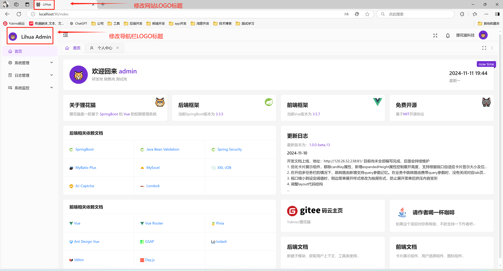
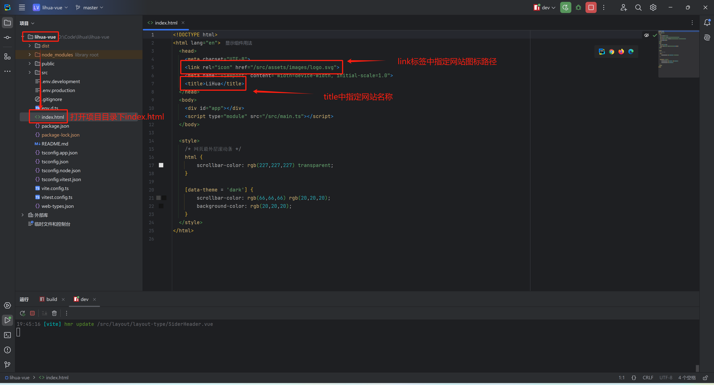
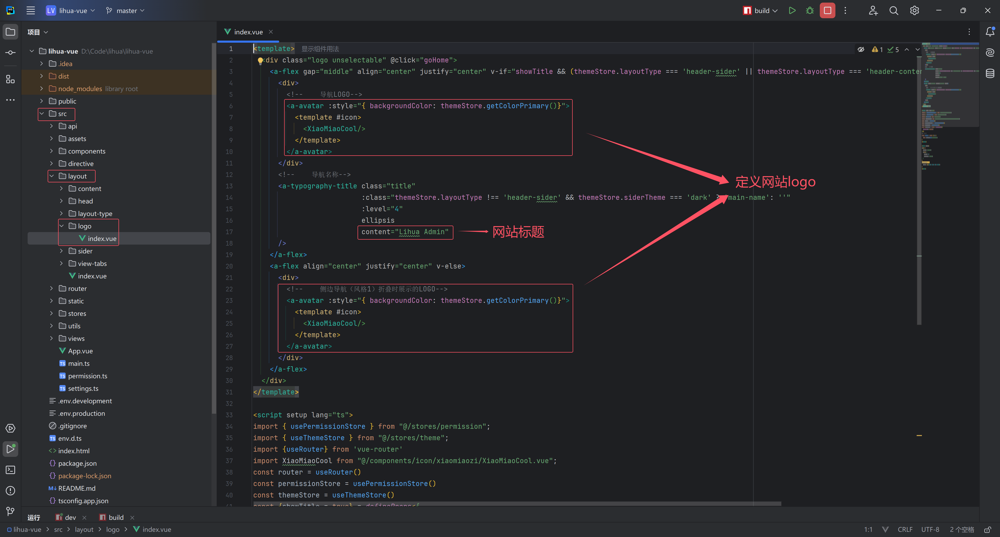

# Layout


## Layout 结构

项目菜单栏、头部元素及view-tab 均属于Layout，位于项目 `lihua-web/src/layout/` 目录下，根据需求可自行修改

``` text
lihua-web/src/layout/  
├── index.vue                   # 布局主入口，根据窗口尺寸与主题类型动态加载不同布局
├── content/               
│   └── index.vue               # 内容区域组件（keep-alive 缓存容器）
├── footer/                       
│   └── index.vue               # 页脚组件
├── head/
│   ├── index.vue               # 头部组件
│   └── components/  
│       ├── breadcrumb/         # 面包屑导航
│       ├── collapsed/          # 菜单收缩按钮
│       ├── dept/   			# 默认部门选择器  
│       ├── lock-screen/        # 锁屏组件  
│       ├── menu-search/        # 菜单搜索  
│       ├── notice/     		# 消息通知  
│       ├── user/               # 用户信息组件  
│       ├── window-change/      # 全屏切换组件  
│       └── ws-status/          # WebSocket 连接状态图标  
├── layout-type/ 
│   ├── DrawerNavigation.vue    # 抽屉导航布局（小窗口自动启用）
│   ├── MixNavigation.vue       # 混合导航布局
│   ├── SideNavigation.vue      # 侧边导航布局
│   └── TopNavigation.vue       # 顶部导航布局
├── logo/                       
│   └── index.vue               # Logo组件
├── sider/                       
│   └── index.vue               # 侧边栏组件
└── view-tabs/                   
    ├── index.vue               # 标签页组件
    ├── composables/            # 标签页组合式函数
    └── components/
    		├── SortableTabLabel.vue	# 可拖拽排序的标签页元素
    		├── TabPaneMenu.vue			# 标签页元素及右键菜单
        └── TabRightMenu.vue    # 标签页右键菜单
```


## 导航布局

系统提供四种导航布局，由主题 store 的 `layoutType` 配置驱动，在 `layout/index.vue` 中动态切换：

| 布局 | layoutType 取值 | 说明 |
| --- | --- | --- |
| 侧边导航 | `side-navigation` | 默认布局，菜单在左侧边栏 |
| 混合导航 | `mix-navigation` | 一级菜单在顶部，二级菜单在左侧 |
| 顶部导航 | `top-navigation` | 全部菜单在顶部 |
| 抽屉导航 | —（小窗口自动启用） | 视口宽度到达触发阈值（`menuToggleWidth`，默认 768px）后自动切换为抽屉式导航，无需手动配置 |

布局切换入口在「系统设置」页面的布局选择器，内置组件 `nav-type-select` 以三格缩略图方式呈现三种正常布局：

```vue
<template>
  <nav-type-select v-model="themeStore.layoutType"/>
</template>

<script setup lang="ts">
import {useThemeStore} from "@/stores/theme.ts";
import NavTypeSelect from "@/components/nav-type-select/index.vue";

const themeStore = useThemeStore();
</script>
```

| 属性名称 | 描述 | 类型 | 默认值 | 是否必填 |
| --- | --- | --- | --- | --- |
| modelValue | 当前布局类型（v-model），取值 `side-navigation` / `mix-navigation` / `top-navigation` | string | - | 是 |

事件：

| 事件名称 | 描述 | 回调参数 |
| --- | --- | --- |
| click | 点击布局缩略图时触发 | `key: string` |
| change | 布局类型变化时触发 | `key: string` |


## view-tabs 多标签

多标签页由 `view-tabs` 组件与 `viewTabs` store 协作实现：

- 后端下发的菜单与前端静态路由中，`meta.viewTab` 为 `true` 的页面纳入标签页管理；`meta.affix` 为 `true` 的页面固定在前排不可关闭，`meta.viewTabSort` 决定固定标签排序
- 标签支持拖拽排序（基于 @dnd-kit）、右键菜单（关闭左边/右边/其他/全部、固定/取消固定）
- 打开的标签列表持久化到 `localStorage`（键按用户名隔离 `cacheViewTabs-<username>`），刷新后自动恢复上次打开的标签
- 「最近使用」列表同样按用户名持久化（上限 50 条），供首页常用页面快速访问
- keep-alive 组件缓存集合由 store 的 `setComponentsKeepAlive` 维护（路由 `meta.cache` 为 `true` 且配置了路由 `name` 的页面参与缓存，首页 `index` 常驻）

主题配置中的 `showViewTabs` 开关控制多标签栏显隐，`viewTabs` store 中另有 `showLayout` 支持隐藏整个布局框架（iframe/画中画等场景）。


## 修改系统标题



- 修改网站Logo及标题

  在项目根目录下`index.html`文件中，通过修改`link` 标签的`href`图片路径修改网站Logo；通过修改`title` 中内容修改网站名称。

  

- 修改导航栏Logo及标题

  在项目`src/layout/logo/index.vue` 组件中定义了导航Logo及标题。导航Logo分为两部分，一部分为大多数时候展示的Logo + 标题形式；另一部分为侧标导航折叠后显示的Logo。可通过修改`<a-avatar/>` 组件来定义导航Logo，修改`<a-typography-title/>` 组件文本内容来定义导航标题。[a-avatar用法参考](https://www.antdv-next.cn/components/avatar-cn)

  

  
