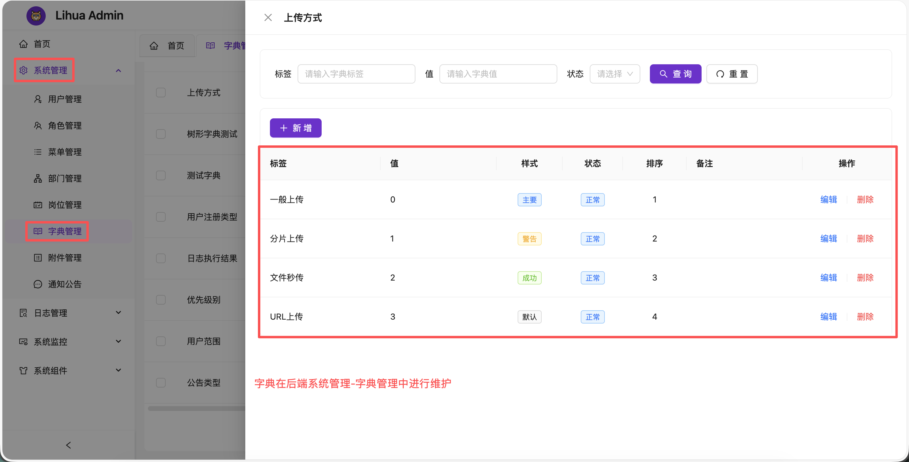

# 系统字典

::: info 提示

initDict()中获取到的字典选项集合为响应式对象（ComputedRef），ts中使用需.value，极端情况下可能需要配合watch使用

字典在后端`系统管理`-`字典管理`中进行维护，添加对应的字典数据后，即可在代码中使用

:::



## 获取字典选项

```typescript
// 引入 @/helpers/dict，拿到initDict函数
import { initDict } from '@/helpers/dict'

// 参数中传入dict_code，返回对象中原封不动解构出来即可使用
const {sys_notice_type} = initDict("sys_notice_type")
```

`initDict(...codes)` 支持一次传入多个字典编码，缺失的编码会合并为一次批量请求拉取，并进行并发去重（多个组件同时初始化同一字典只发一次请求），返回 `Record<code, ComputedRef<SysDictDataType[]>>`：

```typescript
// 一次初始化多个字典
const {sys_notice_type, sys_notice_status, sys_notice_priority} = initDict(
    "sys_notice_type", "sys_notice_status", "sys_notice_priority"
)
```

获取到的ts类型为

```typescript
interface SysDictDataType {
  /**
   * 主键id
   */
  id?: string;

  /**
   * 父级id
   */
  parentId?: string;

  /**
   * 字典类型编码
   */
  dictTypeCode?: string;

  /**
   * 字典标签
   */
  label?: string;

  /**
   * 字典值
   */
  value?: string;

  /**
   * 字典排序
   */
  sort?: number;

  /**
   * 备注
   */
  remark?: string;

  /**
   * 删除标识
   */
  delFlag?: string;

  /**
   * 状态
   */
  status?: string;

  /**
   * 回显颜色
   */
  tagStyle?: string;

  /**
   * 数据子集
   */
  children?: Array<SysDictDataType>;
}
```

## 加载机制

字典数据由 `stores/dict.ts` 的 dict store 统一缓存（Map 结构，key 为字典编码），`helpers/dict.ts` 提供消费入口：

- **initDict(...codes)**：组件初始化入口。store 未命中的 code 合并为一次批量请求；进行中的请求按 code 去重（inflight Map），并发组件初始化同一字典只发一次请求。返回值是经 store 溯源的 computed 引用，store 更新即时反映到消费处
- **reLoadDict(code)**：重新从后端拉取对应字典并更新 store（字典数据变更后刷新缓存用，消费页经 computed 即时更新）
- **getDictLabel(option, value)**：根据选项集合和 value 获取字典 label
- 登录初始化（`initApp`）与登出时字典 store 会整体清空，避免会话残留

## 根据value获取label

```typescript
// 导入 initDict和getDictLabel
import { initDict, getDictLabel } from '@/helpers/dict'
// 拿到目标字典选项集合
const {sys_notice_type} = initDict("sys_notice_type")
// 传入字典选项集合和需要翻译的value，将返回label，如果不存在则直接返回value
const label = getDictLabel(sys_notice_type.value, '1')
```

## 在模板中使用

模板中可以将字典翻译为tag标签。使用时需要保证 dict-data-value 值存在，可以使用v-if进行判断加载，[详见](/3.0/doc-web/components/dict-tag)

```vue
<template>
	<view class="content">
        <!--组件中使用 
            dict-data-option 传如字典选项，
            dict-data-value 传入需要被翻译的值
        -->
        <dict-tag dict-data-value="0" :dict-data-option="sys_status"/>
	</view>
</template>

<script lang="ts" setup>
// 引入 DictTag 组件
import DictTag from "@/components/dict-tag/index.vue"
// 引入 initDict 函数
import {initDict} from "@/helpers/dict"
// 获取字典选项列表
const {sys_status} = initDict("sys_status")
</script>
```
