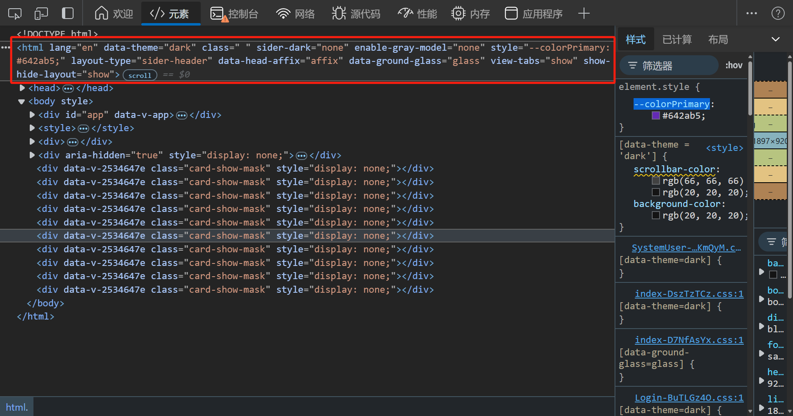

# 系统主题

3.0 主题体系围绕「双事实源」设计：亮暗档位（外观模式）以浏览器 `localStorage` 为唯一事实源（跟浏览器走不跟账号走）；其余主题配置（主题色、圆角、布局、磨砂玻璃、多标签、页脚、路由动画、点击效果等）以服务端为唯一事实源（跟账号走），登录后从服务端拉取、变更后防抖回存。可获取当前是否处于暗色模式、布局类型、主题颜色等，方便自定义组件的适配


## 外观模式（亮暗档位）

外观模式为三档配置态：`light`（亮色）/ `dark`（暗色）/ `auto`（跟随系统偏好），持久化在 `localStorage['theme-mode']`：

- 手动切档立即写入 localStorage；`auto` 档由系统偏好 `prefers-color-scheme` 实时推导实际态
- 登录后从服务端加载主题时，档位仍只认 localStorage（服务端主题 JSON 中的同名键被序列化时剔除，不随账号走）
- 同源多窗口之间通过 `storage` 事件感知档位变化：任一窗口切档，其他窗口即时跟随（自身写入不触发 storage 事件，天然无回环）
- 页面顶栏内置 `theme-mode-segmented` 三档切换组件，可直接使用：

```vue
<template>
  <!-- translucent：玻璃/透明底面场景开启半透明样式 -->
  <theme-mode-segmented :translucent="false"/>
</template>

<script setup lang="ts">
// 组件为全局注册，可直接使用；也可显式引入
// import ThemeModeSegmented from "@/components/theme-mode-segmented/index.vue"
</script>
```

| 属性名称 | 描述 | 类型 | 默认值 | 是否必填 |
| --- | --- | --- | --- | --- |
| translucent | 是否使用半透明玻璃样式（用于玻璃/透明底面场景） | boolean | `false` | 否 |

暗色算法经 antdv-next 的 `theme.darkAlgorithm` / `theme.defaultAlgorithm` 提供，由应用根组件 `<a-config-provider :theme="themeStore.themeConfig">` 响应式生效，无需手动切换组件样式。


## 服务端主题（唯一事实源）

登录后 `app-init.ts` 的 `initApp` 调用 `themeStore.init(userInfo.theme)`，以服务端下发的主题 JSON 全量初始化 store；此后任意主题变更经 userStore 挂接的防抖同步（800ms）回存服务端（`saveTheme`，与已知服务端值相同则静默跳过），避免拖动色板/圆角等连续调整产生高频请求。登出不保存主题并拆除同步（防抖窗口内未发出的变更随之丢弃——主题为非关键数据）。

服务端保存与跨窗广播共用同一序列化形态（`serializeThemeState`，剔除窗口尺寸等运行时字段），保证字符串可直接比较。

### 跨窗同步

主窗与画中画小窗之间通过 `BroadcastChannel('theme-sync')` 全量广播：变更经 100ms 防抖广播，接收方经 `init` 重放（算法/html 属性/主题色全量落地），接收期间的变更不回播，防消息回环。

### 主题色候选

主题色提供 8 色候选（`settings.colorOptions`：拂晓蓝/薄暮/火山/日暮/明青/极光绿/极客蓝/酱紫），主题色变更后落地为：

- `themeConfig.token.colorPrimary`：经 ConfigProvider 驱动 antdv-next 全部组件
- CSS 变量 `--colorPrimary`：供纯 CSS 消费
- store 字段 `antColorPrimary`：供模板/JS 响应式消费（暗色模式下经算法调整）

### 灰色模式

灰色模式（哀悼等场景全站置灰）为管理员级全局配置，由 setting store 从服务端拉取（`enableGrayMode`），经 html 属性 `gray-model="enable"` 生效，不随用户主题重置。


## 在组件中获取主题

通过`useThemeStore.$state` 可获取当前主题信息

> 其中主题颜色获取需通过 `antColorPrimary` 属性进行获取，或调用`actions` 下`getColorPrimary()` 方法进行获取
>
> `colorPrimary` 属性的颜色在暗色模式下没有经过算法调整，会出现色号和全局不统一的问题

``` vue
<script setup lang="ts">
// 导入 useThemeStore
import {useThemeStore} from "@/stores/theme.ts";
const themeStore = useThemeStore();
// 当前是否处于暗色模式（实际态：auto 时由系统偏好推导）
const isDark = themeStore.$state.isDarkTheme
// 通过方法获取当前主题颜色
const colorPrimary = themeStore.getColorPrimary()
// 获取布局类型
const layoutType = themeStore.$state.layoutType
</script>
```

主题定义state如下

``` typescript
state() {
    /**
     * 外观模式（配置态）：light / dark 手动指定，auto 跟随系统
     */
    const themeMode: ThemeMode = settings.themeMode

    /**
     * 当前明暗（实际态）：auto 时由系统偏好推导，手动时等于配置
     */
    const isDarkTheme: boolean = settings.isDarkTheme

    /**
     * 布局类型 side-navigation / mix-navigation / top-navigation
     */
    const layoutType: string = settings.layoutType

    /**
     * 组件大小 small/ middle / large
     */
    const componentSize: string = settings.componentSize

    /**
     * 菜单分组
     */
    const siderGroup: boolean = settings.siderGroup

    /**
     * 主要颜色
     * 组件中使用系统颜色不可直接取用该字段
     * 使用下面提供的getColorPrimary()方法进行获取
     */
    const colorPrimary: string = settings.themeConfig.token.colorPrimary

    /**
     * 通过ant提供的theme的主要颜色，针对暗色模式进行了颜色调整
     */
    const antColorPrimary: string = settings.themeConfig.token.colorPrimary

    /**
     * 界面圆角（同步进 themeConfig.token 生效，派生圆角 token 自动跟随）
     */
    const borderRadius: number = settings.themeConfig.token.borderRadius

    /**
     * 磨砂玻璃效果
     */
    const groundGlass: boolean = settings.groundGlass

    /**
     * 固定头部
     */
    const affixHead: boolean = settings.affixHead

    /**
     * 显示多窗口标签
     */
    const showViewTabs: boolean = settings.showViewTabs

    /**
     * 显示页脚
     */
    const showFooter: boolean = settings.showFooter

    /**
     * 侧边颜色 light / dark
      */
    const siderTheme: string = settings.siderTheme

    /**
     * 侧边宽度
     */
    const siderWith: number = settings.siderWith

    /**
     * 是否为小尺寸窗口
     */
    const isSmallWindow: boolean = false

    /**
     * 是否为画中画小窗（URL 携带 miniWindow=true 的 iframe 宿主）
     */
    const isMiniWindow: boolean = window.location.href.includes("miniWindow=true")

    /**
     * 原侧边宽度，用于调整侧边栏时保存临时变量
     */
    const originSiderWith: number = settings.originSiderWith

    /**
     * 切换路由时的过渡动画 zoom / pop / fade / blur / slide-right / slide-left / slide-up / slide-down
     */
    const routeTransition: string = settings.routeTransition

    /**
     * 点击效果 none / wave / inset / shake / happy
     * happy 为快乐工作点击特效（@antdv-next/happy-work-theme 官方包）
     */
    const clickEffect: ClickEffect = settings.clickEffect

    /**
     * 灰色模式
     */
    const grayModel: boolean = settings.grayModel

    /**
     * ant 主题配置
     */
    const themeConfig = { ...settings.themeConfig, token: { ...settings.themeConfig.token } }

    /**
     * 是否从服务端加载完毕
     * 系统主题默认从settings中读取默认值，用户登录后会从服务器获取用户定义的主题信息
     * 当获取到服务器主题后会将此属性设置为 true
     */
    const isServerLoad = false

    return {
        layoutType,
        componentSize,
        showViewTabs,
        showFooter,
        themeMode,
        isDarkTheme,
        colorPrimary,
        antColorPrimary,
        borderRadius,
        siderTheme,
        groundGlass,
        affixHead,
        isSmallWindow,
        isMiniWindow,
        siderGroup,
        siderWith,
        originSiderWith,
        routeTransition,
        clickEffect,
        grayModel,
        themeConfig,
        isServerLoad
    }
}
```


## 主题设置页

主题相关的全部配置项（外观模式、主题色、界面圆角、导航布局、磨砂玻璃、路由动画、点击效果等）在「系统设置」页面维护，配置变更即时生效并自动回存服务端：



## 在css中获取主题

在dom元素html标签中，定义了若干自定义属性，用来标识各种主题属性

### 自定义属性

| 属性名称   | 属性描述                                        |
| ---------- | ----------------------------------------------- |
| data-theme | 全局主题模式（暗色模式：dark，亮色模式：light） |
| ground-glass | 是否开启毛玻璃模式（开启：enable）            |
| gray-model | 是否开启灰色模式（开启：enable）                |

> 组件中使用属性选择器 `style` 标签不可添加 `scoped` 否则不会生效

``` css
[data-theme = 'dark'] {
    .scrollbar, .sider-scrollbar {
        scrollbar-color: rgb(66,66,66) transparent;
    }
}
```

### css 变量

| 变量名         | 变量描述                                        |
| -------------- | ----------------------------------------------- |
| --colorPrimary | 当前主题颜色（经由ant算法处理，已适配暗色模式） |
| --ant-*        | antdv-next 运行时注入的主题 token（Unocss 原子类的取值来源） |

``` css
.icon-group:hover {
	background: var(--colorPrimary);
}
```


更多css变量在 `src/static/css/variable.css` 中进行维护，包含玻璃材质、alpha 遮罩、布局常量（`--content-height` 内容区可用高度公式）、滚动条、页面底色等自有变量（`--ant-*` token 之外的部分）：

``` css
/* 亮色模式变量 */
:root {
    /* ======================主题颜色 会由ts进行覆盖======================== */
    --colorPrimary: rgba(0, 0, 0, 0);

    /* ===============================模糊=============================== */
    --lihua-backdrop-filter-lg: saturate(180%) blur(20px);
    --lihua-backdrop-filter-md: saturate(180%) blur(12px);
    --lihua-backdrop-filter-sm: saturate(180%) blur(6px);

    /* =========================模糊状态下背景颜色========================= */
    --lihua-backdrop-filter-on-color: rgba(255,255,255,0.6);
    --lihua-backdrop-filter-off-color: rgba(255,255,255,1);

    /* ============================layout高度============================ */
    --lihua-layout-height: 48px;

    /* =========================layout头部元素间距========================= */
    --lihua-layout-head-space: 32px;

    /* =============================深色菜单============================== */
    --lihua-sider-dark-color: rgba(0,21,41);

    /* ===============================页脚=============================== */
    --footer-height: 32px;

    /* ====================内容区高度状态（store 切换时直写覆盖）=================== */
    --footer-display-height: var(--footer-height);
    --tab-display-height: 54px;
    --layout-display-height: var(--lihua-layout-height);

    /* ====================内容区可用高度（满高列表页消费）==================== */
    --layout-header-height: 0px;
    --content-space: 16px;
    --content-height: calc(100vh - var(--layout-header-height) - var(--content-space) - max(var(--content-space), var(--footer-display-height)));

    /* ==============================滚动条============================== */
    --lihua-scrollbar-thumb-color: rgb(227,227,227) transparent;
    --lihua-sider-scrollbar-thumb-color: rgb(66,66,66) transparent;

    /* ===============================背景颜色=============================== */
    --lihua-background-color-level-1: #f5f5f5;

    /* ==============================透明度颜色============================== */
    --lihua-alpha-0: rgba(255,255,255,0);
    --lihua-alpha-2: rgba(255,255,255,0.08);
    --lihua-alpha-4: rgba(255,255,255,0.45);
    --lihua-alpha-5: rgba(255,255,255,0.65);
    --lihua-alpha-6: rgba(255,255,255,0.88);
}

/* 暗色模式变量 */
[data-theme = 'dark'] {
    /* =========================模糊状态下背景颜色========================= */
    --lihua-backdrop-filter-on-color: rgba(20,20,20,0.6);
    --lihua-backdrop-filter-off-color: rgba(20,20,20,1);

    /* ==============================滚动条============================== */
    --lihua-scrollbar-thumb-color: rgb(66,66,66) transparent;
    --lihua-sider-scrollbar-thumb-color: rgb(66,66,66) transparent;
}
```
