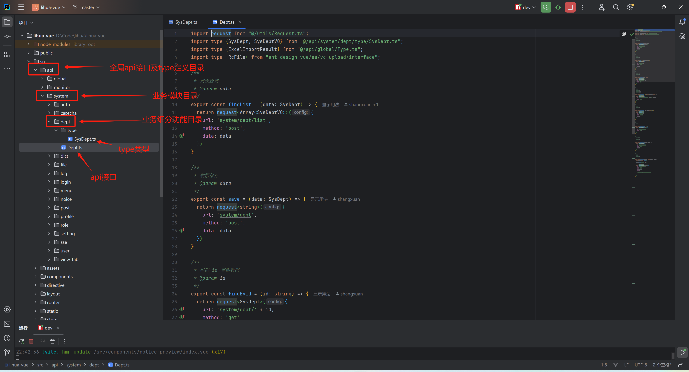

# Api

> `api` 目录主要负责与后端进行 Axios 通信，并集中维护项目中使用的 TypeScript 接口定义。

api 目录结构示意

```text
/src/api/  
├── global/                    		# 全局类型
│   └── type.ts               		# 全局响应类型定义  
├── monitor/                    		# 监控模块  
│   ├── cache/                 		# 缓存监控  
│   ├── logged-user/           		# 在线用户  
│   └── server/                		# 服务监控  
├── system/                    		# 系统管理模块  
│   ├── attachment/           		# 附件管理  
│   │   ├── attachment-storage.ts 	# 附件业务API  
│   │   └── type/  					# interface类型定义
│   │       └── sys-attachment.ts 	# 附件类型定义  
│   ├── notice/               		# 通知公告  
│   │   ├── notice.ts         		# 公告业务API  
│   │   └── type/  					# interface类型定义
...									# 略
```



## 全局通用Type

`/api/global/type.ts` 中定义了全局公共的 interface包含：

- ResponseType\<T\>：后端接口通用返回包装对象 `{code, msg, data}`
- PageResponseType\<T\>：后端分页查询接口返回包装对象 `{current, pages, records, size, total}`
- MapResponseType\<String,V\>：后端Map接口返回包装对象
- BaseModalActiveType：基础模态框属性维护对象（弹窗约定，见[页面与组件开发规范](/3.0/doc-web/standard/component-page)）
- ResponseError：可控的异常包装对象

## 模块Type

每个业务可在自己的模块下定义interface，在本模块的目录下新建 `type/` 目录存放类型文件，export interface 类型供外部使用，例：


```typescript
/**
 * 登陆成功后的认证数据信息，包含用户、角色、部门、岗位等所有信息
 */
export interface AuthInfoType {
    // 权限信息（菜单权限编码，角色编码集合）
    permissions: string[],
    // 所有角色信息
    roles: SysRole[],
    // 登陆用户信息
    userInfo: UserInfoType,
    // 部门信息
    depts: SysDept[],
    // 默认部门
    defaultDept: SysDept,
    // 岗位信息
    posts: SysPost[],
}
```

## 请求交互

> request 使用 `/src/utils/request.ts` 中封装的全局 axios 实例，如需修改全局请求配置，可在这里进行配置

### request

- `baseURL` 取环境变量 `VITE_APP_BASE_API`（开发环境 `/dev-api`），默认请求头带 `Client-Type: web`
- 发送请求时经过请求拦截器，自动携带 `Authorization: Bearer <token>` 请求头（token 持久化在 `localStorage['lihua_token']`，由 `@/helpers/token` 经 `@vueuse` 的 `useStorage` 管理）
- 接收响应时针对特殊业务码进行全局处理：
  - `401` 登录失效：调用 userStore 的 `authenticationFailure`（5 秒单飞窗内重复触发只执行一次：清空用户态 + 跳转登录页 + 错误提示）
  - `451` 非法访问：直接重定向到 `/451` 页面
- 错误处理分三种分支，提示文案 3 秒内去重（同文案并发失败不刷屏）：
  - 后端返回的业务异常（HTTP 200 + code 的 JSON 体）：透传后端 `msg` 提示
  - 网关/服务器层错误（响应体为 HTML 或空，如 404/500/413）：统一提示「服务暂时不可用，请稍后重试」，413 提示请求体超限
  - 无响应（后端不可达/超时/DNS）：提示「请求超时」或「网络异常」
- 所有错误统一抛出 `ResponseError(code, msg)`，`catch` 中可用 `instanceof` 精确判断
- 封装了统一返回格式，响应数据自动包装为 ResponseType\<T\>，api中传入对应泛型即可
- 另导出 `blobRequest`：`responseType` 固定为 `blob`，直接返回 `Promise<Blob>`，用于附件二进制下载

### Api

api中需要引入 `/utils/request` ，按模块目录组织（`xxx.ts` 业务API + `type/` 类型），使用具名导出并为每个方法编写 JSDoc 注释。request的参数为`url` `data` `param` `method` 等。使用时传入泛型类型，在业务中使用即可自动推导。request 返回值为 Promise\<ResponseType\<T\>\>，例：

- 定义api（以通知公告 `api/system/notice/notice.ts` 为例）

  ```typescript
  import request from "@/utils/request.ts"
  import type {SysNotice, SysNoticeDTO, SysNoticeVO} from "@/api/system/notice/type/sys-notice.ts";
  import type {PageResponseType} from "@/api/global/type.ts";
  
  /**
   * 分页查询
   * @param data
   */
  export const queryPage = (data: SysNoticeDTO) => {
      return request<PageResponseType<SysNotice>>({
          url: "/system/notice/page",
          method: "post",
          data: data
      })
  }
  
  /**
   * 根据id查询
   */
  export const queryById = (id: string) => {
      return request<SysNoticeVO>({
          url: "/system/notice/" + id,
          method: "get"
      })
  }
  
  /**
   * 保存数据
   * @param data
   */
  export const save = (data: SysNoticeVO) => {
      return request<string>({
          url: "/system/notice",
          method: "post",
          data: data
      })
  }
  
  /**
   * 根据ids删除
   * @param ids
   */
  export const deleteByIds = (ids: string[]) => {
      return request({
          url: '/system/notice',
          method: 'delete',
          data: ids
      })
  }
  ```

- 组件中使用

  引入`api`调用接口，此函数返回的都是异步操作，需要`then().catch()`或使用`await语法糖` 接收返回和处理异常。消息反馈统一从 `@/antd-adapter` 引入 `message`（经 `<a-app>` 上下文接线，主题算法才能生效），**业务代码禁止直接 import antdv-next 的 `message`/`notification`/`Modal` 静态API**

  ```typescript
  <script lang="ts" setup>
  import {queryPage} from "@/api/system/notice/notice.ts";
  import {message} from "@/antd-adapter";
  
  const loadData = async () => {
      try {
          const resp = await queryPage(queryParam)
          if (resp.code === 200) {
              tableData.value = resp.data.records
          } else {
              message.error(resp.msg)
          }
      } catch (e) {
          if (e instanceof ResponseError) {
              message.error(e.msg)
          } else {
              console.error(e)
          }
      }
  }
  </script>
  ```

- 异常处理

  当发生异常后会进入`Promise`的`catch`代码块，需要判断 err 类型进行处理

  有可控异常和不可控异常，可控异常为底层处理封装为 `ResponseError` 对象的异常，可获取到异常码和异常信息。

  

  ```typescript
  // 异常类型是否为 ResponseError
  if (err instanceof ResponseError) {
    // 给出提示
    message.error(err.msg)
  } else {
    // 打印log
    console.error(err)
  }
  ```
