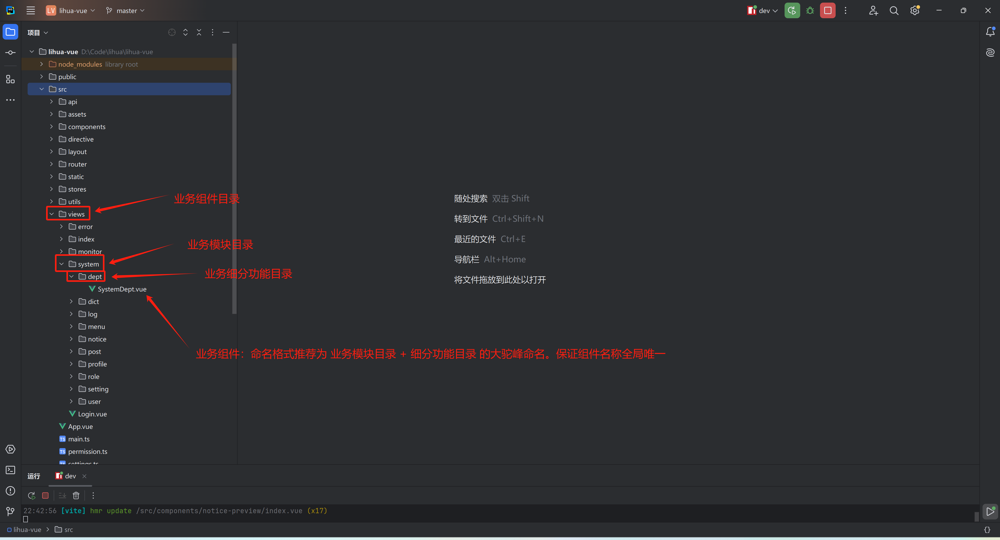

# 页面与组件

## 页面

页面根据实际需求在 `src/views`下创建对应模块和 `vue`文件

为保证 keep-alive 正常工作，业务组件名称应全局唯一，推荐使用 业务模块目录名称 + 细分功能目录名称 的大驼峰命名



## 组件

组件根据实际需求在 `src/components` 下创建全局通用组件

## 弹窗约定

表单类弹窗（新增/编辑）统一使用全局类型 `BaseModalActiveType` 维护模态框状态，字段包含 `open`（开关）、`saveLoading`（保存按钮加载）、`title`（标题），配合 `reactive` 使用：

```typescript
import {type BaseModalActiveType} from "@/api/global/type.ts";

const modalActive = reactive<BaseModalActiveType>({
    open: false,
    saveLoading: false,
    title: ""
})

// 打开弹窗（传入标题区分新增/编辑）
const handleModalStatus = (title?: string) => {
    modalActive.open = !modalActive.open
    if (title) {
        modalActive.title = title
    }
    // 重置表单
}

// 保存：请求期锁 OK 按钮（confirm-loading），防连点重复提交
const saveData = async () => {
    modalActive.saveLoading = true
    try {
        const resp = await save(form)
        if (resp.code === 200) {
            message.success(resp.msg)
            modalActive.open = false
            await initPage()
        } else {
            message.error(resp.msg)
        }
    } finally {
        modalActive.saveLoading = false
    }
}
```

```vue
<a-modal v-model:open="modalActive.open" :title="modalActive.title" :confirm-loading="modalActive.saveLoading" @ok="saveData">
    <!-- 表单内容 -->
</a-modal>
```

## 消息反馈

`message` / `notification` / `Modal` 统一从 `@/antd-adapter` 引入：

```typescript
import {message, notification, Modal} from "@/antd-adapter";
```

> 这三个 API 的静态调用会渲染出独立的 Vue 实例，不经过应用根部的 ConfigProvider，主题算法（暗色/主色/组件尺寸）不生效。`antd-adapter` 已将其代理转发到 `<a-app>` 内部挂载的上下文实例，**业务代码禁止直接 import antdv-next 的这三个静态API**。

## 全屏加载

耗时操作（导入导出、批量处理等）使用 `@/components/spin` 的函数式全屏 Spin，`service(options)` 创建实例并返回 `close()` 关闭方法（单例：重复调用返回同一实例）：

```typescript
import Spin from "@/components/spin";
import {download} from "@/utils/attachment-download.ts";

const handleExportExcel = async () => {
    const spinInstance = Spin.service({
        description: '努力加载中...'
    });
    try {
        const blob = await exportExcel(query)
        download(blob, "导出数据")
    } catch (err) {
        message.error("导出失败")
    } finally {
        spinInstance.close()
    }
}
```
