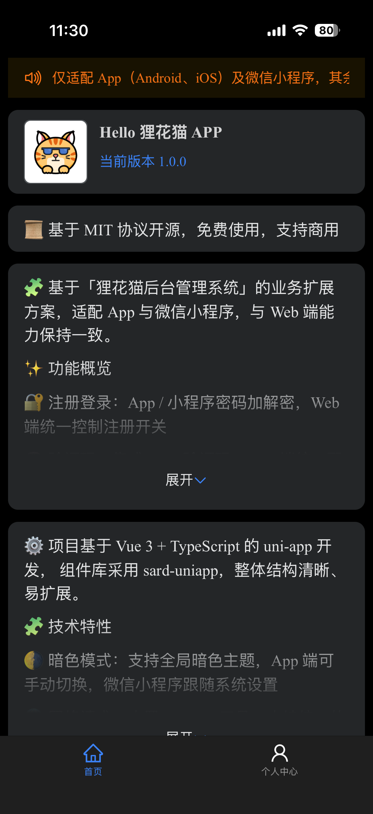

# Lihua App

基于「狸花猫后台管理系统」的业务扩展方案，使用 **uni-app** 开发，适配 **App 与微信小程序**，并与 Web 端能力保持一致。

------

## ✨ 功能特性

- 🔐 **注册登录**：App / 小程序密码加解密，Web 端统一控制注册开关
- 🧠 **验证码**：集成 tianai 验证码，Web 端统一配置启用状态
- 👤 **个人中心**：头像、昵称等基础信息与后端保持一致
- 🛡️ **权限体系**：支持角色、权限、部门标识，`user store` 可直接获取
- 🔔 **通知公告**：WebSocket 实时消息推送，App 支持原生通知提醒
- 🌗 **暗色模式**：
  - App：支持手动切换亮 / 暗主题
  - 微信小程序：自动跟随系统设置

------

## 🛠️ 技术特性

- 🔧 **基础框架**：Vue 3 + TypeScript，提供完善的类型约束与开发体验
- 🗂️ **状态管理**：内置 Pinia，统一管理全局状态，数据流清晰可维护
- 🌐 **网络请求**：内置 Request 工具，支持请求 / 响应统一拦截处理
- 🧭 **路由管理**：基于 Router 的路由封装，支持前置拦截与权限校验
- 🧱 **全局能力**：集成 `uni-ku/root`，模拟 Web 端 Vue 根组件，集中处理全局逻辑

------

## 📦 下载体验（APK）

- 👉 [狸花猫 APP 下载](https://gitee.com/yukino_git/lihua-app/releases/download/1.0.0/狸花猫APP.apk)

::: info

<div style="display:flex; flex-wrap:wrap; gap:8px;">
	
</div>

:::

------

## 🧩 组件库 & 关键依赖

- **UI 组件库**：[sard-uniapp](https://sard.wzt.zone/sard-uniapp-docs/)
- **虚拟根组件方案**：[Uni Ku Root](https://uni-ku.js.org/projects/root/introduction)

------

## 🖼️ 项目截图

::: info ㅤ 

<div style="display:flex; flex-wrap:wrap; gap:8px;">
	
	
	
	
	
	
</div>
:::

------

## 📁 项目目录结构

```text
├── .env.development                # 开发环境配置文件
├── .env.production                 # 生产环境配置文件
├── .gitignore                      # Git 忽略文件配置
├── LICENSE                         # 项目许可证
├── index.html                      # 入口 HTML 文件
├── package.json                    # 项目依赖与脚本配置
├── plugins/
│   └── buildIcons.ts               # 图标构建脚本
├── shims-uni.d.ts                  # Uni-app 类型声明
├── src/
│   ├── App.vue                     # 根 Vue 组件
│   ├── AppRoot.vue                 # 应用虚拟根组件
│   ├── api/                        # API 接口定义
│   ├── components/                 # 公共组件
│   ├── env.d.ts                    # 环境变量类型定义
│   ├── main.ts                     # 应用入口文件
│   ├── manifest.json               # 应用清单文件
│   ├── pages.json                  # 页面路由配置
│   ├── pages/                      # 页面视图
│   ├── router/                     # 路由封装与拦截逻辑
│   ├── static/                     # 静态资源
│   ├── stores/                     # Pinia 状态管理
│   ├── subpackages/                # 业务子包模块
│   ├── theme.json                  # 主题配置
│   ├── uni.scss                    # 全局样式变量
│   ├── utils/                      # 工具函数
│   └── vite.config.ts              # Vite 配置文件
```

------

## 📄 许可证

本项目采用 **MIT License** 开源协议，详情请查看 `LICENSE` 文件。