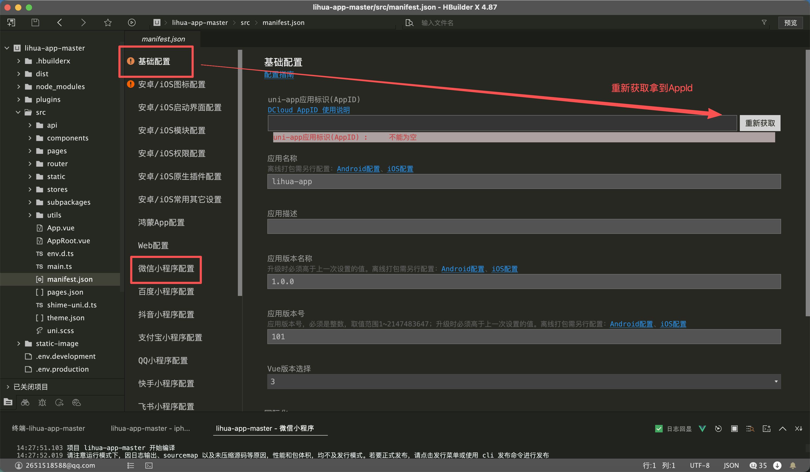
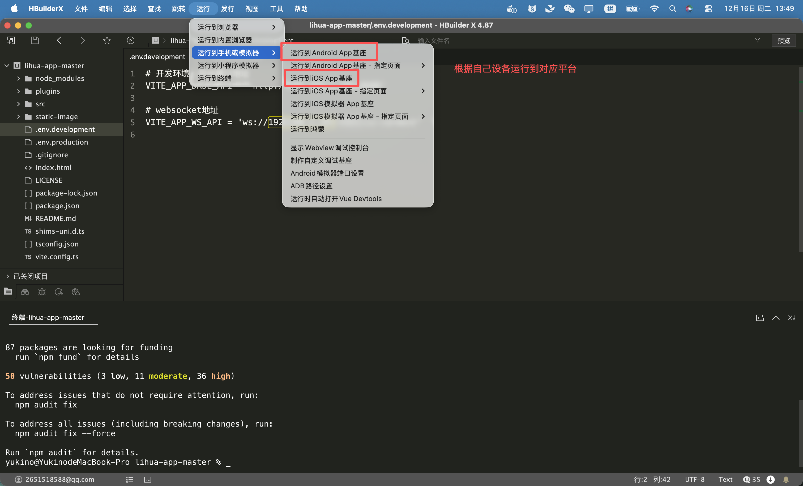
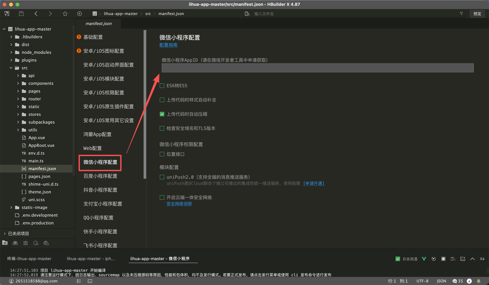

# 项目启动

## 前期准备

- 开发环境：[node 20+](https://nodejs.cn/download/)
-  开发工具：[HbuilderX](https://www.dcloud.io/hbuilderx.html)
- 小程序开发工具：[微信开发者工具](https://developers.weixin.qq.com/miniprogram/dev/devtools/devtools.html) 

## 拉取项目代码

1. 前往仓库下载master分支代码 [仓库](https://gitee.com/yukino_git/lihua-app)

   

   

2. 使用 `HbuilderX` 导入项目刚才下载解压好的项目源码

   

3. 导入后在终端执行`npm install`命令安装依赖

   

   

## 基础配置

> 请确保狸花猫后台(1.3.0+)已正常启动，填写正确的ip及端口 [后台启动教程](../../doc-server/server)

1. 找到项目下`.env`  环境变量配置，根据自己后台情况配置 `VITE_APP_BASE_API` 和 `VITE_APP_WS_API`

   

2. 在项目目录`src/manifest.json`中 `基础配置` 获取Uniapp的AppId

   

   

## 运行

> 本项目支持运行到安卓、Ios app及微信小程序，其余平台请自行测试

### 运行到App

> 运行到iOS基座需要 Apple 颁发的证书及签名，[详见](https://uniapp.dcloud.net.cn/tutorial/run/ios-apple-certificate-signature.html)

HbuilderX `运行` ` 运行到手机或模拟器` ` 运行到安卓或iOS App基座`

手机使用数据线连接电脑（安卓需要打开开发者模式，开启usb调试）找到自己的手机，选择基座类型后点击运行

编译完成后控制台会打印项目已启动，手机上会出现对应app

打开App显示此页面即启动成功

::: info 如显示 连接服务器失败，点击重试 则表示**后台服务未启动**或**.env**配置有误

    
    

:::

### 运行到微信小程序

> 运行到微信小程序需提前[注册](https://mp.weixin.qq.com/cgi-bin/wx)，并确保电脑上安装了[微信开发者工具](https://developers.weixin.qq.com/miniprogram/dev/devtools/devtools.html)

HbuilderX `运行` ` 运行到手机或模拟器` ` 微信开发者工具`

运行成功会自动调起微信开发者工具，第一次启动需要从 `设置` `通用设置` `安全` 中将 `服务端口` 打开

运行成功后会提示 `fail appid missing` 将自己账号下的appid进行配置

从项目 `src/manifest.json` 中 ` 微信小程序配置` 也可进行配置

